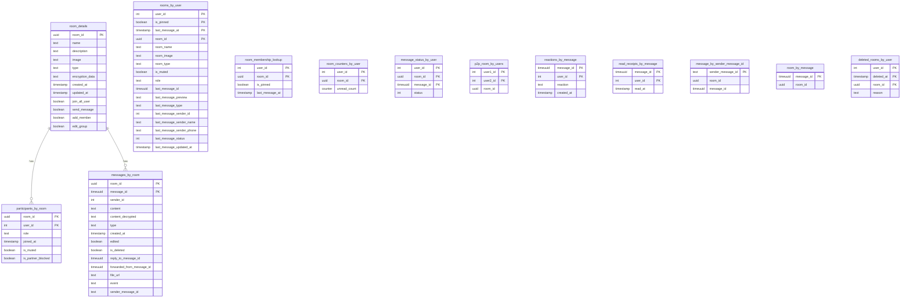

# Guía de ScyllaDB (Cassandra) — Chat Messages API

Esta guía explica cómo funciona ScyllaDB dentro del sistema, cómo se inicializa usando `migrations/cassandra/0001_init.cql`, y cómo la aplicación la utiliza (sinergía 100%).


## 1) Activación y configuración

- Modo Scylla: controlado por la variable de entorno `USE_SCYLLADB`.
  - `USE_SCYLLADB=true` → la app usa el repositorio Scylla (`ScyllaRoomRepository`).
  - `USE_SCYLLADB=false` → solo PostgreSQL (repositorio SQL). 
- Variables de entorno relevantes (se cargan desde `.env` y docker-compose):
  - `CASSANDRA_HOSTS` (ej: `scylla`)
  - `CASSANDRA_PORT` (ej: `9042`)
  - `CASSANDRA_KEYSPACE` (ej: `chat_keyspace`)
  - `USE_SCYLLADB` (ej: `true`)
- La conexión Scylla la inicializa `database/database.go` vía el core (`cassandra.DefaultConnectionConfig`).
- En `handlers/chat/v1/handler.go` se selecciona el repositorio:
  - Por defecto: `NewSQLRoomRepository(database.DB())` (Postgres)
  - Si `USE_SCYLLADB=true`: `NewScyllaRoomRepository(database.CQLDB(), repoSQL)`
    - Nota: Scylla usa el repositorio SQL como `UserFetcher` para obtener datos de usuarios desde Postgres.


## 2) Migraciones y despliegue

- Archivo: `migrations/cassandra/0001_init.cql` (idempotente). Crea keyspace y tablas.
- docker-compose crea un job `scylla-init` que:
  1. Espera a que `scylla` esté healthy
  2. Ejecuta `cqlsh` con `SOURCE '/migrations/cassandra/0001_init.cql'`.
- Verificación manual:
  - `docker compose exec -T scylla cqlsh -e "DESCRIBE KEYSPACES"`
  - `docker compose exec -T scylla cqlsh -e "DESCRIBE TABLES chat_keyspace"`


## 3) Modelo de datos (resumen) — 100% alineado con el código



Keyspace: `chat_keyspace`

Tablas core:
- `room_details (room_id PK)`
  - Datos estáticos de la sala: `name, description, image, type, encryption_data, created_at, updated_at, join_all_user, send_message, add_member, edit_group`.
  - Usada por: CreateRoom (INSERT), GetRoom/GetRoomList/AddParticipantToRoom/UpdateRoom (SELECT/UPDATE).

- `participants_by_room ((room_id), user_id)`
  - Miembros por sala: `role, joined_at, is_muted, is_partner_blocked`.
  - Usada por: CreateRoom/AddParticipantToRoom/LeaveRoom/DeleteRoom/IsPartnerMuted.

- `messages_by_room ((room_id), message_id timeuuid)`
  - Mensajes por sala: `sender_id, content, content_decrypted, type, created_at, edited, is_deleted, reply_to_message_id, forwarded_from_message_id, file_url, event, sender_message_id`.
  - Usada por: SaveMessage (INSERT), GetMessage/GetMessageHistory (SELECT), UpdateMessage (UPDATE), DeleteMessage (UPDATE is_deleted).
  - Ordenamiento por `message_id DESC` optimiza historial.

- `rooms_by_user ((user_id), is_pinned, last_message_at, room_id)`
  - Vista denormalizada para pintar la lista de salas de un usuario, incluyendo datos del último mensaje: `last_message_id, last_message_preview, last_message_type, last_message_sender_id, last_message_sender_name, last_message_sender_phone, last_message_status, last_message_updated_at`, además de `room_name, room_image, room_type, is_muted, role`.
  - Usada por: GetRoomList/GetRoom y fan-out de SaveMessage.

- `room_membership_lookup ((user_id), room_id)`
  - Lookup para obtener claves de clúster actuales (`is_pinned, last_message_at`).
  - Usada por: GetRoom/PinRoom/MuteRoom/LeaveRoom/SaveMessage (fan-out)/UpdateParticipantRoom.

- `room_counters_by_user ((user_id), room_id)` (counter)
  - Contador de no leídos (`unread_count`).
  - Usada por: SaveMessage (+1 a otros), MarkMessagesAsRead (0), CreateRoom/AddParticipantToRoom (inicialización a 0).

- `message_status_by_user (((user_id, room_id), message_id))`
  - Estado del mensaje para cada usuario: `status` (SENT/DELIVERED/READ).
  - Usada por: SaveMessage (SENT/DELIVERED), GetMessage/GetMessageHistory (SELECT), MarkMessagesAsRead (READ).

Tablas auxiliares:
- `p2p_room_by_users ((user1_id), user2_id)` — evita duplicados en salas P2P.
- `reactions_by_message ((message_id), user_id)` — reacciones por mensaje.
- `read_receipts_by_message ((message_id), user_id)` — lecturas (read_at).
- `message_by_sender_message_id (sender_message_id PK)` — búsqueda por ID de cliente.
- `room_by_message (message_id PK)` — lookup room_id ← message_id.
- `deleted_rooms_by_user ((user_id), deleted_at, room_id)` — sincronización de salas eliminadas.

Todos los nombres de columnas, tipos y claves coinciden con los usos en `repository/rooms/room_scylladb_impl.go`.


## 4) Flujo de escritura — cómo se mantiene la lista de salas y estados

```mermaid
flowchart TD
  A[SaveMessage] --> B[INSERT messages_by_room]
  B --> C[INSERT room_by_message]
  B --> D{sender_message_id?}
  D -- sí --> E[INSERT message_by_sender_message_id]
  D -- no --> F[skip]
  B --> G[Get participants_by_room]
  G --> H[Get sender from UserFetcher (Postgres)]
  H --> I[Fan-out por usuario]
  I --> J[Lookup is_pinned,last_message_at en room_membership_lookup]
  J --> K[READ rooms_by_user fila actual]
  K --> L[DELETE rooms_by_user fila vieja]
  L --> M[INSERT rooms_by_user con nuevos datos último mensaje]
  M --> N[UPDATE room_membership_lookup.last_message_at]
  I --> O{user != sender}
  O -- sí --> P[room_counters_by_user += 1;
                 message_status_by_user=DELIVERED]
  O -- no --> Q[message_status_by_user=SENT]
```

- Crear sala (CreateRoom):
  1. (P2P) `p2p_room_by_users` para evitar duplicados.
  2. `room_details` (una fila por sala).
  3. `participants_by_room` (1 fila por miembro)
  4. `rooms_by_user` y `room_membership_lookup` para cada miembro.
  5. Inicialización de `room_counters_by_user` a 0.

- Enviar mensaje (SaveMessage):
  1. Inserta el mensaje en `messages_by_room` (timeuuid), y los lookups `room_by_message` y opcional `message_by_sender_message_id`.
  2. Obtiene participantes y datos del remitente (vía `UserFetcher` → Postgres) para fan-out.
  3. Fan-out (por cada usuario):
     - Lee la clave de clúster actual de `room_membership_lookup`.
     - Lee la fila actual de `rooms_by_user` (nombre/imagen/tipo/is_muted/role y último mensaje).
     - Ejecuta batch DELETE+INSERT en `rooms_by_user` para mover `last_message_at` y actualizar datos del último mensaje.
     - Actualiza `room_membership_lookup.last_message_at`.
  4. Estados y no leídos:
     - Para los demás usuarios: `room_counters_by_user += 1` y `message_status_by_user = DELIVERED`.
     - Para el remitente: `message_status_by_user = SENT`.

- Editar/Eliminar mensaje: UPDATE en `messages_by_room`.


## 5) Flujo de lectura — consultas optimizadas a partición

```mermaid
flowchart TD
  GR[GetRoom] --> RD[SELECT room_details]
  RD --> RL[SELECT room_membership_lookup]
  RL --> RBU[SELECT rooms_by_user]
  RBU --> RC[SELECT room_counters_by_user]
  GR -->|allData| PR[SELECT participants_by_room]

  GL[GetRoomList] --> RBU2[SELECT rooms_by_user by user_id]
  RBU2 --> RC2[JOIN/SELECT room_counters_by_user por cada sala]

  GMH[GetMessageHistory] --> MBR[SELECT messages_by_room by room_id
    con filtros before/after/limit]

  GM[GetMessage] --> RBM[SELECT room_by_message]
  RBM --> MBR1[SELECT messages_by_room (fila 1)]
  GM --> MSU[SELECT message_status_by_user]

  MMR[MarkMessagesAsRead] --> MBR2[SELECT messages_by_room < MaxTimeUUID(since)]
  MBR2 --> RRBM[INSERT read_receipts_by_message]
  RRBM --> MSU2[UPSERT message_status_by_user=READ]
  MSU2 --> RCU[UPDATE room_counters_by_user=0]
```

- GetRoom: `room_details` + `room_membership_lookup` + `rooms_by_user` + `room_counters_by_user` (+ participantes si `allData`).
- GetRoomList: `rooms_by_user` por `user_id` (filtro/paginación en app; contadores por consulta adicional a `room_counters_by_user`).
- GetMessageHistory (una sala): `messages_by_room` por `(room_id)` con filtros `before/after` por `message_id timeuuid` y/o `LIMIT`.
- GetMessage: `room_by_message` → `messages_by_room` → estado en `message_status_by_user`.
- MarkMessagesAsRead: `messages_by_room` con `message_id < MaxTimeUUID(since)`; inserta `read_receipts_by_message`, marca READ en `message_status_by_user`, resetea contador a 0.
- Reacciones: `reactions_by_message` (INSERT/DELETE simple).

Todas las operaciones se limitan a una partición por consulta (clave de partición explícita) para rendimiento óptimo.


## 6) Consideraciones de diseño y rendimiento

- timeuuid para `message_id`: asegura orden temporal total por partición y permite paginación por `before/after`.
- `rooms_by_user` y `room_membership_lookup` se actualizan con patrón delete+insert en la misma partición para consistencia.
- `room_counters_by_user` es una tabla de counters: no mezclar en el mismo batch con operaciones no-counter (el código ya lo separa).
- Queries dependen de claves compuestas: deben pasar `(user_id, is_pinned, last_message_at, room_id)` según corresponda; el repositorio lee `is_pinned`/`last_message_at` de `room_membership_lookup` antes de modificar `rooms_by_user`.


## 7) Sinergía 100% — validación contra el código

- Nombres de tablas y columnas coinciden exactamente con los usados en `repository/rooms/room_scylladb_impl.go`:
  - `room_details`, `participants_by_room`, `messages_by_room`, `rooms_by_user`,
    `room_membership_lookup`, `room_counters_by_user`, `message_status_by_user`,
    `p2p_room_by_users`, `reactions_by_message`, `read_receipts_by_message`,
    `message_by_sender_message_id`, `room_by_message`, `deleted_rooms_by_user`.
- Tipos clave:
  - `message_id` = `timeuuid`; `room_id` = `uuid`; `status` = `int`; timestamps = `timestamp`.
- Flujos de CreateRoom/SaveMessage/UpdateRoom/Pin/Mute/Block/Leave/MarkRead/GetMessage/GetRoom/GetRoomList reproduciendo 1:1 lo que espera el repositorio Scylla.
- Postgres se mantiene como fuente para datos de usuarios (`UserFetcher`).


## 8) Cómo ponerlo en marcha (Docker Compose)

- Archivos relevantes: `docker-compose.yml`, `.env`, `migrations/cassandra/0001_init.cql`.
- Pasos:
  1. Ajusta `.env` (por defecto `USE_SCYLLADB=true`).
  2. `docker compose --env-file .env up -d --build`
  3. Verifica que `scylla-init` termine OK (migraciones aplicadas).
  4. La app quedará en `http://localhost:8080`.
- Comandos útiles:
  - Logs app: `docker compose logs -f app`
  - Verificar keyspace: `docker compose exec -T scylla cqlsh -e "DESCRIBE TABLES chat_keyspace"`


## 9) Troubleshooting

- `Invalid UUID`/`timeuuid`: asegúrate de pasar IDs generados por el sistema; el repositorio crea `gocql.TimeUUID()` para mensajes.
- `Unavailable: Cannot achieve consistency`: espera a que `scylla` esté healthy; sube el timeout o reduce carga.
- Counters: si ves errores de counters, verifica que no se estén mezclando en el mismo batch (el código ya separa estas operaciones).
- Reaplicar migraciones: 
  - `docker compose exec -T scylla cqlsh -e "SOURCE '/migrations/cassandra/0001_init.cql';"`


## 10) Notas finales

- `join_all_user` (canales) dispara un proceso en background para añadir todos los usuarios del sistema.
- No se usan LWT; la consistencia se logra con claves bien diseñadas y batches por partición.
- La caché y eventos (Redis/NATS) funcionan igual en modo Scylla.

Esta guía refleja exactamente el contrato entre `migrations/cassandra/0001_init.cql` y el código en `repository/rooms/room_scylladb_impl.go`, garantizando sinergía del 100%.
