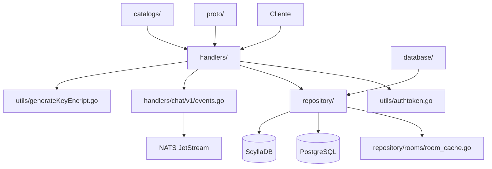

# 📁 Documentación Completa de Carpetas

## 📋 Índice
1. [Estructura General](#estructura-general)
2. [Carpeta Raíz (/)](#carpeta-raíz-)
3. [.qodo/](#qodo)
4. [catalogs/](#catalogs)
5. [cmd/](#cmd)
6. [database/](#database)
7. [docs/](#docs)
8. [handlers/](#handlers)
9. [proto/](#proto)
10. [repository/](#repository)
11. [utils/](#utils)

---

## 🏗️ Estructura General

```
campaing-app-chat-messages-api-go/
├── .qodo/                          # Configuración de herramientas Qodo
├── catalogs/                       # Configuraciones y constantes del sistema
├── cmd/                           # Aplicaciones ejecutables
│   └── campaing-app-chat-cli/     # Cliente CLI de chat
├── database/                      # Configuración de conexiones a BD
├── docs/                          # Documentación del proyecto
├── handlers/                      # Controladores gRPC/HTTP
│   ├── chat/v1/                   # Handlers del servicio de chat
│   └── tokens/v1/                 # Handlers del servicio de tokens
├── proto/                         # Definiciones Protocol Buffers
│   ├── generated/                 # Código generado automáticamente
│   └── services/                  # Definiciones .proto originales
├── repository/                    # Capa de acceso a datos
│   ├── rooms/                     # Repositorio de salas y mensajes
│   └── tokens/                    # Repositorio de tokens de dispositivos
├── utils/                         # Utilidades y helpers
├── main.go                        # Punto de entrada principal
├── go.mod                         # Dependencias de Go
├── Dockerfile                     # Configuración de contenedor
└── schema.cpl                     # Schema de ScyllaDB
```

---

## 📂 Carpeta Raíz (/)

### 📄 **Archivos Principales**

#### `main.go`
```go
// Punto de entrada principal de la aplicación
// Inicializa el servidor gRPC con todos los servicios
```

**Responsabilidades:**
- Configuración del entorno
- Inicialización de Redis y NATS
- Registro de servicios gRPC
- Configuración de rutas especiales (debug, swagger, protos)
- Inicio del servidor en el puerto configurado

#### `go.mod` & `go.sum`
```go
module github.com/Venqis-NolaTech/campaing-app-chat-messages-api-go
go 1.23.0
```

**Dependencias Clave:**
- `connectrpc.com/connect` - Framework gRPC/HTTP
- `github.com/scylladb-solutions/gocql/v2` - Driver ScyllaDB
- `github.com/nats-io/nats.go` - Cliente NATS para streaming
- `github.com/Masterminds/squirrel` - Query builder SQL
- `golang.org/x/crypto` - Funciones criptográficas

#### `Dockerfile`
```dockerfile
# Multi-stage build para optimización
FROM golang:1.23-alpine AS builder
# ... configuración de build con SSH keys para repos privados
FROM alpine:3.20 AS runner
# ... imagen final mínima con certificados SSL
```

**Características:**
- Build multi-etapa para optimización de tamaño
- Soporte para repositorios privados con SSH
- Configuración de seguridad (usuario no-root)
- Caché de dependencias de Go

#### `schema.cpl`
```cql
-- Schema optimizado para ScyllaDB
-- Tablas principales: messages_by_room, rooms_by_user, room_details
-- Tablas de lookup: room_by_message, p2p_room_by_users
-- Contadores distribuidos: room_counters_by_user
```

**Diseño de Datos:**
- Particionamiento por `room_id` y `user_id`
- Clustering keys para ordenamiento temporal
- Desnormalización para performance
- Contadores distribuidos para métricas

#### Archivos de Configuración Protocol Buffers
- `buf.yaml` - Configuración principal de Buf
- `buf.gen.yaml` - Configuración de generación de código
- `buf.lock` - Lock file de dependencias

#### `.gitignore`
```gitignore
# Archivos generados, binarios, logs, etc.
```

---

## 🔧 .qodo/

### 📋 **Propósito**
Carpeta de configuración para herramientas de desarrollo Qodo (actualmente vacía).

### 🎯 **Uso Típico**
- Configuraciones de linting
- Reglas de análisis de código
- Configuraciones de CI/CD específicas de Qodo

### 📁 **Estado Actual**
```
.qodo/
└── (vacía)
```

---

## 📚 catalogs/

### 📋 **Propósito**
Contiene configuraciones globales, constantes del sistema y catálogos de configuración.

### 📄 **Archivos**

#### `catalogs.go`
```go
package catalogs

// Variables de entorno y configuración
var (
    IsProd = os.Getenv("MODE") == "PROD"
    
    SpecialRoutes = struct {
        DebugRoute     string  // "/api/chat/debug"
        SwaggerRoute   string  // "/api/chat/swagger"
        ProtosDownload string  // "/api/chat/protos_download"
    }
)

// Función para obtener dirección del cliente
func ClientAddress() string
```

### 🎯 **Responsabilidades**
- **Detección de Entorno**: Determina si está en producción
- **Rutas Especiales**: Define endpoints para debug, swagger y descarga de protos
- **Configuración de Cliente**: Proporciona direcciones de servicios
- **Constantes del Sistema**: Centraliza valores de configuración

### 💡 **Casos de Uso**
- Configuración de rutas de desarrollo vs producción
- Habilitación/deshabilitación de features por entorno
- Configuración de endpoints de servicios externos

---

## 🖥️ cmd/

### 📋 **Propósito**
Contiene aplicaciones ejecutables del proyecto siguiendo la convención estándar de Go.

### 📁 **Estructura**
```
cmd/
└── campaing-app-chat-cli/
    └── main.go
```

### 🎯 **campaing-app-chat-cli/**

#### **Propósito**
Cliente de línea de comandos para interactuar con el sistema de chat.

#### **Funcionalidades**
```go
// Características principales:
- Autenticación automática con tokens JWT
- Creación/unión a salas de chat
- Envío y recepción de mensajes en tiempo real
- Encriptación/desencriptación de mensajes
- Interfaz TUI (Terminal User Interface) con Bubble Tea
```

#### **Componentes Clave**
1. **Autenticación**
   ```go
   token, err := auth.GenerateSessionToken(auth.SessionData{
       UserID: *userID,
       Type:   "ACCESS",
   })
   ```

2. **Gestión de Salas**
   ```go
   // Crear sala P2P
   res, err := chatv1client.CreateRoom(context.Background(), generalParams, &chatv1.CreateRoomRequest{
       Type: "p2p",
       Participants: []int32{int32(*remitentID)},
   })
   
   // Unirse a sala existente
   res, err := chatv1client.GetRoom(context.Background(), generalParams, &chatv1.GetRoomRequest{
       Id: strconv.Itoa(*roomID),
   })
   ```

3. **Streaming de Mensajes**
   ```go
   stream, err := client.StreamMessages(ctx, req)
   for stream.Receive() {
       msg := stream.Msg().GetMessage()
       // Procesar mensaje recibido
   }
   ```

4. **Interfaz TUI**
   ```go
   // Componentes de Bubble Tea:
   - viewport.Model    // Área de visualización de mensajes
   - textarea.Model    // Área de entrada de texto
   - Estilos con lipgloss
   ```

#### **Parámetros de Línea de Comandos**
- `-u <userID>` - ID del usuario (requerido)
- `-t <remitentID>` - ID del destinatario para chat P2P
- `-r <roomID>` - ID de sala existente para unirse

#### **Flujo de Uso**
1. **Inicio**: `./chat-cli -u 123 -t 456`
2. **Autenticación**: Genera token JWT automáticamente
3. **Conexión**: Crea/une a sala de chat
4. **Streaming**: Inicia listener de mensajes en tiempo real
5. **Interacción**: Interfaz TUI para enviar/recibir mensajes

---

## 🗄️ database/

### 📋 **Propósito**
Configuración y gestión de conexiones a bases de datos (PostgreSQL y ScyllaDB).

### 📄 **Archivos**

#### `database.go`
```go
package database

import (
    "database/sql"
    "github.com/scylladb-solutions/gocql/v2"
)

// Variables globales de conexión
var db *sql.DB           // Conexión PostgreSQL
var cassandraDB *gocql.Session  // Conexión ScyllaDB

// Funciones de acceso
func CQLDB() *gocql.Session
func DB() *sql.DB

// Inicialización automática
func init()
```

### 🎯 **Responsabilidades**
1. **Gestión de Conexiones**
   - Inicialización de PostgreSQL con configuración por defecto
   - Conexión a ScyllaDB/Cassandra con configuración por defecto
   - Manejo de errores de conexión

2. **Patrón Singleton**
   - Variables globales para reutilización de conexiones
   - Funciones getter para acceso controlado
   - Inicialización única en `init()`

3. **Configuración**
   - Usa configuraciones por defecto del core
   - Soporte para variables de entorno
   - Logging de errores de conexión

### 💡 **Uso en el Código**
```go
// En repositorios
pgRepo := roomsrepository.NewSQLRoomRepository(database.DB())
scyllaRepo := roomsrepository.NewScyllaRoomRepository(database.CQLDB(), pgRepo)

// En handlers
if scylladb, _ := strconv.ParseBool(os.Getenv("USE_SCYLLADB")); scylladb {
    repo = roomsrepository.NewScyllaRoomRepository(database.CQLDB(), repo)
}
```

### ⚠️ **Consideraciones**
- Las conexiones se inicializan al importar el paquete
- Errores de ScyllaDB no son fatales (fallback a PostgreSQL)
- Configuración centralizada en el paquete core

---

## 📖 docs/

### 📋 **Propósito**
Documentación técnica del proyecto y guías de optimización.

### 📄 **Archivos**

#### `OPTIMIZACION_GETROOM_FUNCTIONS.md`
Documentación específica sobre optimizaciones de las funciones de obtención de salas.

### 📁 **Contenido Típico**
```
docs/
├── OPTIMIZACION_GETROOM_FUNCTIONS.md
├── API_DOCUMENTATION.md (potencial)
├── DEPLOYMENT_GUIDE.md (potencial)
└── ARCHITECTURE_DECISIONS.md (potencial)
```

### 🎯 **Propósito de la Documentación**
- **Optimizaciones**: Guías de performance y mejores prácticas
- **Arquitectura**: Decisiones de diseño y patrones utilizados
- **Deployment**: Instrucciones de despliegue y configuración
- **API**: Documentación de endpoints y contratos

---

## 🎮 handlers/

### 📋 **Propósito**
Controladores gRPC que implementan la lógica de negocio de los servicios.

### 📁 **Estructura**
```
handlers/
├── handlers.go              # Registro de servicios
├── chat/
│   └── v1/                  # Versión 1 del servicio de chat
│       ├── handler.go       # Lógica principal del chat
│       ├── events.go        # Gestión de eventos
│       ├── helpers.go       # Funciones auxiliares
│       ├── init_stream.go   # Configuración de streams NATS
│       ├── register.go      # Registro del servicio
│       └── handler_test.go  # Tests unitarios
└── tokens/
    └── v1/                  # Versión 1 del servicio de tokens
        ├── handler.go       # Lógica de tokens
        ├── register.go      # Registro del servicio
        └── handler_test.go  # Tests unitarios
```

### 🎯 **handlers.go**
```go
package handlers

// Registro centralizado de todos los servicios
var RegisterServicesFns = []server.RegisterServiceFn{
    chatv1handler.RegisterServiceHandler,
    tokensv1handler.RegisterServiceHandler,
}
```

### 💬 **handlers/chat/v1/**

#### **handler.go** - Controlador Principal
```go
type handlerImpl struct {
    logger          *slog.Logger
    nc              *nats.Conn                    // Cliente NATS
    js              jetstream.JetStream           // JetStream para eventos
    sm              *events.StreamManager         // Gestor de streams
    dispatcher      *events.EventDispatcher      // Despachador de eventos
    roomsRepository roomsrepository.RoomsRepository
}
```

**Métodos Implementados:**
- `CreateRoom` - Crear salas P2P o grupales
- `GetRoom` - Obtener información de sala
- `GetRooms` - Listar salas del usuario
- `LeaveRoom` - Abandonar sala
- `UpdateRoom` - Actualizar configuración de sala
- `AddParticipantToRoom` - Añadir participantes
- `SendMessage` - Enviar mensajes
- `EditMessage` - Editar mensajes
- `DeleteMessage` - Eliminar mensajes
- `GetMessageHistory` - Obtener historial
- `MarkMessagesAsRead` - Marcar como leídos
- `ReactToMessage` - Reaccionar a mensajes
- `StreamMessages` - Stream en tiempo real
- `PinRoom` - Fijar/desfijar salas
- `MuteRoom` - Silenciar salas
- `BlockUser` - Bloquear usuarios

#### **events.go** - Gestión de Eventos
```go
type ChatEvent struct {
    roomID string
    userID int
    event  *chatv1.MessageEvent
}

// Implementa interfaces para JetStream
func (e ChatEvent) Subject() string
func (e ChatEvent) Payload() ([]byte, error)
func (e ChatEvent) EventType() string
```

#### **init_stream.go** - Configuración NATS
```go
const (
    StreamChatEventsName = "CHAT_EVENTS"
    StreamChatDirectEventsSubjectPrefix = "CHAT_DIRECT_EVENTS"
)

var requiredStreams = []jetstream.StreamConfig{
    // Configuración de streams para eventos de chat
}
```

#### **helpers.go** - Funciones Auxiliares
```go
// Publicación de eventos de chat
func (h *handlerImpl) publishChatEvent(generalParams api.GeneralParams, roomID string, event *chatv1.MessageEvent)
```

### 🔑 **handlers/tokens/v1/**

#### **handler.go** - Gestión de Tokens
```go
type handlerImpl struct{}

// Métodos implementados:
func (h *handlerImpl) SaveToken(ctx context.Context, req *connect.Request[tokensv1.SaveTokenRequest]) (*connect.Response[tokensv1.SaveTokenResponse], error)
```

**Funcionalidades:**
- Guardar tokens de dispositivos para notificaciones push
- Validación de autenticación
- Gestión de tokens por usuario

### 🧪 **Tests**
- `handler_test.go` - Tests unitarios para cada servicio
- Cobertura de casos de éxito y error
- Mocking de dependencias

### 🔄 **Flujo de Procesamiento**
1. **Recepción**: gRPC/Connect recibe request
2. **Autenticación**: Validación de token JWT
3. **Validación**: Verificación de parámetros
4. **Lógica de Negocio**: Procesamiento en repository
5. **Eventos**: Publicación en NATS (si aplica)
6. **Respuesta**: Retorno de resultado

---

## 📡 proto/

### 📋 **Propósito**
Definiciones Protocol Buffers y código generado para servicios gRPC.

### 📁 **Estructura**
```
proto/
├── embed.go                    # Embedding de documentación OpenAPI
├── generated/                  # Código generado automáticamente
│   ├── openapi.yaml           # Documentación OpenAPI/Swagger
│   └── services/
│       ├── chat/v1/           # Código generado para chat
│       │   ├── service.pb.go  # Tipos y servicios
│       │   ├── types.pb.go    # Tipos de datos
│       │   ├── chatv1connect/ # Conectores Connect
│       │   └── client/        # Cliente generado
│       └── tokens/v1/         # Código generado para tokens
│           ├── service.pb.go
│           ├── types.pb.go
│           ├── tokensv1connect/
│           └── client/
└── services/                   # Definiciones .proto originales
    └── chat/v1/
        ├── service.proto      # Definición del servicio
        └── types.proto        # Definición de tipos
```

### 🎯 **embed.go**
```go
package proto

import _ "embed"

//go:embed generated/openapi.yaml
var SwaggerJsonDoc []byte
```

**Propósito:**
- Embebe la documentación OpenAPI en el binario
- Permite servir Swagger UI sin archivos externos
- Usado en el endpoint `/api/chat/swagger`

### 📄 **services/chat/v1/service.proto**
```protobuf
syntax = "proto3";

service ChatService {
  // Gestión de salas
  rpc CreateRoom(CreateRoomRequest) returns (CreateRoomResponse);
  rpc GetRoom(GetRoomRequest) returns (GetRoomResponse);
  rpc GetRooms(GetRoomsRequest) returns (GetRoomsResponse);
  
  // Gestión de mensajes
  rpc SendMessage(SendMessageRequest) returns (SendMessageResponse);
  rpc GetMessageHistory(GetMessageHistoryRequest) returns (GetMessageHistoryResponse);
  
  // Streaming
  rpc StreamMessages(StreamMessagesRequest) returns (stream MessageEvent);
  
  // ... otros métodos
}
```

### 📄 **services/chat/v1/types.proto**
```protobuf
// Tipos de datos principales
message Room { ... }
message MessageData { ... }
message RoomParticipant { ... }
message MessageEvent { ... }
message PaginationMeta { ... }
```

### 🤖 **generated/** - Código Generado

#### **service.pb.go & types.pb.go**
- Código Go generado por protoc
- Tipos de datos y servicios
- Métodos de serialización/deserialización
- Validaciones automáticas

#### **chatv1connect/** - Conectores Connect
```go
// service.connect.go
type ChatServiceHandler interface {
    CreateRoom(context.Context, *connect.Request[CreateRoomRequest]) (*connect.Response[CreateRoomResponse], error)
    // ... otros métodos
}

func NewChatServiceHandler(svc ChatServiceHandler, opts ...connect.HandlerOption) (string, http.Handler)
```

#### **client/** - Clientes Generados
```go
// chatservice.client.go
func CreateRoom(ctx context.Context, generalParams api.GeneralParams, req *CreateRoomRequest) (*CreateRoomResponse, error)
func SendMessage(ctx context.Context, generalParams api.GeneralParams, req *SendMessageRequest) (*SendMessageResponse, error)
// ... otros métodos cliente
```

### 🔧 **Generación de Código**
```bash
# Comando típico de generación
buf generate

# Configurado en buf.gen.yaml:
- plugin: go
- plugin: connect-go
- plugin: openapi
```

### 📚 **openapi.yaml**
- Documentación Swagger/OpenAPI generada automáticamente
- Describe todos los endpoints REST/gRPC
- Incluye esquemas de request/response
- Servida en `/api/chat/swagger`

---

## 🗃️ repository/

### 📋 **Propósito**
Capa de acceso a datos que implementa el patrón Repository para abstraer las operaciones de base de datos.

### 📁 **Estructura**
```
repository/
├── rooms/                      # Repositorio de salas y mensajes
│   ├── room.go                # Interfaces y tipos
│   ├── room_postgres_impl.go  # Implementación PostgreSQL
│   ├── room_scylladb_impl.go  # Implementación ScyllaDB
│   ├── room_cache.go          # Gestión de caché
│   └── helpers.go             # Funciones auxiliares
└── tokens/                     # Repositorio de tokens
    ├── tokens.go              # Interface
    └── tokens_impl.go         # Implementación PostgreSQL
```

### 🏠 **repository/rooms/**

#### **room.go** - Interfaces y Contratos
```go
type RoomsRepository interface {
    UserFetcher
    
    // Gestión de salas
    CreateRoom(ctx context.Context, userId int, room *chatv1.CreateRoomRequest) (*chatv1.Room, error)
    GetRoom(ctx context.Context, userId int, roomId string, allData bool, cache bool) (*chatv1.Room, error)
    GetRoomList(ctx context.Context, userId int, pagination *chatv1.GetRoomsRequest) ([]*chatv1.Room, *chatv1.PaginationMeta, error)
    
    // Gestión de mensajes
    SaveMessage(ctx context.Context, userId int, req *chatv1.SendMessageRequest, room *chatv1.Room, contentDecrypted *string) (*chatv1.MessageData, error)
    GetMessagesFromRoom(ctx context.Context, userId int, req *chatv1.GetMessageHistoryRequest) ([]*chatv1.MessageData, *chatv1.PaginationMeta, error)
    
    // ... otros métodos
}

type UserFetcher interface {
    GetUserByID(ctx context.Context, id int) (*User, error)
    GetUsersByID(ctx context.Context, ids []int) ([]User, error)
    GetAllUserIDs(ctx context.Context) ([]int, error)
}

type User struct {
    ID        int     `json:"id"`
    Name      string  `json:"name"`
    Phone     string  `json:"phone"`
    Email     *string `json:"email"`
    Avatar    *string `json:"avatar"`
    // ... otros campos
}
```

#### **room_postgres_impl.go** - Implementación PostgreSQL
```go
type SQLRoomRepository struct {
    db *sql.DB
}

func NewSQLRoomRepository(db *sql.DB) RoomsRepository {
    return &SQLRoomRepository{db: db}
}
```

**Características:**
- Usa Squirrel para query building
- Transacciones ACID para operaciones complejas
- JOINs optimizados para consultas relacionales
- Índices estratégicos para performance
- Paginación con OFFSET/LIMIT

**Ejemplo de Query Compleja:**
```go
query := dbpq.QueryBuilder().
    Select("room.id", "room.name", "last_msg.content").
    From("room").
    InnerJoin("room_member ON room.id = room_member.room_id").
    LeftJoin(`LATERAL (
        SELECT content, created_at 
        FROM room_message 
        WHERE room_id = room.id 
        ORDER BY created_at DESC 
        LIMIT 1
    ) AS last_msg ON true`).
    Where(sq.Eq{"room_member.user_id": userId})
```

#### **room_scylladb_impl.go** - Implementación ScyllaDB
```go
type ScyllaRoomRepository struct {
    session     *gocql.Session
    userFetcher UserFetcher
}

func NewScyllaRoomRepository(session *gocql.Session, userFetcher UserFetcher) RoomsRepository {
    return &ScyllaRoomRepository{
        session:     session,
        userFetcher: userFetcher,
    }
}
```

**Características:**
- Modelo de datos desnormalizado
- Particionamiento por `user_id` y `room_id`
- Batches para operaciones atómicas
- Contadores distribuidos
- Fan-out manual para actualizaciones

**Ejemplo de Operación Batch:**
```go
batch := r.session.Batch(gocql.LoggedBatch)
batch.Query(`INSERT INTO messages_by_room (room_id, message_id, content) VALUES (?, ?, ?)`, roomID, msgID, content)
batch.Query(`UPDATE rooms_by_user SET last_message_at = ? WHERE user_id = ? AND room_id = ?`, now, userID, roomID)
r.session.ExecuteBatch(batch)
```

#### **room_cache.go** - Gestión de Caché
```go
type CachedRoomResponse struct {
    Data *chatv1.Room `json:"data"`
}

// Funciones principales
func GetCachedRoom(ctx context.Context, cacheKey string) (*chatv1.Room, bool)
func SetCachedRoom(ctx context.Context, roomId string, cacheKey string, data *chatv1.Room)
func DeleteRoomCacheByRoomID(ctx context.Context, roomId string)
func UpdateRoomCacheWithNewMessage(ctx context.Context, message *chatv1.MessageData)
```

**Características:**
- Caché con Redis
- TTL configurable (1 hora por defecto)
- Invalidación inteligente por room_id
- Actualización atómica de último mensaje
- Locks distribuidos para concurrencia

#### **helpers.go** - Utilidades
```go
// Funciones auxiliares
func sortUserIDs(id1, id2 int) (int, int)
func removeAccents(s string) (string, error)
```

### 🔑 **repository/tokens/**

#### **tokens.go** - Interface
```go
type TokensRepository interface {
    SaveToken(ctx context.Context, userId int, room *tokensv1.SaveTokenRequest) error
}
```

#### **tokens_impl.go** - Implementación
```go
type SQLTokensRepository struct {
    db *sql.DB
}

func NewSQLTokensRepository(db *sql.DB) TokensRepository {
    return &SQLTokensRepository{db: db}
}
```

**Funcionalidades:**
- Guardar tokens de dispositivos para push notifications
- Soporte para múltiples plataformas (iOS, Android, Web)
- Gestión de tokens por usuario
- Limpieza de tokens expirados

### 🔄 **Patrón de Selección de Implementación**
```go
// En handlers
repo := roomsrepository.NewSQLRoomRepository(database.DB())
if scylladb, _ := strconv.ParseBool(os.Getenv("USE_SCYLLADB")); scylladb {
    repo = roomsrepository.NewScyllaRoomRepository(database.CQLDB(), repo)
}
```

### 💡 **Ventajas del Patrón Repository**
1. **Abstracción**: Lógica de negocio independiente de la BD
2. **Flexibilidad**: Cambio fácil entre implementaciones
3. **Testing**: Mocking sencillo para tests unitarios
4. **Mantenibilidad**: Separación clara de responsabilidades

---

## 🛠️ utils/

### 📋 **Propósito**
Utilidades y funciones auxiliares reutilizables en todo el proyecto.

### 📄 **Archivos**

#### **authtoken.go** - Autenticación
```go
package utils

// Validación de token público
func ValidatePublicToken(header http.Header) (bool, error)

// Validación de token de autenticación
func ValidateAuthToken[T any](req *connect.Request[T]) (int, error)
```

**Funcionalidades:**
- Validación de tokens públicos para endpoints abiertos
- Extracción y validación de tokens JWT de usuarios
- Integración con el sistema de autenticación del core
- Manejo de errores de autenticación

#### **errors.go** - Códigos de Error
```go
var ERRORS = struct {
    NOT_FOUND                    string
    INVALID_REQUEST_DATA         string
    INVALID_CREDENTIALS          string
    USER_NOT_FOUND               string
    INVALID_TOKEN                string
    INTERNAL_SERVER_ERROR        string
    // ... más códigos
}{
    NOT_FOUND:                    "not_found",
    INVALID_REQUEST_DATA:         "invalid_request_data",
    INVALID_CREDENTIALS:          "invalid_credentials",
    // ... valores correspondientes
}
```

**Propósito:**
- Centralización de códigos de error
- Consistencia en mensajes de error
- Internacionalización futura
- Debugging y logging estructurado

#### **format.go** - Formateo de Datos
```go
func FormatRoom(room *chatv1.Room) *chatv1.Room {
    if room.Type == "p2p" && room.Partner != nil {
        room.PhotoUrl = room.Partner.Avatar
        room.Name = room.Partner.Name
    }
    if room.LastMessage != nil {
        room.LastMessageAt = room.LastMessage.CreatedAt
    }
    return room
}
```

**Funcionalidades:**
- Formateo específico para salas P2P
- Normalización de datos de respuesta
- Aplicación de reglas de negocio de presentación
- Transformaciones de datos para UI

#### **generateKeyEncript.go** - Encriptación
```go
// Generación de claves de encriptación
func GenerateKeyEncript() (string, error)
func GenerateRandomKeyAndIV() (string, string, error)

// Encriptación/Desencriptación de mensajes
func EncryptMessage(message string, encriptionData string) (string, error)
func DecryptMessage(message string, encriptionData string) (string, error)

// Utilidades internas
func makePublicEncryptUtil(data any) (string, error)
func makePublicDecryptUtil(data string) (string, string, error)
```

**Características de Seguridad:**
- **Algoritmo**: AES-256-CBC
- **Derivación de Claves**: scrypt con salt aleatorio
- **Padding**: PKCS7
- **Encoding**: Base64 para transporte
- **Clave Maestra**: Configurada por variables de entorno

**Flujo de Encriptación:**
1. **Generación**: Crear clave y IV aleatorios por sala
2. **Derivación**: scrypt para fortalecer la clave
3. **Encriptación Maestra**: Encriptar clave/IV con clave maestra
4. **Almacenamiento**: Guardar datos encriptados en BD
5. **Uso**: Desencriptar clave/IV para cada mensaje

**Ejemplo de Uso:**
```go
// Al crear sala
encryptionData, err := utils.GenerateKeyEncript()
room.EncryptionData = encryptionData

// Al enviar mensaje
encryptedContent, err := utils.EncryptMessage(message, room.EncryptionData)

// Al recibir mensaje
decryptedContent, err := utils.DecryptMessage(encryptedContent, room.EncryptionData)
```

### 🔐 **Seguridad**
- **End-to-End**: Cada sala tiene claves únicas
- **Forward Secrecy**: Claves no reutilizables
- **Protección de Claves**: Clave maestra en variables de entorno
- **Resistencia**: scrypt contra ataques de fuerza bruta

### 🎯 **Casos de Uso**
- Encriptación de mensajes de chat
- Protección de contenido sensible
- Cumplimiento de regulaciones de privacidad
- Seguridad en tránsito y reposo

---

## 🎯 Resumen de Responsabilidades

| Carpeta | Responsabilidad Principal | Tecnologías Clave |
|---------|---------------------------|-------------------|
| **/** | Configuración y entrada principal | Go, Docker, Protocol Buffers |
| **.qodo/** | Herramientas de desarrollo | Qodo tools |
| **catalogs/** | Configuración del sistema | Variables de entorno |
| **cmd/** | Aplicaciones ejecutables | Bubble Tea, gRPC clients |
| **database/** | Conexiones a BD | PostgreSQL, ScyllaDB |
| **docs/** | Documentación técnica | Markdown |
| **handlers/** | Lógica de negocio | gRPC, Connect, NATS |
| **proto/** | Contratos de API | Protocol Buffers, OpenAPI |
| **repository/** | Acceso a datos | SQL, CQL, Redis |
| **utils/** | Utilidades transversales | Crypto, Auth, Formatting |

## 🚀 Flujo de Datos



## 📋 Conclusión

Esta estructura de carpetas implementa una **arquitectura limpia y modular** que:

✅ **Separa responsabilidades** claramente entre capas
✅ **Facilita el testing** con interfaces bien definidas  
✅ **Permite escalabilidad** con múltiples implementaciones de BD
✅ **Mantiene seguridad** con encriptación end-to-end
✅ **Soporta tiempo real** con streaming de eventos
✅ **Optimiza performance** con caché inteligente

La organización sigue las **mejores prácticas de Go** y patrones de **arquitectura empresarial**, resultando en un código **mantenible, testeable y escalable**.