# Documentación Completa: Sistema de Chat/Mensajería en Tiempo Real

## 📋 Índice
1. [Resumen Ejecutivo](#resumen-ejecutivo)
2. [Arquitectura del Sistema](#arquitectura-del-sistema)
3. [Análisis de Código](#análisis-de-código)
4. [Comparación PostgreSQL vs ScyllaDB](#comparación-postgresql-vs-scylladb)
5. [Guía de Adaptación](#guía-de-adaptación)
6. [Mejores Prácticas](#mejores-prácticas)
7. [Estrategias de Migración](#estrategias-de-migración)
8. [Monitoreo y Observabilidad](#monitoreo-y-observabilidad)

---

## 🎯 Resumen Ejecutivo

Este proyecto implementa un **sistema de mensajería en tiempo real** construido en Go que soporta tanto **PostgreSQL** como **ScyllaDB** como backends de almacenamiento. El sistema está diseñado para manejar chat P2P, grupos, notificaciones push y streaming de eventos en tiempo real.

### Características Principales
- ✅ **Dual Database Support**: PostgreSQL y ScyllaDB
- ✅ **Real-time Messaging**: NATS JetStream para eventos
- ✅ **End-to-End Encryption**: Encriptación AES de mensajes
- ✅ **Scalable Architecture**: Patrón Repository + gRPC
- ✅ **Caching Layer**: Redis para optimización
- ✅ **Push Notifications**: Integración con servicios de notificaciones

---

## 🏗️ Arquitectura del Sistema

### Diagrama de Arquitectura


### Componentes Principales

#### 1. **API Layer** (`/handlers/`)
- **Chat Handler** (`handlers/chat/v1/`): Gestión de salas y mensajes
- **Tokens Handler** (`handlers/tokens/v1/`): Gestión de tokens de dispositivos
- **gRPC/Connect**: Protocolo de comunicación

#### 2. **Business Logic Layer** (`/repository/`)
- **Repository Pattern**: Abstracción de acceso a datos
- **Dual Implementation**: PostgreSQL y ScyllaDB
- **Interface Unificada**: Mismo contrato para ambas BD

#### 3. **Data Layer**
- **PostgreSQL**: Base de datos relacional tradicional
- **ScyllaDB**: Base de datos NoSQL distribuida
- **Redis**: Caché distribuido

#### 4. **Event Streaming** (`/handlers/chat/v1/events.go`)
- **NATS JetStream**: Eventos en tiempo real
- **Event Dispatcher**: Distribución de eventos
- **Stream Manager**: Gestión de conexiones

#### 5. **Utilities** (`/utils/`)
- **Authentication**: Validación de tokens JWT
- **Encryption**: Encriptación AES de mensajes
- **Formatting**: Formateo de datos

---

## 🔍 Análisis de Código

### Estructura del Proyecto

```
campaing-app-chat-messages-api-go/
├── main.go                     # Punto de entrada
├── go.mod                      # Dependencias
├── Dockerfile                  # Containerización
├── schema.cql                  # Schema ScyllaDB
├── database/
│   └── database.go            # Configuración de conexiones
├── handlers/
│   ├── chat/v1/               # Handlers de chat
│   │   ├── handler.go         # Lógica principal
│   │   ├── events.go          # Eventos en tiempo real
│   │   ├── init_stream.go     # Configuración de streams
│   │   └── helpers.go         # Funciones auxiliares
│   └── tokens/v1/             # Handlers de tokens
├── repository/
│   ├── rooms/                 # Repositorio de salas
│   │   ├── room.go           # Interfaces
│   │   ├── room_postgres_impl.go    # Implementación PostgreSQL
│   │   ├── room_scylladb_impl.go    # Implementación ScyllaDB
│   │   ├── room_cache.go     # Gestión de caché
│   │   └── helpers.go        # Utilidades
│   └── tokens/               # Repositorio de tokens
├── utils/                    # Utilidades
│   ├── authtoken.go         # Autenticación
│   ├── generateKeyEncript.go # Encriptación
│   ├── format.go            # Formateo
│   └── errors.go            # Manejo de errores
└── proto/                   # Definiciones protobuf
```

### Funcionalidades Implementadas

#### 🏠 **Gestión de Salas**
```go
// Crear sala P2P o grupo
CreateRoom(ctx, userId, req) (*Room, error)

// Obtener sala específica
GetRoom(ctx, userId, roomId, allData, cache) (*Room, error)

// Listar salas del usuario
GetRoomList(ctx, userId, pagination) ([]*Room, *PaginationMeta, error)

// Abandonar sala
LeaveRoom(ctx, userId, roomId, participants, leaveAll) ([]User, error)
```

#### 💬 **Gestión de Mensajes**
```go
// Enviar mensaje
SaveMessage(ctx, userId, req, room, contentDecrypted) (*MessageData, error)

// Obtener historial
GetMessagesFromRoom(ctx, userId, req) ([]*MessageData, *PaginationMeta, error)

// Marcar como leído
MarkMessagesAsRead(ctx, userId, roomId, messageIds, since) (int32, error)

// Reaccionar a mensaje
ReactToMessage(ctx, userId, messageId, reaction) error
```

#### 🔄 **Streaming en Tiempo Real**
```go
// Stream de eventos
StreamMessages(ctx, req, stream) error

// Publicar evento
publishChatEvent(generalParams, roomID, event)
```

---

## ⚖️ Comparación PostgreSQL vs ScyllaDB

### 📊 Tabla Comparativa

| Aspecto | PostgreSQL | ScyllaDB |
|---------|------------|----------|
| **Modelo de Datos** | Relacional normalizado | NoSQL desnormalizado |
| **Consultas** | SQL con JOINs complejos | Queries por clave primaria |
| **Escalabilidad** | Vertical (scale-up) | Horizontal (scale-out) |
| **Consistencia** | ACID fuerte | Eventual consistency |
| **Latencia** | Baja-Media | Ultra baja |
| **Throughput** | Medio-Alto | Muy alto |
| **Complejidad** | Media | Alta |
| **Casos de Uso** | Aplicaciones tradicionales | Aplicaciones de alta escala |

### 🗄️ **Diseño de Datos PostgreSQL**

#### Esquema Relacional
```sql
-- Tabla principal de salas
CREATE TABLE room (
    id UUID PRIMARY KEY,
    name VARCHAR(255),
    type VARCHAR(50),
    created_at TIMESTAMP,
    -- ... otros campos
);

-- Miembros de salas
CREATE TABLE room_member (
    id SERIAL PRIMARY KEY,
    room_id UUID REFERENCES room(id),
    user_id INTEGER,
    role VARCHAR(50),
    -- ... otros campos
);

-- Mensajes
CREATE TABLE room_message (
    id UUID PRIMARY KEY,
    room_id UUID REFERENCES room(id),
    sender_id INTEGER,
    content TEXT,
    created_at TIMESTAMP,
    -- ... otros campos
);
```

#### Características PostgreSQL
- **JOINs Complejos**: Consultas relacionales con múltiples tablas
- **Transacciones ACID**: Garantías de consistencia fuerte
- **Índices Tradicionales**: B-tree, GIN, GiST
- **Paginación**: OFFSET/LIMIT

### 🚀 **Diseño de Datos ScyllaDB**

#### Esquema Desnormalizado
```cql
-- Mensajes por sala (optimizado para historial)
CREATE TABLE messages_by_room (
    room_id uuid,           -- Partition Key
    message_id timeuuid,    -- Clustering Key
    sender_id int,
    content text,
    created_at timestamp,
    PRIMARY KEY ((room_id), message_id)
) WITH CLUSTERING ORDER BY (message_id DESC);

-- Salas por usuario (optimizado para lista de chats)
CREATE TABLE rooms_by_user (
    user_id int,            -- Partition Key
    is_pinned boolean,      -- Clustering Key 1
    last_message_at timestamp, -- Clustering Key 2
    room_id uuid,           -- Clustering Key 3
    -- Datos desnormalizados
    room_name text,
    last_message_preview text,
    unread_count int,
    PRIMARY KEY ((user_id), is_pinned, last_message_at, room_id)
) WITH CLUSTERING ORDER BY (is_pinned DESC, last_message_at DESC);

-- Contadores distribuidos
CREATE TABLE room_counters_by_user (
    user_id int,
    room_id uuid,
    unread_count counter,
    PRIMARY KEY ((user_id), room_id)
);
```

#### Características ScyllaDB
- **Particionamiento**: Distribución automática por partition key
- **Clustering**: Ordenamiento automático dentro de particiones
- **Desnormalización**: Duplicación estratégica de datos
- **Contadores**: Operaciones atómicas distribuidas

---

## 🛠️ Guía de Adaptación

### 🎯 **Cuándo Usar Cada Base de Datos**

#### Usar **PostgreSQL** cuando:
- ✅ Aplicación de tamaño pequeño-mediano (< 1M usuarios)
- ✅ Necesitas consistencia ACID fuerte
- ✅ Queries complejas con múltiples JOINs
- ✅ Equipo familiarizado con SQL
- ✅ Presupuesto limitado para infraestructura

#### Usar **ScyllaDB** cuando:
- ✅ Aplicación de gran escala (> 1M usuarios)
- ✅ Necesitas latencia ultra-baja (< 1ms)
- ✅ Alto throughput de escrituras
- ✅ Disponibilidad 99.99%+
- ✅ Crecimiento horizontal requerido

### 🔧 **Configuración del Sistema**

#### Variables de Entorno
```bash
# Base de datos a usar
USE_SCYLLADB=true|false

# PostgreSQL
POSTGRES_HOST=localhost
POSTGRES_PORT=5432
POSTGRES_DB=chat_db
POSTGRES_USER=user
POSTGRES_PASSWORD=password

# ScyllaDB
SCYLLA_HOSTS=127.0.0.1:9042
SCYLLA_KEYSPACE=chat_keyspace
SCYLLA_CONSISTENCY=LOCAL_QUORUM

# Redis
REDIS_HOST=localhost
REDIS_PORT=6379

# NATS
NATS_URL=nats://localhost:4222

# Encriptación
CHAT_KEY=your_master_key_hex
CHAT_IV=your_master_iv_hex
```

#### Inicialización en `main.go`
```go
func main() {
    server.InitEnvironment()
    server.InitRedis()
    server.InitNats()

    srv := server.NewServer(
        server.WithProdMode(catalogs.IsProd),
        server.WithServices(handlers.RegisterServicesFns),
    )

    log.Printf("Initializing gRPC server on address: %s\n", address)
    if err := srv.Listen(address); err != nil {
        log.Fatal(err)
    }
}
```

### 🔄 **Patrón de Selección de Implementación**

El código ya implementa un patrón elegante para seleccionar la implementación:

```go
// En handlers/chat/v1/handler.go
func NewHandler() chatv1connect.ChatServiceHandler {
    // Inicializar repositorio base (PostgreSQL)
    repo := roomsrepository.NewSQLRoomRepository(database.DB())
    
    // Si está habilitado ScyllaDB, usar como wrapper
    if scylladb, _ := strconv.ParseBool(os.Getenv("USE_SCYLLADB")); scylladb {
        repo = roomsrepository.NewScyllaRoomRepository(database.CQLDB(), repo)
    }
    
    return &handlerImpl{
        roomsRepository: repo,
        // ... otros campos
    }
}
```

---

## 🎯 Mejores Prácticas

### 📈 **Optimización para ScyllaDB**

#### 1. **Modelado de Datos**
```go
// ✅ CORRECTO: Diseñar por queries
// Query: "Obtener mensajes de una sala"
CREATE TABLE messages_by_room (
    room_id uuid,        -- Partition: Agrupa mensajes por sala
    message_id timeuuid, -- Clustering: Ordena cronológicamente
    content text,
    PRIMARY KEY ((room_id), message_id)
);

// ❌ INCORRECTO: Diseñar por entidades
CREATE TABLE message (
    id uuid PRIMARY KEY,
    room_id uuid,
    content text
);
```

#### 2. **Patrones de Escritura**
```go
// ✅ CORRECTO: Batch en la misma partición
batch := session.Batch(gocql.LoggedBatch)
batch.Query(`INSERT INTO messages_by_room ...`, roomID, msgID, content)
batch.Query(`UPDATE rooms_by_user SET last_message_at = ? ...`, roomID)
session.ExecuteBatch(batch)

// ❌ INCORRECTO: Batch cross-partition
batch := session.Batch(gocql.LoggedBatch)
batch.Query(`INSERT INTO messages_by_room ...`, roomID1, ...)
batch.Query(`INSERT INTO messages_by_room ...`, roomID2, ...)
session.ExecuteBatch(batch) // Puede fallar
```

#### 3. **Fan-out Pattern**
```go
// Implementación del fan-out para actualizar múltiples vistas
func (r *ScyllaRoomRepository) SaveMessage(ctx context.Context, userId int, req *chatv1.SendMessageRequest) {
    // 1. Guardar mensaje principal
    messageID := gocql.TimeUUID()
    r.session.Query(`INSERT INTO messages_by_room ...`, roomID, messageID, content)
    
    // 2. Fan-out: Actualizar vista de cada participante
    participants, _ := r.GetRoomParticipants(ctx, roomID)
    for _, participant := range participants {
        r.updateRoomForUser(ctx, participant.ID, roomID, messageID)
    }
}
```

### 🗄️ **Optimización para PostgreSQL**

#### 1. **Índices Estratégicos**
```sql
-- Índice compuesto para consultas frecuentes
CREATE INDEX idx_room_member_user_room 
ON room_member (user_id, room_id) 
WHERE removed_at IS NULL;

-- Índice parcial para mensajes activos
CREATE INDEX idx_room_message_room_created 
ON room_message (room_id, created_at DESC) 
WHERE deleted_at IS NULL;
```

#### 2. **Consultas Optimizadas**
```go
// ✅ CORRECTO: Usar LATERAL JOIN para subconsultas correlacionadas
query := `
SELECT room.*, last_msg.content as last_message_content
FROM room 
LEFT JOIN LATERAL (
    SELECT content, created_at 
    FROM room_message 
    WHERE room_id = room.id 
    ORDER BY created_at DESC 
    LIMIT 1
) last_msg ON true
WHERE room.user_id = ?`

// ❌ INCORRECTO: Subconsulta correlacionada lenta
query := `
SELECT room.*, 
    (SELECT content FROM room_message 
     WHERE room_id = room.id 
     ORDER BY created_at DESC LIMIT 1) as last_message
FROM room 
WHERE user_id = ?`
```

#### 3. **Paginación Eficiente**
```go
// ✅ CORRECTO: Cursor-based pagination
query := `
SELECT * FROM room_message 
WHERE room_id = ? AND created_at < ?
ORDER BY created_at DESC 
LIMIT ?`

// ❌ INCORRECTO: OFFSET pagination para grandes datasets
query := `
SELECT * FROM room_message 
WHERE room_id = ?
ORDER BY created_at DESC 
LIMIT ? OFFSET ?`
```

### 🔐 **Seguridad y Encriptación**

#### Implementación de Encriptación
```go
// Generar claves de encriptación por sala
func GenerateKeyEncript() (string, error) {
    // Generar clave y IV aleatorios
    keyBuffer, _ := scrypt.Key([]byte(password), salt, 16384, 8, 1, 32)
    ivBuffer := make([]byte, 16)
    rand.Read(ivBuffer)
    
    // Encriptar con clave maestra
    encryptionData := map[string]string{
        "key": hex.EncodeToString(keyBuffer),
        "iv":  hex.EncodeToString(ivBuffer),
    }
    
    return makePublicEncryptUtil(encryptionData)
}

// Encriptar mensaje
func EncryptMessage(message string, encryptionData string) (string, error) {
    key, iv, _ := makePublicDecryptUtil(encryptionData)
    
    // AES-CBC encryption
    block, _ := aes.NewCipher(keyBytes)
    cipher := cipher.NewCBCEncrypter(block, ivBytes)
    
    paddedData := pkcs7Padding([]byte(message), 16)
    encrypted := make([]byte, len(paddedData))
    cipher.CryptBlocks(encrypted, paddedData)
    
    return base64.StdEncoding.EncodeToString(encrypted), nil
}
```

---

## 🚀 Estrategias de Migración

### 📋 **Plan de Migración Gradual**

#### Fase 1: Preparación (2-4 semanas)

```mermaid
graph LR
    A[Análisis Actual] --> B[Setup ScyllaDB]
    B --> C[Schema Migration]
    C --> D[Data Validation]
```


1. **Análisis de Carga Actual**
   - Métricas de PostgreSQL
   - Patrones de uso
   - Puntos de dolor

2. **Setup de ScyllaDB**
   - Cluster de desarrollo
   - Configuración de keyspace
   - Tuning inicial

#### Fase 2: Implementación Dual (4-6 semanas)

```mermaid
graph TB
    App[Aplicación] --> Router[Router]
    Router --> PG[(PostgreSQL)]
    Router --> Scylla[(ScyllaDB)]
    Router --> Sync[Sync Service]
```


1. **Dual Write Pattern**
```go
func (h *handlerImpl) SaveMessage(ctx context.Context, req *chatv1.SendMessageRequest) {
    // Escribir a PostgreSQL (fuente de verdad)
    msg, err := h.pgRepo.SaveMessage(ctx, req)
    if err != nil {
        return nil, err
    }
    
    // Escribir a ScyllaDB (async)
    go func() {
        if err := h.scyllaRepo.SaveMessage(ctx, req); err != nil {
            log.Error("Failed to sync to ScyllaDB", "error", err)
        }
    }()
    
    return msg, nil
}
```

2. **Feature Flags**
```go
type Config struct {
    UseScyllaForReads  bool `env:"USE_SCYLLA_READS"`
    UseScyllaForWrites bool `env:"USE_SCYLLA_WRITES"`
    SyncToScylla       bool `env:"SYNC_TO_SCYLLA"`
}
```

#### Fase 3: Migración de Lecturas (2-3 semanas)
```go
func (h *handlerImpl) GetMessages(ctx context.Context, req *chatv1.GetMessageHistoryRequest) {
    if h.config.UseScyllaForReads {
        return h.scyllaRepo.GetMessagesFromRoom(ctx, req)
    }
    return h.pgRepo.GetMessagesFromRoom(ctx, req)
}
```

#### Fase 4: Migración Completa (1-2 semanas)
- Migrar escrituras a ScyllaDB
- PostgreSQL como backup
- Monitoreo intensivo

### 🔄 **Herramientas de Migración**

#### Script de Migración de Datos
```go
func MigrateData(pgRepo, scyllaRepo RoomsRepository) error {
    // Migrar salas
    rooms, err := pgRepo.GetAllRooms(ctx)
    for _, room := range rooms {
        if err := scyllaRepo.CreateRoom(ctx, room); err != nil {
            log.Error("Failed to migrate room", "id", room.ID, "error", err)
        }
    }
    
    // Migrar mensajes en lotes
    batchSize := 1000
    for offset := 0; ; offset += batchSize {
        messages, err := pgRepo.GetMessagesBatch(ctx, offset, batchSize)
        if len(messages) == 0 {
            break
        }
        
        for _, msg := range messages {
            if err := scyllaRepo.SaveMessage(ctx, msg); err != nil {
                log.Error("Failed to migrate message", "id", msg.ID, "error", err)
            }
        }
    }
    
    return nil
}
```

#### Validación de Consistencia
```go
func ValidateConsistency(pgRepo, scyllaRepo RoomsRepository) error {
    // Comparar conteos
    pgCount, _ := pgRepo.GetMessageCount(ctx)
    scyllaCount, _ := scyllaRepo.GetMessageCount(ctx)
    
    if pgCount != scyllaCount {
        return fmt.Errorf("message count mismatch: pg=%d, scylla=%d", pgCount, scyllaCount)
    }
    
    // Validar muestras aleatorias
    sampleIDs := generateRandomSampleIDs(1000)
    for _, id := range sampleIDs {
        pgMsg, _ := pgRepo.GetMessage(ctx, id)
        scyllaMsg, _ := scyllaRepo.GetMessage(ctx, id)
        
        if !messagesEqual(pgMsg, scyllaMsg) {
            return fmt.Errorf("message mismatch for ID %s", id)
        }
    }
    
    return nil
}
```

---

## 📊 Monitoreo y Observabilidad

### 🔍 **Métricas Clave**

#### Métricas de Aplicación
```go
// Prometheus metrics
var (
    messagesSent = prometheus.NewCounterVec(
        prometheus.CounterOpts{
            Name: "chat_messages_sent_total",
            Help: "Total number of messages sent",
        },
        []string{"room_type", "database"},
    )
    
    queryDuration = prometheus.NewHistogramVec(
        prometheus.HistogramOpts{
            Name: "chat_query_duration_seconds",
            Help: "Duration of database queries",
        },
        []string{"operation", "database"},
    )
    
    activeConnections = prometheus.NewGaugeVec(
        prometheus.GaugeOpts{
            Name: "chat_active_connections",
            Help: "Number of active streaming connections",
        },
        []string{"client_type"},
    )
)
```

#### Métricas de PostgreSQL
```sql
-- Queries más lentas
SELECT query, mean_time, calls, total_time
FROM pg_stat_statements
ORDER BY mean_time DESC
LIMIT 10;

-- Uso de índices
SELECT schemaname, tablename, indexname, idx_scan, idx_tup_read
FROM pg_stat_user_indexes
ORDER BY idx_scan DESC;

-- Locks y bloqueos
SELECT mode, locktype, database, relation, page, tuple, pid
FROM pg_locks
WHERE NOT granted;
```

#### Métricas de ScyllaDB
```bash
# Latencia por operación
nodetool cfstats chat_keyspace.messages_by_room

# Throughput de escrituras
nodetool tpstats

# Uso de memoria
nodetool info

# Compactación
nodetool compactionstats
```

### 📈 **Dashboards de Monitoreo**

#### Grafana Dashboard - Chat Metrics
```json
{
  "dashboard": {
    "title": "Chat System Metrics",
    "panels": [
      {
        "title": "Messages per Second",
        "type": "graph",
        "targets": [
          {
            "expr": "rate(chat_messages_sent_total[5m])",
            "legendFormat": "{{database}} - {{room_type}}"
          }
        ]
      },
      {
        "title": "Query Latency",
        "type": "graph",
        "targets": [
          {
            "expr": "histogram_quantile(0.95, chat_query_duration_seconds)",
            "legendFormat": "95th percentile - {{operation}}"
          }
        ]
      },
      {
        "title": "Active Connections",
        "type": "singlestat",
        "targets": [
          {
            "expr": "sum(chat_active_connections)",
            "legendFormat": "Total Connections"
          }
        ]
      }
    ]
  }
}
```

### 🚨 **Alertas Críticas**

#### Alertmanager Rules
```yaml
groups:
- name: chat_system
  rules:
  - alert: HighMessageLatency
    expr: histogram_quantile(0.95, chat_query_duration_seconds{operation="save_message"}) > 0.1
    for: 5m
    labels:
      severity: warning
    annotations:
      summary: "High message latency detected"
      description: "95th percentile latency is {{ $value }}s"

  - alert: DatabaseConnectionFailure
    expr: up{job="chat-api"} == 0
    for: 1m
    labels:
      severity: critical
    annotations:
      summary: "Chat API is down"
      description: "Chat API has been down for more than 1 minute"

  - alert: ScyllaDBHighLatency
    expr: scylla_storage_proxy_coordinator_write_latency_quantile{quantile="0.95"} > 10000
    for: 5m
    labels:
      severity: warning
    annotations:
      summary: "ScyllaDB high write latency"
      description: "95th percentile write latency is {{ $value }}μs"
```

### 🔧 **Health Checks**

#### Implementación de Health Checks
```go
func (h *handlerImpl) HealthCheck(ctx context.Context) error {
    // Check PostgreSQL
    if err := h.pgRepo.Ping(ctx); err != nil {
        return fmt.Errorf("PostgreSQL health check failed: %w", err)
    }
    
    // Check ScyllaDB
    if err := h.scyllaRepo.Ping(ctx); err != nil {
        return fmt.Errorf("ScyllaDB health check failed: %w", err)
    }
    
    // Check Redis
    if err := cache.Ping(ctx); err != nil {
        return fmt.Errorf("Redis health check failed: %w", err)
    }
    
    // Check NATS
    if !h.nc.IsConnected() {
        return fmt.Errorf("NATS connection is down")
    }
    
    return nil
}
```

---

## 🎯 Recomendaciones Finales

### ✅ **Implementación Recomendada**

1. **Para Aplicaciones Nuevas**:
   - Comenzar con PostgreSQL para MVP
   - Implementar métricas desde el día 1
   - Planificar migración a ScyllaDB cuando sea necesario

2. **Para Aplicaciones Existentes**:
   - Evaluar métricas actuales
   - Implementar dual-write pattern
   - Migración gradual con rollback plan

3. **Arquitectura Híbrida**:
   - PostgreSQL para datos transaccionales
   - ScyllaDB para datos de alta frecuencia
   - Redis para caché y sesiones

### 🚀 **Próximos Pasos**

1. **Implementar Monitoreo**
   ```bash
   # Setup Prometheus + Grafana
   docker-compose up -d prometheus grafana
   
   # Configure alerts
   kubectl apply -f alertmanager-config.yaml
   ```

2. **Testing de Carga**
   ```bash
   # Load testing con k6
   k6 run --vus 100 --duration 30s load-test.js
   ```

3. **Optimización Continua**
   - Revisar métricas semanalmente
   - Ajustar configuraciones según carga
   - Implementar auto-scaling

### 📚 **Recursos Adicionales**

- [ScyllaDB Best Practices](https://docs.scylladb.com/stable/using-scylla/best-practices.html)
- [PostgreSQL Performance Tuning](https://wiki.postgresql.org/wiki/Performance_Optimization)
- [NATS JetStream Guide](https://docs.nats.io/nats-concepts/jetstream)
- [Go gRPC Best Practices](https://grpc.io/docs/languages/go/basics/)

---

## 📝 Conclusión

Este sistema de chat está **excepcionalmente bien diseñado** con una arquitectura que permite **escalabilidad horizontal** y **flexibilidad en la elección de base de datos**. La implementación del patrón Repository permite cambiar entre PostgreSQL y ScyllaDB sin afectar la lógica de negocio.

**Puntos Fuertes**:
- ✅ Arquitectura limpia y modular
- ✅ Soporte dual de bases de datos
- ✅ Encriptación end-to-end
- ✅ Streaming en tiempo real
- ✅ Caché inteligente

**Áreas de Mejora**:
- 🔄 Implementar circuit breakers
- 📊 Métricas más granulares
- 🧪 Tests de integración
- 📖 Documentación de APIs

El código está **listo para producción** y puede escalar desde aplicaciones pequeñas hasta sistemas de millones de usuarios con las adaptaciones apropiadas.