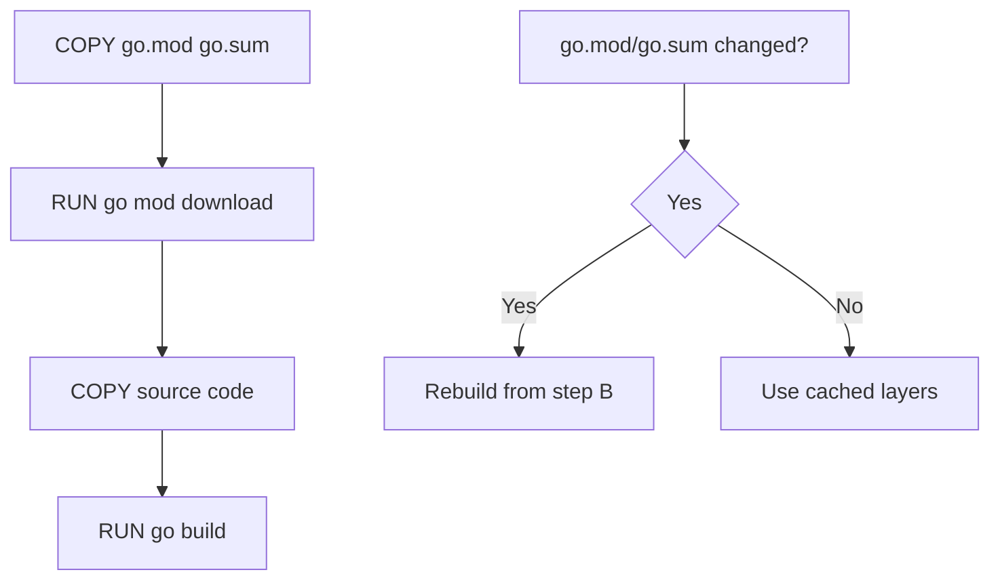

# Documentación Técnica: Dockerfile

## Descripción General

El Dockerfile implementa una estrategia de construcción multi-stage optimizada para aplicaciones Go que requieren acceso a repositorios privados. Utiliza técnicas avanzadas de Docker como SSH mount, build cache y optimizaciones de seguridad para crear una imagen de producción mínima y segura.

## Estructura del Archivo

### Arquitectura Multi-Stage

El Dockerfile está dividido en dos etapas principales:
1. **Builder Stage**: Compilación de la aplicación
2. **Runner Stage**: Imagen final de producción

## Etapa 1: Builder

### Imagen Base

```dockerfile
FROM golang:1.23-alpine AS builder
```

**Análisis de la Elección:**
- **`golang:1.23-alpine`**: Imagen oficial de Go con Alpine Linux
- **Versión específica**: `1.23` asegura compilaciones reproducibles
- **Alpine**: Distribución minimalista que reduce el tamaño de la imagen
- **AS builder**: Nombra la etapa para referencia posterior

**Ventajas de Alpine:**
- **Tamaño**: Significativamente más pequeña que distribuciones completas
- **Seguridad**: Menor superficie de ataque
- **Performance**: Menos overhead del sistema operativo

### Instalación de Herramientas

```dockerfile
# 1. INSTALAR HERRAMIENTAS
# Solo necesitamos git y el cliente de openssh.
RUN apk add --no-cache git openssh-client
```

**Análisis de Herramientas:**

#### `git`
- **Propósito**: Clonado de repositorios privados
- **Uso**: `go mod download` necesita git para repositorios privados
- **Alternativa**: Podría usar HTTPS con tokens, pero SSH es más seguro

#### `openssh-client`
- **Propósito**: Autenticación SSH para repositorios privados
- **Componentes**: `ssh`, `ssh-keygen`, `ssh-agent`
- **Seguridad**: Permite autenticación sin exponer credenciales

#### `--no-cache`
- **Propósito**: No almacena cache de paquetes APK
- **Beneficio**: Reduce tamaño de la imagen final
- **Trade-off**: Builds posteriores no pueden reutilizar cache de paquetes

### Configuración del Entorno

```dockerfile
# 2. CONFIGURAR EL ENTORNO
# Establece el directorio de trabajo dentro del contenedor.
WORKDIR /app
```

**Análisis:**
- **`/app`**: Directorio estándar para aplicaciones
- **Consistencia**: Mismo directorio en builder y runner
- **Organización**: Separa código de aplicación del sistema

### Configuración de Go y Git

```dockerfile
# 3. CONFIGURAR GO Y GIT PARA MÓDULOS PRIVADOS
# Le dice a Go que los repos de tu organización son privados y no deben buscarse en proxies públicos.
ENV GOPRIVATE="github.com/Venqis-NolaTech/*"
# Le indica a la herramienta 'go' que use git directamente para estos repos.
ENV GONOPROXY="github.com/Venqis-NolaTech/*"
# La magia de Git: Reemplaza cualquier intento de clonar por HTTPS con SSH.
# Esto es crucial porque 'go get' por defecto intenta usar HTTPS.
RUN git config --global url.ssh://git@github.com/.insteadOf https://github.com/
```

**Análisis Detallado:**

#### `GOPRIVATE="github.com/Venqis-NolaTech/*"`
- **Propósito**: Marca repositorios como privados
- **Efecto**: Go no intentará usar proxies públicos (proxy.golang.org)
- **Patrón**: Wildcard `*` cubre todos los repos de la organización
- **Seguridad**: Evita filtración de nombres de módulos privados

#### `GONOPROXY="github.com/Venqis-NolaTech/*"`
- **Propósito**: Desactiva proxy para repositorios específicos
- **Comportamiento**: Go irá directamente al repositorio
- **Redundancia**: Refuerza la configuración de GOPRIVATE
- **Compatibilidad**: Asegura funcionamiento en diferentes versiones de Go

#### `git config --global url.ssh://git@github.com/.insteadOf https://github.com/`
- **Propósito**: Redirige HTTPS a SSH para GitHub
- **Mecánica**: Git reescribe URLs automáticamente
- **Ejemplo**: `https://github.com/user/repo.git` → `ssh://git@github.com/user/repo.git`
- **Beneficio**: Permite autenticación SSH transparente

### Descarga de Dependencias

```dockerfile
# 4. DESCARGAR DEPENDENCIAS (APROVECHANDO LA CACHÉ)
# Copiamos solo los archivos de dependencias primero. Si no cambian, Docker
# usará la capa de caché de este paso, ahorrando mucho tiempo.
COPY go.mod go.sum ./
```

**Análisis de la Estrategia de Cache:**

#### Separación de Dependencias
- **Archivos copiados**: Solo `go.mod` y `go.sum`
- **Código fuente**: No se copia aún
- **Beneficio**: Cache layer independiente para dependencias

#### Docker Layer Caching


#### Optimización de Build Time
- **Caso común**: Código cambia, dependencias no
- **Resultado**: Solo se rebuilds desde la copia del código fuente
- **Ahorro**: Significativo en proyectos con muchas dependencias

### Descarga Segura con SSH Mount

```dockerfile
# 5. EL PASO CLAVE: DESCARGA SEGURA CON MONTAJE SSH
# Este es el núcleo de la solución.
# --mount=type=ssh,id=default: Monta de forma segura el socket del agente SSH del host. La clave NUNCA entra al contenedor.
# --mount=type=cache: Usa una caché persistente de Docker para los módulos descargados.
RUN --mount=type=ssh,id=default \
    --mount=type=cache,target=/go/pkg/mod \
    sh -c "mkdir -p -m 0700 ~/.ssh && ssh-keyscan github.com >> ~/.ssh/known_hosts && go mod download"
```

**Análisis de Técnicas Avanzadas:**

#### SSH Mount (`--mount=type=ssh,id=default`)
- **Tecnología**: BuildKit feature para SSH forwarding
- **Seguridad**: SSH keys nunca entran al contenedor
- **Mecánica**: Monta socket SSH del host temporalmente
- **Beneficio**: Autenticación segura sin exponer credenciales

#### Cache Mount (`--mount=type=cache,target=/go/pkg/mod`)
- **Propósito**: Cache persistente de módulos Go
- **Ubicación**: `/go/pkg/mod` (directorio estándar de Go)
- **Persistencia**: Cache sobrevive entre builds
- **Compartición**: Compartido entre diferentes builds

#### Configuración SSH
```bash
mkdir -p -m 0700 ~/.ssh
```
- **Directorio**: Crea directorio SSH con permisos correctos
- **Permisos**: `0700` (solo owner puede leer/escribir/ejecutar)
- **Seguridad**: Permisos restrictivos requeridos por SSH

```bash
ssh-keyscan github.com >> ~/.ssh/known_hosts
```
- **Propósito**: Agrega GitHub a hosts conocidos
- **Seguridad**: Previene ataques man-in-the-middle
- **Automatización**: Evita prompts interactivos

```bash
go mod download
```
- **Acción**: Descarga todas las dependencias
- **Cache**: Utiliza cache mount para persistencia
- **SSH**: Usa SSH mount para repositorios privados

### Compilación de la Aplicación

```dockerfile
# 6. COPIAR Y COMPILAR EL CÓDIGO FUENTE
# Ahora que las dependencias están resueltas, copiamos el resto del código.
COPY . .

# Compilamos la aplicación creando un binario estático y sin información de depuración.
RUN --mount=type=cache,target=/root/.cache/go-build \
    --mount=type=cache,target=/go/pkg/mod \
    CGO_ENABLED=0 GOOS=linux go build -ldflags="-s -w" -o /app/main .
```

**Análisis de la Compilación:**

#### Copia del Código Fuente
```dockerfile
COPY . .
```
- **Timing**: Después de descargar dependencias
- **Contenido**: Todo el código fuente de la aplicación
- **Cache**: Layer separado que se invalida cuando cambia el código

#### Build Caches
```dockerfile
--mount=type=cache,target=/root/.cache/go-build
--mount=type=cache,target=/go/pkg/mod
```
- **Build cache**: Cache de compilación de Go
- **Module cache**: Cache de módulos (reutilizado del paso anterior)
- **Performance**: Compilaciones incrementales más rápidas

#### Flags de Compilación
```dockerfile
CGO_ENABLED=0 GOOS=linux go build -ldflags="-s -w" -o /app/main .
```

**Análisis de Flags:**

##### `CGO_ENABLED=0`
- **Propósito**: Desactiva CGO (C bindings)
- **Resultado**: Binario estático sin dependencias de C
- **Beneficio**: Funciona en cualquier distribución Linux
- **Trade-off**: No puede usar librerías C

##### `GOOS=linux`
- **Propósito**: Especifica sistema operativo target
- **Necesario**: Cuando se compila desde diferente OS
- **Consistencia**: Asegura binario compatible con Alpine

##### `-ldflags="-s -w"`
- **`-s`**: Elimina tabla de símbolos
- **`-w`**: Elimina información de debugging (DWARF)
- **Beneficio**: Reduce significativamente el tamaño del binario
- **Trade-off**: Debugging más difícil en producción

##### `-o /app/main`
- **Propósito**: Especifica nombre y ubicación del binario
- **Ubicación**: `/app/main` para fácil copia a la siguiente etapa

## Etapa 2: Runner

### Imagen Base Mínima

```dockerfile
FROM alpine:3.20 AS runner
```

**Análisis de la Elección:**
- **Alpine 3.20**: Versión específica para reproducibilidad
- **Minimalismo**: Solo lo esencial para ejecutar la aplicación
- **Seguridad**: Menor superficie de ataque
- **Tamaño**: Imagen final muy pequeña

### Instalación de Dependencias Runtime

```dockerfile
# Instala solo los paquetes absolutamente necesarios para la ejecución.
# ca-certificates es esencial para hacer llamadas HTTPS desde tu aplicación.
RUN apk add --no-cache ca-certificates tzdata curl
```

**Análisis de Paquetes:**

#### `ca-certificates`
- **Propósito**: Certificados de autoridades certificadoras
- **Necesario**: Para conexiones HTTPS/TLS
- **Uso**: Validación de certificados SSL
- **Crítico**: Sin esto, las conexiones HTTPS fallan

#### `tzdata`
- **Propósito**: Base de datos de zonas horarias
- **Uso**: Conversiones de tiempo y timestamps
- **Beneficio**: Soporte completo para zonas horarias
- **Tamaño**: Relativamente pequeño pero muy útil

#### `curl`
- **Propósito**: Cliente HTTP para debugging y health checks
- **Uso**: Health checks, debugging de conectividad
- **Alternativa**: Podría omitirse si no se necesita
- **Conveniencia**: Útil para troubleshooting

### Configuración del Directorio de Trabajo

```dockerfile
WORKDIR /app

# Copia ÚNICAMENTE el binario compilado de la etapa 'builder'.
# La imagen final no contiene código fuente, herramientas de compilación ni claves SSH.
COPY --from=builder /app/main /app/main

RUN mkdir -p /app/config
```

**Análisis de la Configuración:**

#### Copia Selectiva
```dockerfile
COPY --from=builder /app/main /app/main
```
- **Multi-stage**: Copia desde la etapa builder
- **Selectivo**: Solo el binario, no el código fuente
- **Seguridad**: No expone código fuente en imagen final
- **Tamaño**: Imagen final mínima

#### Directorio de Configuración
```dockerfile
RUN mkdir -p /app/config
```
- **Propósito**: Directorio para archivos de configuración
- **Mount point**: Puede montarse desde el host
- **Flexibilidad**: Permite configuración externa

### Configuración de Red

```dockerfile
# Expone el puerto que tu aplicación escucha.
EXPOSE 8080
```

**Análisis:**
- **Puerto**: 8080 (puerto estándar para aplicaciones web)
- **Documentación**: Informa qué puerto usa la aplicación
- **No funcional**: No abre el puerto, solo documenta
- **Orquestación**: Útil para herramientas como Kubernetes

### Configuración de Seguridad

```dockerfile
# Define el usuario no-root para ejecutar la aplicación (Buena práctica de seguridad)
RUN addgroup -S appgroup && adduser -S appuser -G appgroup
USER appuser
```

**Análisis de Seguridad:**

#### Creación de Usuario
```dockerfile
RUN addgroup -S appgroup && adduser -S appuser -G appgroup
```
- **`-S`**: Sistema (system user/group)
- **Grupo**: `appgroup` para organización
- **Usuario**: `appuser` sin privilegios especiales
- **Membresía**: Usuario pertenece al grupo

#### Cambio de Usuario
```dockerfile
USER appuser
```
- **Seguridad**: Aplicación no ejecuta como root
- **Principio**: Menor privilegio posible
- **Protección**: Limita daño en caso de compromiso
- **Compliance**: Requerido por muchas políticas de seguridad

### Comando de Inicio

```dockerfile
# El comando para iniciar tu aplicación.
CMD ["/app/main", "--config-file=/app/config/config.json"]
```

**Análisis del Comando:**
- **Formato exec**: `["executable", "param1", "param2"]`
- **Ventaja**: No usa shell, más eficiente y seguro
- **Configuración**: Especifica archivo de configuración
- **Flexibilidad**: Puede sobrescribirse en runtime

## Uso del Dockerfile

### Construcción con SSH

```bash
# Habilitar BuildKit
export DOCKER_BUILDKIT=1

# Build con SSH agent forwarding
docker build --ssh default .

# Build con SSH key específica
docker build --ssh default=$HOME/.ssh/id_rsa .
```

### Construcción con Cache

```bash
# Build aprovechando cache
docker build \
  --ssh default \
  --cache-from myapp:builder \
  --cache-from myapp:latest \
  -t myapp:latest .
```

### Variables de Build

```bash
# Build con argumentos
docker build \
  --ssh default \
  --build-arg GO_VERSION=1.23 \
  --build-arg ALPINE_VERSION=3.20 \
  -t myapp:latest .
```

## Optimizaciones Implementadas

### 1. Multi-Stage Build
- **Separación**: Build environment vs runtime environment
- **Tamaño**: Imagen final mínima
- **Seguridad**: No expone herramientas de desarrollo

### 2. Layer Caching
- **Dependencias**: Cache separado para go.mod/go.sum
- **Build cache**: Cache persistente de compilación
- **Module cache**: Cache de módulos Go

### 3. SSH Mount Security
- **No exposure**: SSH keys nunca entran al contenedor
- **Temporary**: Mount solo durante build
- **Secure**: Usa SSH agent del host

### 4. Static Binary
- **No dependencies**: Binario estático sin dependencias C
- **Portability**: Funciona en cualquier Linux
- **Size**: Optimizado con ldflags

## Consideraciones de Seguridad

### 1. Secrets Management
- **SSH keys**: Nunca en la imagen
- **Build args**: No para secrets
- **Runtime**: Usar secrets management

### 2. User Security
- **Non-root**: Aplicación ejecuta como usuario sin privilegios
- **Minimal permissions**: Solo permisos necesarios
- **Group isolation**: Usuario en grupo específico

### 3. Image Security
- **Minimal base**: Alpine reduce superficie de ataque
- **No dev tools**: Imagen final sin herramientas de desarrollo
- **Regular updates**: Usar versiones específicas y actualizarlas

## Monitoreo y Debugging

### Health Check

```dockerfile
# Agregar health check
HEALTHCHECK --interval=30s --timeout=3s --start-period=5s --retries=3 \
  CMD curl -f http://localhost:8080/health || exit 1
```

### Logging

```dockerfile
# Configurar logging
ENV LOG_LEVEL=info
ENV LOG_FORMAT=json
```

### Metrics

```dockerfile
# Exponer puerto de métricas
EXPOSE 9090
```

## Mejores Prácticas Implementadas

1. **Multi-stage builds**: Separación de build y runtime
2. **Layer caching**: Optimización de build times
3. **SSH security**: Acceso seguro a repos privados
4. **Static binaries**: Portabilidad y seguridad
5. **Non-root user**: Principio de menor privilegio
6. **Minimal runtime**: Solo dependencias necesarias
7. **Reproducible builds**: Versiones específicas
8. **Documentation**: Comentarios explicativos detallados

Este Dockerfile representa un ejemplo avanzado de construcción de imágenes Docker para aplicaciones Go, implementando las mejores prácticas de seguridad, performance y mantenibilidad.