# 🚀 Guía Completa de Migración: PostgreSQL ↔ ScyllaDB

## 📋 Índice
1. [Decisión: ¿Cuándo Migrar?](#decisión-cuándo-migrar)
2. [Preparación Pre-Migración](#preparación-pre-migración)
3. [Estrategias de Migración](#estrategias-de-migración)
4. [Implementación Paso a Paso](#implementación-paso-a-paso)
5. [Validación y Testing](#validación-y-testing)
6. [Rollback y Contingencias](#rollback-y-contingencias)
7. [Optimización Post-Migración](#optimización-post-migración)

---

## 🎯 Decisión: ¿Cuándo Migrar?

### 📊 Matriz de Decisión

| Métrica | PostgreSQL | ScyllaDB | Umbral de Migración |
|---------|------------|----------|-------------------|
| **Usuarios Activos** | < 100K | > 100K | 50K+ usuarios |
| **Mensajes/Segundo** | < 1K | > 10K | 5K+ msg/s |
| **Latencia P95** | < 100ms | < 10ms | > 50ms actual |
| **Tamaño de DB** | < 100GB | > 1TB | 500GB+ |
| **Disponibilidad** | 99.9% | 99.99% | Necesidad crítica |

### 🔍 Evaluación de tu Sistema Actual

#### Script de Análisis PostgreSQL
```sql
-- 1. Análisis de carga actual
SELECT 
    schemaname,
    tablename,
    n_tup_ins as inserts,
    n_tup_upd as updates,
    n_tup_del as deletes,
    n_tup_ins + n_tup_upd + n_tup_del as total_operations
FROM pg_stat_user_tables 
ORDER BY total_operations DESC;

-- 2. Queries más lentas
SELECT 
    query,
    calls,
    total_time,
    mean_time,
    stddev_time
FROM pg_stat_statements 
ORDER BY mean_time DESC 
LIMIT 10;

-- 3. Tamaño de tablas
SELECT 
    schemaname,
    tablename,
    pg_size_pretty(pg_total_relation_size(schemaname||'.'||tablename)) as size
FROM pg_tables 
WHERE schemaname = 'public'
ORDER BY pg_total_relation_size(schemaname||'.'||tablename) DESC;

-- 4. Análisis de concurrencia
SELECT 
    datname,
    numbackends,
    xact_commit,
    xact_rollback,
    blks_read,
    blks_hit,
    tup_returned,
    tup_fetched,
    tup_inserted,
    tup_updated,
    tup_deleted
FROM pg_stat_database 
WHERE datname = current_database();
```

#### Métricas de Decisión
```go
type MigrationMetrics struct {
    // Métricas de carga
    MessagesPerSecond    float64
    ActiveUsers          int64
    DatabaseSize         int64 // en bytes
    
    // Métricas de performance
    AvgQueryLatency      time.Duration
    P95QueryLatency      time.Duration
    P99QueryLatency      time.Duration
    
    // Métricas de escalabilidad
    CPUUtilization       float64
    MemoryUtilization    float64
    DiskIOPS             float64
    
    // Métricas de disponibilidad
    UptimePercentage     float64
    ErrorRate            float64
}

func (m *MigrationMetrics) ShouldMigrate() bool {
    return m.MessagesPerSecond > 5000 ||
           m.ActiveUsers > 50000 ||
           m.P95QueryLatency > 50*time.Millisecond ||
           m.DatabaseSize > 500*1024*1024*1024 // 500GB
}
```

---

## 🛠️ Preparación Pre-Migración

### 1. **Setup del Entorno ScyllaDB**

#### Docker Compose para Desarrollo
```yaml
version: '3.8'
services:
  scylla:
    image: scylladb/scylla:5.2
    container_name: scylla-dev
    ports:
      - "9042:9042"
      - "9160:9160"
      - "10000:10000"
    volumes:
      - scylla-data:/var/lib/scylla
    command: --seeds=scylla --smp 1 --memory 2G --overprovisioned 1 --api-address 0.0.0.0
    
  scylla-monitoring:
    image: scylladb/scylla-monitoring:4.4
    container_name: scylla-monitoring
    ports:
      - "3000:3000"  # Grafana
      - "9090:9090"  # Prometheus
    volumes:
      - ./monitoring:/opt/scylla-monitoring
    depends_on:
      - scylla

volumes:
  scylla-data:
```

#### Configuración de Keyspace
```cql
-- Crear keyspace con replicación
CREATE KEYSPACE IF NOT EXISTS chat_keyspace 
WITH REPLICATION = {
    'class': 'NetworkTopologyStrategy',
    'datacenter1': 3
} AND DURABLE_WRITES = true;

USE chat_keyspace;

-- Aplicar schema completo
SOURCE 'schema.cql';
```

### 2. **Configuración de la Aplicación**

#### Variables de Entorno Extendidas
```bash
# Configuración de migración
MIGRATION_MODE=dual_write          # none, dual_write, scylla_primary
MIGRATION_BATCH_SIZE=1000
MIGRATION_WORKERS=10
MIGRATION_VALIDATION_ENABLED=true

# ScyllaDB específico
SCYLLA_HOSTS=127.0.0.1:9042,127.0.0.2:9042,127.0.0.3:9042
SCYLLA_KEYSPACE=chat_keyspace
SCYLLA_CONSISTENCY_READ=LOCAL_QUORUM
SCYLLA_CONSISTENCY_WRITE=LOCAL_QUORUM
SCYLLA_TIMEOUT=5s
SCYLLA_RETRY_POLICY=exponential

# PostgreSQL específico
POSTGRES_MAX_CONNECTIONS=100
POSTGRES_CONNECTION_TIMEOUT=30s
POSTGRES_STATEMENT_TIMEOUT=60s

# Configuración de caché
CACHE_TTL_ROOMS=1h
CACHE_TTL_MESSAGES=30m
CACHE_INVALIDATION_STRATEGY=immediate

# Monitoreo
METRICS_ENABLED=true
METRICS_PORT=9090
TRACING_ENABLED=true
TRACING_SAMPLE_RATE=0.1
```

### 3. **Herramientas de Migración**

#### Migrator Service
```go
package migration

import (
    "context"
    "fmt"
    "sync"
    "time"
)

type MigrationConfig struct {
    BatchSize       int
    Workers         int
    ValidationMode  bool
    DryRun          bool
    StartDate       time.Time
    EndDate         time.Time
}

type Migrator struct {
    pgRepo      roomsrepository.RoomsRepository
    scyllaRepo  roomsrepository.RoomsRepository
    config      MigrationConfig
    metrics     *MigrationMetrics
}

func NewMigrator(pg, scylla roomsrepository.RoomsRepository, config MigrationConfig) *Migrator {
    return &Migrator{
        pgRepo:     pg,
        scyllaRepo: scylla,
        config:     config,
        metrics:    NewMigrationMetrics(),
    }
}

func (m *Migrator) MigrateAll(ctx context.Context) error {
    log.Info("Starting full migration", "config", m.config)
    
    // 1. Migrar estructura de salas
    if err := m.migrateRooms(ctx); err != nil {
        return fmt.Errorf("failed to migrate rooms: %w", err)
    }
    
    // 2. Migrar mensajes en paralelo
    if err := m.migrateMessages(ctx); err != nil {
        return fmt.Errorf("failed to migrate messages: %w", err)
    }
    
    // 3. Migrar metadatos
    if err := m.migrateMetadata(ctx); err != nil {
        return fmt.Errorf("failed to migrate metadata: %w", err)
    }
    
    // 4. Validar consistencia
    if m.config.ValidationMode {
        if err := m.validateConsistency(ctx); err != nil {
            return fmt.Errorf("validation failed: %w", err)
        }
    }
    
    log.Info("Migration completed successfully", "metrics", m.metrics)
    return nil
}

func (m *Migrator) migrateRooms(ctx context.Context) error {
    log.Info("Migrating rooms...")
    
    offset := 0
    for {
        rooms, err := m.pgRepo.GetRoomsBatch(ctx, offset, m.config.BatchSize)
        if err != nil {
            return err
        }
        
        if len(rooms) == 0 {
            break
        }
        
        for _, room := range rooms {
            if !m.config.DryRun {
                if err := m.scyllaRepo.CreateRoom(ctx, room.CreatorID, room.ToCreateRequest()); err != nil {
                    log.Error("Failed to migrate room", "id", room.ID, "error", err)
                    m.metrics.FailedRooms++
                    continue
                }
            }
            m.metrics.MigratedRooms++
        }
        
        offset += m.config.BatchSize
        log.Info("Migrated rooms batch", "offset", offset, "count", len(rooms))
    }
    
    return nil
}

func (m *Migrator) migrateMessages(ctx context.Context) error {
    log.Info("Migrating messages with parallel workers", "workers", m.config.Workers)
    
    // Canal para distribuir trabajo
    workChan := make(chan MessageBatch, m.config.Workers*2)
    
    // WaitGroup para workers
    var wg sync.WaitGroup
    
    // Iniciar workers
    for i := 0; i < m.config.Workers; i++ {
        wg.Add(1)
        go m.messageWorker(ctx, workChan, &wg)
    }
    
    // Generar batches de trabajo
    go func() {
        defer close(workChan)
        
        offset := 0
        for {
            messages, err := m.pgRepo.GetMessagesBatch(ctx, offset, m.config.BatchSize, m.config.StartDate, m.config.EndDate)
            if err != nil {
                log.Error("Failed to get messages batch", "error", err)
                return
            }
            
            if len(messages) == 0 {
                break
            }
            
            workChan <- MessageBatch{
                Messages: messages,
                Offset:   offset,
            }
            
            offset += m.config.BatchSize
        }
    }()
    
    // Esperar a que terminen todos los workers
    wg.Wait()
    
    return nil
}

func (m *Migrator) messageWorker(ctx context.Context, workChan <-chan MessageBatch, wg *sync.WaitGroup) {
    defer wg.Done()
    
    for batch := range workChan {
        for _, message := range batch.Messages {
            if !m.config.DryRun {
                if err := m.scyllaRepo.SaveMessage(ctx, message.SenderID, message.ToSaveRequest(), nil, &message.ContentDecrypted); err != nil {
                    log.Error("Failed to migrate message", "id", message.ID, "error", err)
                    m.metrics.FailedMessages++
                    continue
                }
            }
            m.metrics.MigratedMessages++
        }
        
        log.Info("Completed message batch", "offset", batch.Offset, "count", len(batch.Messages))
    }
}
```

---

## 🔄 Estrategias de Migración

### Estrategia 1: **Big Bang Migration** 
*Recomendado para: Aplicaciones pequeñas con ventana de mantenimiento*


#### Implementación
```go
func BigBangMigration(ctx context.Context) error {
    // 1. Poner aplicación en modo mantenimiento
    if err := setMaintenanceMode(true); err != nil {
        return err
    }
    defer setMaintenanceMode(false)
    
    // 2. Migrar todos los datos
    migrator := NewMigrator(pgRepo, scyllaRepo, MigrationConfig{
        BatchSize: 5000,
        Workers:   20,
        ValidationMode: true,
    })
    
    if err := migrator.MigrateAll(ctx); err != nil {
        return err
    }
    
    // 3. Cambiar configuración a ScyllaDB
    if err := updateConfig("USE_SCYLLADB", "true"); err != nil {
        return err
    }
    
    // 4. Reiniciar aplicación
    return restartApplication()
}
```

### Estrategia 2: **Dual Write Pattern**
*Recomendado para: Aplicaciones medianas con alta disponibilidad*

```mermaid
graph TB
    App[Aplicación] --> Router[Write Router]
    Router --> PG[(PostgreSQL)]
    Router --> Scylla[(ScyllaDB)]
    Router --> Sync[Sync Service]
    
    App --> ReadRouter[Read Router]
    ReadRouter --> PG
    ReadRouter --> Scylla
```



#### Implementación
```go
type DualWriteRepository struct {
    primary   roomsrepository.RoomsRepository // PostgreSQL
    secondary roomsrepository.RoomsRepository // ScyllaDB
    config    DualWriteConfig
}

type DualWriteConfig struct {
    WriteToSecondary bool
    ReadFromSecondary bool
    SyncAsync        bool
    FailoverEnabled  bool
}

func (r *DualWriteRepository) SaveMessage(ctx context.Context, userId int, req *chatv1.SendMessageRequest, room *chatv1.Room, contentDecrypted *string) (*chatv1.MessageData, error) {
    // Escribir a fuente primaria (PostgreSQL)
    msg, err := r.primary.SaveMessage(ctx, userId, req, room, contentDecrypted)
    if err != nil {
        return nil, fmt.Errorf("primary write failed: %w", err)
    }
    
    // Escribir a fuente secundaria (ScyllaDB)
    if r.config.WriteToSecondary {
        if r.config.SyncAsync {
            // Escritura asíncrona
            go func() {
                if err := r.secondary.SaveMessage(ctx, userId, req, room, contentDecrypted); err != nil {
                    log.Error("Secondary write failed", "error", err, "messageId", msg.Id)
                    // Enviar a cola de retry
                    retryQueue.Push(RetryItem{
                        Operation: "SaveMessage",
                        Data:      req,
                        Timestamp: time.Now(),
                    })
                }
            }()
        } else {
            // Escritura síncrona
            if err := r.secondary.SaveMessage(ctx, userId, req, room, contentDecrypted); err != nil {
                log.Error("Secondary write failed", "error", err)
                // No fallar la operación principal
            }
        }
    }
    
    return msg, nil
}

func (r *DualWriteRepository) GetMessagesFromRoom(ctx context.Context, userId int, req *chatv1.GetMessageHistoryRequest) ([]*chatv1.MessageData, *chatv1.PaginationMeta, error) {
    if r.config.ReadFromSecondary {
        // Intentar leer de ScyllaDB primero
        messages, meta, err := r.secondary.GetMessagesFromRoom(ctx, userId, req)
        if err == nil {
            return messages, meta, nil
        }
        
        log.Warn("Secondary read failed, falling back to primary", "error", err)
    }
    
    // Fallback a PostgreSQL
    return r.primary.GetMessagesFromRoom(ctx, userId, req)
}
```

### Estrategia 3: **Gradual Migration**
*Recomendado para: Aplicaciones grandes con múltiples features*


#### Implementación por Features
```go
type FeatureBasedRepository struct {
    pgRepo     roomsrepository.RoomsRepository
    scyllaRepo roomsrepository.RoomsRepository
    features   FeatureFlags
}

type FeatureFlags struct {
    MessagesOnScylla    bool
    RoomsOnScylla      bool
    NewUsersOnScylla   bool
    UserMigrationList  map[int]bool
}

func (r *FeatureBasedRepository) SaveMessage(ctx context.Context, userId int, req *chatv1.SendMessageRequest, room *chatv1.Room, contentDecrypted *string) (*chatv1.MessageData, error) {
    // Decidir qué repositorio usar basado en feature flags
    if r.shouldUseScyllaForUser(userId) && r.features.MessagesOnScylla {
        return r.scyllaRepo.SaveMessage(ctx, userId, req, room, contentDecrypted)
    }
    
    return r.pgRepo.SaveMessage(ctx, userId, req, room, contentDecrypted)
}

func (r *FeatureBasedRepository) shouldUseScyllaForUser(userId int) bool {
    // Nuevos usuarios van a ScyllaDB
    if r.features.NewUsersOnScylla && r.isNewUser(userId) {
        return true
    }
    
    // Usuarios específicamente migrados
    if migrated, exists := r.features.UserMigrationList[userId]; exists && migrated {
        return true
    }
    
    return false
}

func (r *FeatureBasedRepository) isNewUser(userId int) bool {
    // Lógica para determinar si es un usuario nuevo
    // Por ejemplo, usuarios creados después de cierta fecha
    user, err := r.pgRepo.GetUserByID(context.Background(), userId)
    if err != nil {
        return false
    }
    
    migrationStartDate := time.Date(2024, 1, 1, 0, 0, 0, 0, time.UTC)
    return user.CreatedAt.After(migrationStartDate)
}
```

---

## 📝 Implementación Paso a Paso

### Paso 1: **Configuración Inicial**

#### 1.1 Actualizar Configuración
```go
// config/migration.go
type MigrationConfig struct {
    Enabled           bool          `env:"MIGRATION_ENABLED" default:"false"`
    Strategy          string        `env:"MIGRATION_STRATEGY" default:"dual_write"`
    BatchSize         int           `env:"MIGRATION_BATCH_SIZE" default:"1000"`
    Workers           int           `env:"MIGRATION_WORKERS" default:"5"`
    ValidationEnabled bool          `env:"MIGRATION_VALIDATION" default:"true"`
    DryRun           bool          `env:"MIGRATION_DRY_RUN" default:"false"`
    
    // Configuración de dual write
    WriteToSecondary  bool          `env:"DUAL_WRITE_SECONDARY" default:"false"`
    ReadFromSecondary bool          `env:"DUAL_READ_SECONDARY" default:"false"`
    AsyncWrites      bool          `env:"DUAL_WRITE_ASYNC" default:"true"`
    
    // Configuración de rollback
    RollbackEnabled  bool          `env:"ROLLBACK_ENABLED" default:"true"`
    BackupEnabled    bool          `env:"BACKUP_ENABLED" default:"true"`
}
```

#### 1.2 Implementar Factory Pattern
```go
// repository/factory.go
func NewRoomsRepository(config Config) roomsrepository.RoomsRepository {
    pgRepo := roomsrepository.NewSQLRoomRepository(database.DB())
    
    if !config.Migration.Enabled {
        // Modo normal - solo PostgreSQL
        return pgRepo
    }
    
    scyllaRepo := roomsrepository.NewScyllaRoomRepository(database.CQLDB(), pgRepo)
    
    switch config.Migration.Strategy {
    case "dual_write":
        return NewDualWriteRepository(pgRepo, scyllaRepo, config.Migration)
    case "feature_based":
        return NewFeatureBasedRepository(pgRepo, scyllaRepo, config.Features)
    case "scylla_primary":
        return scyllaRepo
    default:
        return pgRepo
    }
}
```

### Paso 2: **Implementar Monitoreo**

#### 2.1 Métricas de Migración
```go
// metrics/migration.go
var (
    migrationOperations = prometheus.NewCounterVec(
        prometheus.CounterOpts{
            Name: "migration_operations_total",
            Help: "Total number of migration operations",
        },
        []string{"operation", "status", "database"},
    )
    
    migrationLatency = prometheus.NewHistogramVec(
        prometheus.HistogramOpts{
            Name: "migration_operation_duration_seconds",
            Help: "Duration of migration operations",
        },
        []string{"operation", "database"},
    )
    
    migrationErrors = prometheus.NewCounterVec(
        prometheus.CounterOpts{
            Name: "migration_errors_total",
            Help: "Total number of migration errors",
        },
        []string{"operation", "error_type"},
    )
)

func RecordMigrationOperation(operation, status, database string, duration time.Duration) {
    migrationOperations.WithLabelValues(operation, status, database).Inc()
    migrationLatency.WithLabelValues(operation, database).Observe(duration.Seconds())
}

func RecordMigrationError(operation, errorType string) {
    migrationErrors.WithLabelValues(operation, errorType).Inc()
}
```

#### 2.2 Health Checks Específicos
```go
// health/migration.go
type MigrationHealthChecker struct {
    pgRepo     roomsrepository.RoomsRepository
    scyllaRepo roomsrepository.RoomsRepository
    config     MigrationConfig
}

func (h *MigrationHealthChecker) Check(ctx context.Context) error {
    var errors []error
    
    // Check PostgreSQL
    if err := h.checkPostgreSQL(ctx); err != nil {
        errors = append(errors, fmt.Errorf("PostgreSQL: %w", err))
    }
    
    // Check ScyllaDB si está habilitado
    if h.config.Enabled {
        if err := h.checkScyllaDB(ctx); err != nil {
            errors = append(errors, fmt.Errorf("ScyllaDB: %w", err))
        }
        
        // Check consistencia si está en modo dual
        if h.config.Strategy == "dual_write" && h.config.ValidationEnabled {
            if err := h.checkConsistency(ctx); err != nil {
                errors = append(errors, fmt.Errorf("Consistency: %w", err))
            }
        }
    }
    
    if len(errors) > 0 {
        return fmt.Errorf("health check failed: %v", errors)
    }
    
    return nil
}

func (h *MigrationHealthChecker) checkConsistency(ctx context.Context) error {
    // Verificar consistencia de una muestra pequeña
    sampleSize := 10
    
    // Obtener mensajes recientes de ambas fuentes
    pgMessages, _, err := h.pgRepo.GetMessagesFromRoom(ctx, 0, &chatv1.GetMessageHistoryRequest{
        Limit: uint32(sampleSize),
    })
    if err != nil {
        return fmt.Errorf("failed to get PG messages: %w", err)
    }
    
    scyllaMessages, _, err := h.scyllaRepo.GetMessagesFromRoom(ctx, 0, &chatv1.GetMessageHistoryRequest{
        Limit: uint32(sampleSize),
    })
    if err != nil {
        return fmt.Errorf("failed to get Scylla messages: %w", err)
    }
    
    // Comparar conteos
    if len(pgMessages) != len(scyllaMessages) {
        return fmt.Errorf("message count mismatch: PG=%d, Scylla=%d", len(pgMessages), len(scyllaMessages))
    }
    
    return nil
}
```

### Paso 3: **Implementar Validación**

#### 3.1 Validador de Consistencia
```go
// validation/consistency.go
type ConsistencyValidator struct {
    pgRepo     roomsrepository.RoomsRepository
    scyllaRepo roomsrepository.RoomsRepository
    logger     *slog.Logger
}

func (v *ConsistencyValidator) ValidateMessages(ctx context.Context, roomID string, limit int) error {
    // Obtener mensajes de ambas fuentes
    pgMessages, err := v.getMessagesFromPG(ctx, roomID, limit)
    if err != nil {
        return fmt.Errorf("failed to get PG messages: %w", err)
    }
    
    scyllaMessages, err := v.getMessagesFromScylla(ctx, roomID, limit)
    if err != nil {
        return fmt.Errorf("failed to get Scylla messages: %w", err)
    }
    
    // Crear mapas para comparación
    pgMap := make(map[string]*chatv1.MessageData)
    for _, msg := range pgMessages {
        pgMap[msg.Id] = msg
    }
    
    scyllaMap := make(map[string]*chatv1.MessageData)
    for _, msg := range scyllaMessages {
        scyllaMap[msg.Id] = msg
    }
    
    // Verificar que todos los mensajes de PG estén en Scylla
    var missingInScylla []string
    for id, pgMsg := range pgMap {
        scyllaMsg, exists := scyllaMap[id]
        if !exists {
            missingInScylla = append(missingInScylla, id)
            continue
        }
        
        // Verificar contenido
        if err := v.compareMessages(pgMsg, scyllaMsg); err != nil {
            v.logger.Error("Message content mismatch", "id", id, "error", err)
        }
    }
    
    // Verificar que no haya mensajes extra en Scylla
    var extraInScylla []string
    for id := range scyllaMap {
        if _, exists := pgMap[id]; !exists {
            extraInScylla = append(extraInScylla, id)
        }
    }
    
    if len(missingInScylla) > 0 || len(extraInScylla) > 0 {
        return fmt.Errorf("consistency check failed: missing in Scylla: %v, extra in Scylla: %v", 
            missingInScylla, extraInScylla)
    }
    
    return nil
}

func (v *ConsistencyValidator) compareMessages(pg, scylla *chatv1.MessageData) error {
    if pg.Content != scylla.Content {
        return fmt.Errorf("content mismatch")
    }
    
    if pg.SenderId != scylla.SenderId {
        return fmt.Errorf("sender ID mismatch")
    }
    
    if pg.Type != scylla.Type {
        return fmt.Errorf("type mismatch")
    }
    
    // Comparar timestamps (con tolerancia de 1 segundo)
    pgTime, _ := time.Parse(time.RFC3339, pg.CreatedAt)
    scyllaTime, _ := time.Parse(time.RFC3339, scylla.CreatedAt)
    
    if abs(pgTime.Sub(scyllaTime)) > time.Second {
        return fmt.Errorf("timestamp mismatch: PG=%s, Scylla=%s", pg.CreatedAt, scylla.CreatedAt)
    }
    
    return nil
}

func abs(d time.Duration) time.Duration {
    if d < 0 {
        return -d
    }
    return d
}
```

### Paso 4: **Implementar Rollback**

#### 4.1 Sistema de Rollback
```go
// rollback/manager.go
type RollbackManager struct {
    config     RollbackConfig
    backupRepo BackupRepository
    logger     *slog.Logger
}

type RollbackConfig struct {
    Enabled        bool
    BackupEnabled  bool
    BackupRetention time.Duration
    AutoRollback   bool
    ErrorThreshold float64
}

func (r *RollbackManager) CreateCheckpoint(ctx context.Context, name string) error {
    if !r.config.BackupEnabled {
        return nil
    }
    
    checkpoint := Checkpoint{
        Name:      name,
        Timestamp: time.Now(),
        Status:    "creating",
    }
    
    // Crear backup de datos críticos
    if err := r.backupRepo.CreateBackup(ctx, checkpoint); err != nil {
        return fmt.Errorf("failed to create backup: %w", err)
    }
    
    checkpoint.Status = "completed"
    return r.backupRepo.SaveCheckpoint(ctx, checkpoint)
}

func (r *RollbackManager) Rollback(ctx context.Context, checkpointName string) error {
    r.logger.Info("Starting rollback", "checkpoint", checkpointName)
    
    // 1. Obtener checkpoint
    checkpoint, err := r.backupRepo.GetCheckpoint(ctx, checkpointName)
    if err != nil {
        return fmt.Errorf("failed to get checkpoint: %w", err)
    }
    
    // 2. Poner aplicación en modo mantenimiento
    if err := r.setMaintenanceMode(true); err != nil {
        return fmt.Errorf("failed to set maintenance mode: %w", err)
    }
    defer r.setMaintenanceMode(false)
    
    // 3. Restaurar configuración
    if err := r.restoreConfiguration(ctx, checkpoint); err != nil {
        return fmt.Errorf("failed to restore configuration: %w", err)
    }
    
    // 4. Restaurar datos si es necesario
    if checkpoint.HasDataBackup {
        if err := r.restoreData(ctx, checkpoint); err != nil {
            return fmt.Errorf("failed to restore data: %w", err)
        }
    }
    
    // 5. Reiniciar aplicación
    if err := r.restartApplication(); err != nil {
        return fmt.Errorf("failed to restart application: %w", err)
    }
    
    r.logger.Info("Rollback completed successfully", "checkpoint", checkpointName)
    return nil
}

func (r *RollbackManager) MonitorAndAutoRollback(ctx context.Context) {
    if !r.config.AutoRollback {
        return
    }
    
    ticker := time.NewTicker(1 * time.Minute)
    defer ticker.Stop()
    
    for {
        select {
        case <-ctx.Done():
            return
        case <-ticker.C:
            if r.shouldAutoRollback(ctx) {
                r.logger.Warn("Auto-rollback triggered due to high error rate")
                if err := r.Rollback(ctx, "pre_migration"); err != nil {
                    r.logger.Error("Auto-rollback failed", "error", err)
                }
                return
            }
        }
    }
}

func (r *RollbackManager) shouldAutoRollback(ctx context.Context) bool {
    // Obtener métricas de error de los últimos 5 minutos
    errorRate := r.getErrorRate(ctx, 5*time.Minute)
    return errorRate > r.config.ErrorThreshold
}
```

---

## ✅ Validación y Testing

### 🧪 **Tests de Migración**

#### Test de Consistencia
```go
// tests/migration_test.go
func TestMigrationConsistency(t *testing.T) {
    // Setup
    pgRepo := setupPostgreSQLRepo(t)
    scyllaRepo := setupScyllaRepo(t)
    migrator := NewMigrator(pgRepo, scyllaRepo, MigrationConfig{
        BatchSize: 100,
        Workers:   2,
        ValidationMode: true,
    })
    
    // Crear datos de prueba en PostgreSQL
    testData := createTestData(t, pgRepo, 1000)
    
    // Ejecutar migración
    err := migrator.MigrateAll(context.Background())
    require.NoError(t, err)
    
    // Validar que todos los datos fueron migrados
    validator := NewConsistencyValidator(pgRepo, scyllaRepo, logger)
    
    for _, room := range testData.Rooms {
        err := validator.ValidateMessages(context.Background(), room.ID, 100)
        assert.NoError(t, err, "Consistency check failed for room %s", room.ID)
    }
}

func TestDualWriteConsistency(t *testing.T) {
    // Setup dual write repository
    pgRepo := setupPostgreSQLRepo(t)
    scyllaRepo := setupScyllaRepo(t)
    dualRepo := NewDualWriteRepository(pgRepo, scyllaRepo, DualWriteConfig{
        WriteToSecondary: true,
        SyncAsync: false, // Síncrono para testing
    })
    
    // Crear mensaje
    req := &chatv1.SendMessageRequest{
        RoomId:  "test-room",
        Content: "Test message",
        Type:    "user_message",
    }
    
    msg, err := dualRepo.SaveMessage(context.Background(), 123, req, nil, nil)
    require.NoError(t, err)
    
    // Verificar que existe en ambas bases de datos
    pgMsg, err := pgRepo.GetMessage(context.Background(), 123, msg.Id)
    require.NoError(t, err)
    
    scyllaMsg, err := scyllaRepo.GetMessage(context.Background(), 123, msg.Id)
    require.NoError(t, err)
    
    // Comparar contenido
    assert.Equal(t, pgMsg.Content, scyllaMsg.Content)
    assert.Equal(t, pgMsg.SenderId, scyllaMsg.SenderId)
}
```

#### Load Testing
```go
// tests/load_test.go
func TestMigrationPerformance(t *testing.T) {
    if testing.Short() {
        t.Skip("Skipping load test in short mode")
    }
    
    pgRepo := setupPostgreSQLRepo(t)
    scyllaRepo := setupScyllaRepo(t)
    
    // Test de escritura concurrente
    concurrency := 50
    messagesPerWorker := 100
    
    var wg sync.WaitGroup
    start := time.Now()
    
    for i := 0; i < concurrency; i++ {
        wg.Add(1)
        go func(workerID int) {
            defer wg.Done()
            
            for j := 0; j < messagesPerWorker; j++ {
                req := &chatv1.SendMessageRequest{
                    RoomId:  fmt.Sprintf("room-%d", workerID%10),
                    Content: fmt.Sprintf("Message %d from worker %d", j, workerID),
                    Type:    "user_message",
                }
                
                _, err := scyllaRepo.SaveMessage(context.Background(), workerID, req, nil, nil)
                require.NoError(t, err)
            }
        }(i)
    }
    
    wg.Wait()
    duration := time.Since(start)
    
    totalMessages := concurrency * messagesPerWorker
    throughput := float64(totalMessages) / duration.Seconds()
    
    t.Logf("Processed %d messages in %v (%.2f msg/s)", totalMessages, duration, throughput)
    
    // Verificar que el throughput es aceptable
    assert.Greater(t, throughput, 1000.0, "Throughput should be > 1000 msg/s")
}
```

### 📊 **Benchmarks**

#### Benchmark de Operaciones
```go
// benchmarks/migration_bench_test.go
func BenchmarkSaveMessage(b *testing.B) {
    pgRepo := setupPostgreSQLRepo(b)
    scyllaRepo := setupScyllaRepo(b)
    
    b.Run("PostgreSQL", func(b *testing.B) {
        b.ResetTimer()
        for i := 0; i < b.N; i++ {
            req := &chatv1.SendMessageRequest{
                RoomId:  "benchmark-room",
                Content: fmt.Sprintf("Benchmark message %d", i),
                Type:    "user_message",
            }
            
            _, err := pgRepo.SaveMessage(context.Background(), 123, req, nil, nil)
            if err != nil {
                b.Fatal(err)
            }
        }
    })
    
    b.Run("ScyllaDB", func(b *testing.B) {
        b.ResetTimer()
        for i := 0; i < b.N; i++ {
            req := &chatv1.SendMessageRequest{
                RoomId:  "benchmark-room",
                Content: fmt.Sprintf("Benchmark message %d", i),
                Type:    "user_message",
            }
            
            _, err := scyllaRepo.SaveMessage(context.Background(), 123, req, nil, nil)
            if err != nil {
                b.Fatal(err)
            }
        }
    })
    
    b.Run("DualWrite", func(b *testing.B) {
        dualRepo := NewDualWriteRepository(pgRepo, scyllaRepo, DualWriteConfig{
            WriteToSecondary: true,
            SyncAsync: false,
        })
        
        b.ResetTimer()
        for i := 0; i < b.N; i++ {
            req := &chatv1.SendMessageRequest{
                RoomId:  "benchmark-room",
                Content: fmt.Sprintf("Benchmark message %d", i),
                Type:    "user_message",
            }
            
            _, err := dualRepo.SaveMessage(context.Background(), 123, req, nil, nil)
            if err != nil {
                b.Fatal(err)
            }
        }
    })
}

func BenchmarkGetMessages(b *testing.B) {
    pgRepo := setupPostgreSQLRepo(b)
    scyllaRepo := setupScyllaRepo(b)
    
    // Preparar datos
    setupBenchmarkData(b, pgRepo, scyllaRepo, 10000)
    
    req := &chatv1.GetMessageHistoryRequest{
        Id:    "benchmark-room",
        Limit: 50,
    }
    
    b.Run("PostgreSQL", func(b *testing.B) {
        b.ResetTimer()
        for i := 0; i < b.N; i++ {
            _, _, err := pgRepo.GetMessagesFromRoom(context.Background(), 123, req)
            if err != nil {
                b.Fatal(err)
            }
        }
    })
    
    b.Run("ScyllaDB", func(b *testing.B) {
        b.ResetTimer()
        for i := 0; i < b.N; i++ {
            _, _, err := scyllaRepo.GetMessagesFromRoom(context.Background(), 123, req)
            if err != nil {
                b.Fatal(err)
            }
        }
    })
}
```

---

## 🔧 Optimización Post-Migración

### 📈 **Tuning de ScyllaDB**

#### Configuración de Cluster
```yaml
# scylla.yaml
cluster_name: 'chat_cluster'
num_tokens: 256
hinted_handoff_enabled: true
max_hint_window_in_ms: 10800000
hinted_handoff_throttle_in_kb: 1024
max_hints_delivery_threads: 2
hints_flush_period_in_ms: 10000
max_hints_file_size_in_mb: 128
batchlog_replay_throttle_in_kb: 1024

# Configuración de memoria
memtable_allocation_type: heap_buffers
memtable_heap_space_in_mb: 2048
memtable_offheap_space_in_mb: 2048

# Configuración de compactación
compaction_throughput_mb_per_sec: 64
concurrent_compactors: 4

# Configuración de red
rpc_address: 0.0.0.0
broadcast_rpc_address: 192.168.1.100
listen_address: 192.168.1.100
broadcast_address: 192.168.1.100

# Configuración de consistencia
read_request_timeout_in_ms: 5000
write_request_timeout_in_ms: 2000
```

#### Optimización de Queries
```go
// Prepared statements para mejor performance
type PreparedStatements struct {
    SaveMessage     *gocql.Query
    GetMessages     *gocql.Query
    UpdateRoom      *gocql.Query
    MarkAsRead      *gocql.Query
}

func NewPreparedStatements(session *gocql.Session) *PreparedStatements {
    return &PreparedStatements{
        SaveMessage: session.Query(`
            INSERT INTO messages_by_room 
            (room_id, message_id, sender_id, content, type, created_at) 
            VALUES (?, ?, ?, ?, ?, ?)`),
            
        GetMessages: session.Query(`
            SELECT message_id, sender_id, content, type, created_at 
            FROM messages_by_room 
            WHERE room_id = ? AND message_id < ? 
            LIMIT ?`),
            
        UpdateRoom: session.Query(`
            UPDATE rooms_by_user 
            SET last_message_at = ?, last_message_preview = ? 
            WHERE user_id = ? AND is_pinned = ? AND last_message_at = ? AND room_id = ?`),
            
        MarkAsRead: session.Query(`
            INSERT INTO read_receipts_by_message 
            (message_id, user_id, read_at) 
            VALUES (?, ?, ?)`),
    }
}

// Usar prepared statements
func (r *ScyllaRoomRepository) SaveMessageOptimized(ctx context.Context, userId int, req *chatv1.SendMessageRequest) error {
    messageID := gocql.TimeUUID()
    roomUUID, _ := gocql.ParseUUID(req.RoomId)
    
    return r.prepared.SaveMessage.
        Bind(roomUUID, messageID, userId, req.Content, req.Type, time.Now()).
        WithContext(ctx).
        Exec()
}
```

### 🚀 **Optimización de PostgreSQL**

#### Configuración de Performance
```sql
-- postgresql.conf optimizations
shared_buffers = '4GB'
effective_cache_size = '12GB'
maintenance_work_mem = '1GB'
checkpoint_completion_target = 0.9
wal_buffers = '16MB'
default_statistics_target = 100
random_page_cost = 1.1
effective_io_concurrency = 200
work_mem = '64MB'
min_wal_size = '2GB'
max_wal_size = '8GB'

-- Configuración de conexiones
max_connections = 200
shared_preload_libraries = 'pg_stat_statements'

-- Configuración de logging
log_min_duration_statement = 1000
log_checkpoints = on
log_connections = on
log_disconnections = on
log_lock_waits = on
```

#### Índices Optimizados
```sql
-- Índices para queries frecuentes
CREATE INDEX CONCURRENTLY idx_room_message_room_created_desc 
ON room_message (room_id, created_at DESC) 
WHERE deleted_at IS NULL;

CREATE INDEX CONCURRENTLY idx_room_member_user_room_active 
ON room_member (user_id, room_id) 
WHERE removed_at IS NULL AND deleted_at IS NULL;

CREATE INDEX CONCURRENTLY idx_room_message_sender_created 
ON room_message (sender_id, created_at DESC) 
WHERE deleted_at IS NULL;

-- Índice para búsqueda de texto
CREATE INDEX CONCURRENTLY idx_room_message_content_gin 
ON room_message USING gin(to_tsvector('english', content)) 
WHERE deleted_at IS NULL;

-- Índice para conteo de no leídos
CREATE INDEX CONCURRENTLY idx_room_message_meta_unread 
ON room_message_meta (user_id, room_id) 
WHERE read_at IS NULL AND "isDeleted" = false;
```

#### Particionamiento
```sql
-- Particionamiento por fecha para mensajes
CREATE TABLE room_message_partitioned (
    LIKE room_message INCLUDING ALL
) PARTITION BY RANGE (created_at);

-- Crear particiones mensuales
CREATE TABLE room_message_2024_01 PARTITION OF room_message_partitioned
FOR VALUES FROM ('2024-01-01') TO ('2024-02-01');

CREATE TABLE room_message_2024_02 PARTITION OF room_message_partitioned
FOR VALUES FROM ('2024-02-01') TO ('2024-03-01');

-- Script para crear particiones automáticamente
CREATE OR REPLACE FUNCTION create_monthly_partition(table_name text, start_date date)
RETURNS void AS $$
DECLARE
    partition_name text;
    end_date date;
BEGIN
    partition_name := table_name || '_' || to_char(start_date, 'YYYY_MM');
    end_date := start_date + interval '1 month';
    
    EXECUTE format('CREATE TABLE %I PARTITION OF %I FOR VALUES FROM (%L) TO (%L)',
                   partition_name, table_name, start_date, end_date);
END;
$$ LANGUAGE plpgsql;
```

---

## 📋 Checklist de Migración

### ✅ **Pre-Migración**
- [ ] Análisis de métricas actuales completado
- [ ] Decisión de estrategia de migración tomada
- [ ] Entorno de ScyllaDB configurado y probado
- [ ] Schema de ScyllaDB creado y validado
- [ ] Herramientas de migración desarrolladas y probadas
- [ ] Plan de rollback documentado y probado
- [ ] Monitoreo y alertas configurados
- [ ] Equipo entrenado en ScyllaDB
- [ ] Ventana de mantenimiento programada (si aplica)

### ✅ **Durante la Migración**
- [ ] Checkpoint de pre-migración creado
- [ ] Aplicación en modo dual-write activado
- [ ] Migración de datos ejecutada
- [ ] Validación de consistencia completada
- [ ] Tests de funcionalidad ejecutados
- [ ] Tests de performance ejecutados
- [ ] Métricas de migración monitoreadas
- [ ] Logs de errores revisados

### ✅ **Post-Migración**
- [ ] Aplicación funcionando en ScyllaDB
- [ ] Métricas de performance validadas
- [ ] Alertas funcionando correctamente
- [ ] Backup de datos completado
- [ ] Documentación actualizada
- [ ] Equipo notificado del cambio
- [ ] Plan de optimización continua implementado
- [ ] PostgreSQL mantenido como backup (temporal)

---

## 🎯 Conclusión

Esta guía proporciona un **framework completo** para migrar entre PostgreSQL y ScyllaDB de manera **segura y eficiente**. La clave del éxito está en:

1. **Planificación cuidadosa** basada en métricas reales
2. **Implementación gradual** con validación continua
3. **Monitoreo exhaustivo** durante todo el proceso
4. **Plan de rollback** bien definido y probado
5. **Optimización continua** post-migración

El código existente ya tiene una **excelente base** para soportar ambas bases de datos, lo que facilita enormemente el proceso de migración.

**Recomendación final**: Comenzar con la estrategia de **dual-write** para aplicaciones en producción, ya que ofrece el mejor balance entre seguridad y funcionalidad durante la transición.