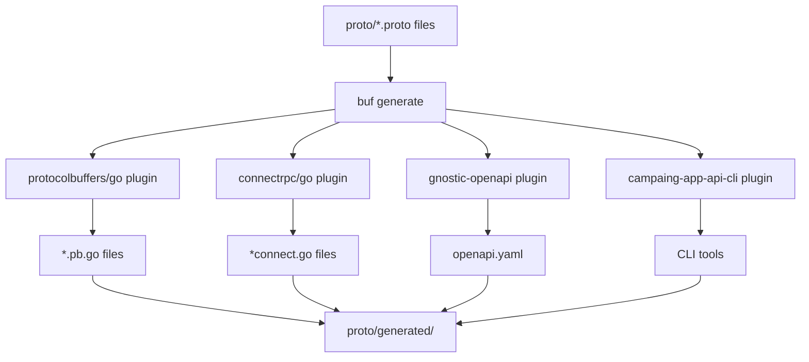

# Documentación Técnica: buf.gen.yaml

## Descripción General

El archivo `buf.gen.yaml` es el archivo de configuración para Buf, una herramienta moderna de gestión de Protocol Buffers. Define cómo generar código Go, clientes gRPC, documentación OpenAPI y otros artefactos a partir de los archivos `.proto` del proyecto. Utiliza la versión 2 de la configuración de Buf con características avanzadas de gestión de dependencias y generación de código.

## Estructura del Archivo

### Versión de Configuración

```yaml
version: v2
```

**Análisis:**
- **Versión**: v2 es la versión más reciente de la configuración de Buf
- **Características**: Soporte para managed mode, mejor gestión de dependencias
- **Compatibilidad**: Requiere Buf CLI v1.0.0 o superior

## Configuración Managed Mode

```yaml
managed:
  enabled: true
  disable:
    - file_option: go_package
      module: buf.build/googleapis/googleapis
    - file_option: go_package
      module: buf.build/bufbuild/protovalidate
  override:
    - file_option: go_package_prefix
      value: github.com/Venqis-NolaTech/campaing-app-chat-messages-api-go/proto/generated
```

**Análisis Detallado:**

### Managed Mode Habilitado
```yaml
managed:
  enabled: true
```

**Propósito:**
- **Gestión automática**: Buf gestiona automáticamente opciones de archivos
- **Consistencia**: Asegura configuración consistente entre archivos
- **Mantenimiento**: Reduce mantenimiento manual de opciones

### Deshabilitación Selectiva
```yaml
disable:
  - file_option: go_package
    module: buf.build/googleapis/googleapis
  - file_option: go_package
    module: buf.build/bufbuild/protovalidate
```

**Análisis de Deshabilitaciones:**

#### `buf.build/googleapis/googleapis`
- **Módulo**: APIs públicas de Google (google.protobuf, google.api, etc.)
- **Razón**: Estos módulos ya tienen sus propios go_package definidos
- **Efecto**: Buf no sobrescribirá las opciones go_package existentes

#### `buf.build/bufbuild/protovalidate`
- **Módulo**: Librería de validación de Protocol Buffers
- **Razón**: Mantiene su propio esquema de paquetes Go
- **Efecto**: Preserva la estructura de paquetes original

### Override de Configuración
```yaml
override:
  - file_option: go_package_prefix
    value: github.com/Venqis-NolaTech/campaing-app-chat-messages-api-go/proto/generated
```

**Propósito:**
- **Prefijo personalizado**: Todos los archivos .proto generarán código Go bajo este prefijo
- **Organización**: Mantiene código generado organizado en un directorio específico
- **Importaciones**: Facilita importaciones consistentes en el código Go

**Ejemplo de aplicación:**
```protobuf
// archivo: proto/services/chat/v1/chat.proto
// package: chat.v1

// Sin override: go_package sería "chat/v1"
// Con override: go_package será "github.com/Venqis-NolaTech/campaing-app-chat-messages-api-go/proto/generated/services/chat/v1"
```

## Configuración de Plugins

```yaml
plugins:
  - remote: buf.build/protocolbuffers/go
    out: proto/generated
    opt:
      - paths=source_relative

  - remote: buf.build/connectrpc/go
    out: proto/generated
    opt:
      - paths=source_relative

  - remote: buf.build/community/google-gnostic-openapi
    out: proto/generated
    opt:
      - version=3
      - title=ChatMessages API
      - default_response=false

  - local: campaing-app-api-cli
    out: proto/generated
    opt:
      - paths=source_relative
```

**Análisis de Plugins:**

### 1. Plugin Protocol Buffers Go

```yaml
- remote: buf.build/protocolbuffers/go
  out: proto/generated
  opt:
    - paths=source_relative
```

**Características:**
- **Plugin**: Generador oficial de Go para Protocol Buffers
- **Ubicación**: Plugin remoto hospedado en Buf Schema Registry
- **Output**: Directorio `proto/generated`
- **Opción**: `paths=source_relative` mantiene estructura de directorios

**Archivos Generados:**
```
proto/generated/
├── services/
│   ├── chat/
│   │   └── v1/
│   │       ├── chat.pb.go          # Tipos de mensajes
│   │       └── chat_grpc.pb.go     # Servicios gRPC
│   └── tokens/
│       └── v1/
│           ├── tokens.pb.go
│           └── tokens_grpc.pb.go
```

### 2. Plugin ConnectRPC Go

```yaml
- remote: buf.build/connectrpc/go
  out: proto/generated
  opt:
    - paths=source_relative
```

**Características:**
- **Plugin**: Generador de clientes y servidores ConnectRPC
- **Protocolo**: Soporte para gRPC, gRPC-Web y Connect
- **Compatibilidad**: Compatible con navegadores web

**Archivos Generados:**
```
proto/generated/
├── services/
│   ├── chat/
│   │   └── v1/
│   │       └── chatv1connect/
│   │           ├── chat.connect.go      # Interfaces de servicio
│   │           └── client/
│   │               └── client.go        # Cliente generado
│   └── tokens/
│       └── v1/
│           └── tokensv1connect/
│               ├── tokens.connect.go
│               └── client/
│                   └── client.go
```

### 3. Plugin OpenAPI

```yaml
- remote: buf.build/community/google-gnostic-openapi
  out: proto/generated
  opt:
    - version=3
    - title=ChatMessages API
    - default_response=false
```

**Características:**
- **Plugin**: Generador de especificaciones OpenAPI
- **Versión**: OpenAPI 3.0
- **Título**: "ChatMessages API"
- **Respuestas**: Sin respuestas por defecto

**Opciones Detalladas:**

#### `version=3`
- **OpenAPI Version**: Genera especificación OpenAPI 3.0
- **Características**: Soporte para componentes, callbacks, links
- **Compatibilidad**: Compatible con herramientas modernas de API

#### `title=ChatMessages API`
- **Título**: Nombre de la API en la documentación
- **Uso**: Aparece en Swagger UI y documentación generada
- **Branding**: Identifica claramente la API

#### `default_response=false`
- **Comportamiento**: No genera respuestas por defecto
- **Limpieza**: Especificación más limpia y específica
- **Control**: Solo respuestas explícitamente definidas

**Archivo Generado:**
```
proto/generated/
└── openapi/
    └── chat_messages_api.yaml    # Especificación OpenAPI
```

### 4. Plugin Local Personalizado

```yaml
- local: campaing-app-api-cli
  out: proto/generated
  opt:
    - paths=source_relative
```

**Características:**
- **Plugin local**: Plugin personalizado específico del proyecto
- **Nombre**: `campaing-app-api-cli`
- **Propósito**: Generación de código específico para CLI o herramientas internas

**Posibles Funcionalidades:**
- Generación de comandos CLI
- Clientes específicos para testing
- Utilidades de desarrollo
- Documentación personalizada

## Configuración de Inputs

```yaml
inputs:
  - directory: proto
```

**Análisis:**
- **Directorio fuente**: `proto` contiene todos los archivos .proto
- **Estructura**: Buf procesará recursivamente todos los .proto en este directorio
- **Organización**: Mantiene separación clara entre fuentes y código generado

## Flujo de Generación

### Proceso Completo



### Comandos de Generación

```bash
# Generar todo el código
buf generate

# Generar solo un plugin específico
buf generate --template '{"version":"v2","plugins":[{"remote":"buf.build/protocolbuffers/go","out":"proto/generated","opt":["paths=source_relative"]}]}'

# Generar con configuración específica
buf generate --path proto/services/chat/v1
```

## Estructura de Salida

### Directorio Generated

```
proto/generated/
├── services/
│   ├── chat/
│   │   └── v1/
│   │       ├── chat.pb.go                    # Protocol Buffers Go
│   │       ├── chat_grpc.pb.go              # gRPC Go
│   │       └── chatv1connect/
│   │           ├── chat.connect.go          # ConnectRPC
│   │           └── client/
│   │               └── client.go            # Cliente
│   └── tokens/
│       └── v1/
│           ├── tokens.pb.go
│           ├── tokens_grpc.pb.go
│           └── tokensv1connect/
│               ├── tokens.connect.go
│               └── client/
│                   └── client.go
├── openapi/
│   └── chat_messages_api.yaml               # OpenAPI spec
└── cli/
    └── commands.go                          # CLI tools (plugin local)
```

## Integración con Build Process

### Makefile Integration

```makefile
.PHONY: generate
generate:
	buf generate

.PHONY: generate-clean
generate-clean:
	rm -rf proto/generated
	buf generate

.PHONY: lint-proto
lint-proto:
	buf lint

.PHONY: breaking-proto
breaking-proto:
	buf breaking --against '.git#branch=main'
```

### CI/CD Integration

```yaml
# GitHub Actions
name: Protocol Buffers
on: [push, pull_request]

jobs:
  proto:
    runs-on: ubuntu-latest
    steps:
      - uses: actions/checkout@v3
      - uses: bufbuild/buf-setup-action@v1
        with:
          version: '1.28.1'
      - name: Lint
        run: buf lint
      - name: Breaking change detection
        run: buf breaking --against 'https://github.com/owner/repo.git#branch=main'
      - name: Generate
        run: buf generate
      - name: Verify generated code
        run: git diff --exit-code
```

## Configuración Avanzada

### Templates Personalizados

```yaml
# buf.gen.template.yaml
version: v2
plugins:
  - remote: buf.build/protocolbuffers/go
    out: internal/proto
    opt:
      - paths=source_relative
      - Minternal/proto/google/protobuf/timestamp.proto=google.golang.org/protobuf/types/known/timestamppb
```

### Configuración por Entorno

```bash
# Desarrollo
buf generate --template buf.gen.dev.yaml

# Producción
buf generate --template buf.gen.prod.yaml

# Testing
buf generate --template buf.gen.test.yaml
```

## Mejores Prácticas Implementadas

### 1. **Managed Mode**
- Configuración automática y consistente
- Menos mantenimiento manual
- Prevención de errores de configuración

### 2. **Plugin Remoto**
- Versionado automático de plugins
- No requiere instalación local
- Actualizaciones automáticas

### 3. **Estructura Organizada**
- Separación clara entre fuentes y generados
- Estructura de directorios consistente
- Fácil navegación del código

### 4. **Múltiples Formatos**
- Go para backend
- ConnectRPC para web
- OpenAPI para documentación
- CLI para herramientas

### 5. **Source Relative Paths**
- Mantiene estructura de directorios original
- Importaciones predecibles
- Organización lógica

## Troubleshooting

### Problemas Comunes

#### 1. **Plugin No Encontrado**
```bash
# Error: plugin not found
# Solución: Verificar nombre del plugin
buf generate --debug
```

#### 2. **Conflictos de go_package**
```bash
# Error: conflicting go_package options
# Solución: Usar disable en managed mode
```

#### 3. **Paths Incorrectos**
```bash
# Error: import paths not found
# Solución: Verificar paths=source_relative
```

### Debugging

```bash
# Modo debug
buf generate --debug

# Verificar configuración
buf config ls-files

# Validar configuración
buf config validate
```

## Monitoreo y Mantenimiento

### Actualizaciones de Plugins

```bash
# Verificar versiones disponibles
buf registry plugin list buf.build/protocolbuffers/go

# Actualizar a versión específica
# Modificar buf.gen.yaml con nueva versión
```

### Validación Continua

```bash
# Verificar que la generación es determinística
buf generate
git status --porcelain proto/generated/

# Debe retornar vacío si no hay cambios
```

Este archivo `buf.gen.yaml` representa una configuración moderna y robusta para la generación de código Protocol Buffers, aprovechando las características avanzadas de Buf para mantener un flujo de desarrollo eficiente y consistente.