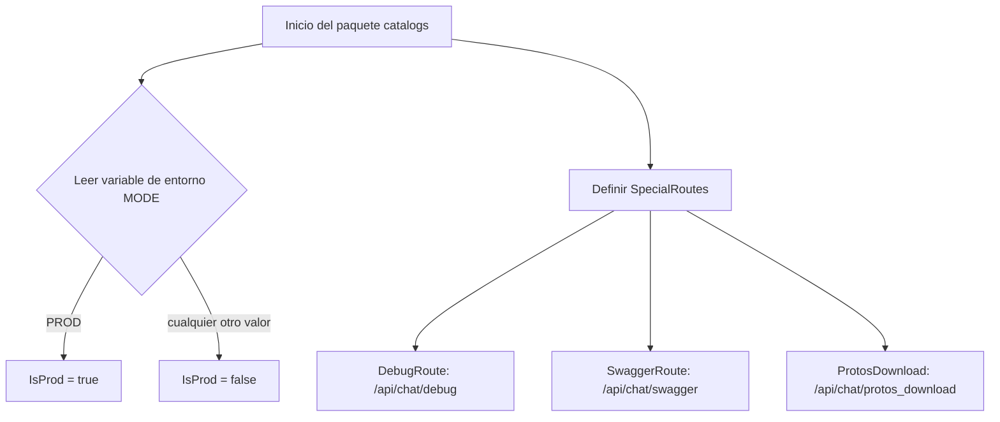

# Diagramas de flujo — catalogs

Este documento resume los flujos principales del paquete catalogs.

## Inicialización y rutas especiales


## Obtención de dirección del cliente gRPC
```mermaid
flowchart TD
    A[Llamar ClientAddress()] --> B[config.GetString("grpc.clientAddresses.chat-messages")]
    B --> C[Retornar dirección del cliente]
```
