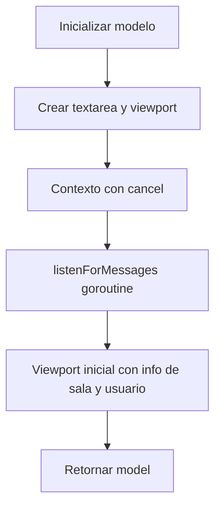

# Diagramas de flujo — cmd/campaing-app-chat-cli

```mermaid
flowchart TD
    A[Inicializar modelo] --> B[Crear textarea y viewport]
    B --> C[Contexto con cancel]
    C --> D[listenForMessages goroutine]
    D --> E[Viewport inicial con info de sala y usuario]
    E --> F[Retornar model]
```

Ver documento padre docs/cmd/DIAGRAMAS.md para más flujos generales del CLI.
