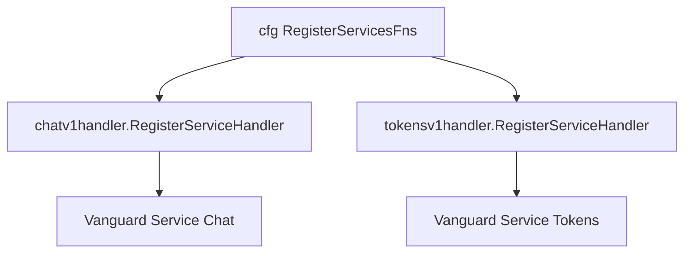

# Diagramas de flujo — handlers (registro de servicios)

```mermaid
flowchart TD
    A[cfg RegisterServicesFns] --> B[chatv1handler.RegisterServiceHandler]
    A --> C[tokensv1handler.RegisterServiceHandler]
    B --> D[Vanguard Service Chat]
    C --> E[Vanguard Service Tokens]
```
