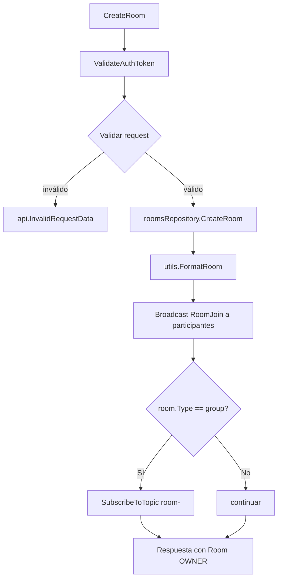
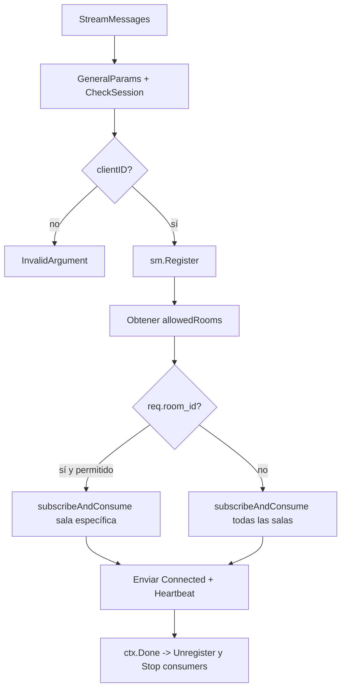
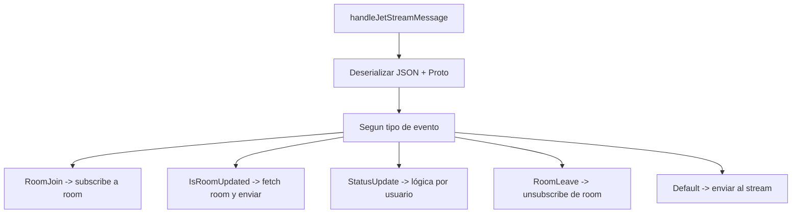

# Diagramas de flujo — handlers/chat

Este módulo contiene el servicio de chat, streaming de eventos y publicación en NATS/JetStream.

## Inicialización del Handler
```mermaid
flowchart TD
    A[NewHandler] --> B[natsmanager.Get()]
    B --> C{nc.IsConnected?}
    C -- No --> X[log.Fatal]
    C -- Sí --> D[jetstream.New(nc)]
    D --> E[EnsureStreams(...requiredStreams)]
    E --> F[Elegir repositorio Rooms: Postgres o Scylla]
    F --> G[events.NewEventDispatcher]
    G --> H[return handlerImpl]
```

## Crear sala (CreateRoom)


## Enviar mensaje (SendMessage)
```mermaid
flowchart TD
    A[SendMessage] --> B[GeneralParams + ValidateAuthToken]
    B --> C[GetRoom y validar permisos]
    C --> D[utils.DecryptMessage]
    D --> E[roomsRepository.SaveMessage]
    E --> F[dispatcher.Fanout:
        - CreateMessageMetaForParticipants
        - Enviar eventos: StatusUpdate (sender) y Message (receptores)
        - Notificación push condicional]
    F --> G[Response Success + Message]
```

## Stream de mensajes (StreamMessages)


## Publicar evento (publishChatEvent)
```mermaid
flowchart TD
    A[publishChatEvent] --> B[Construir MessageEvent con EventId]
    B --> C[Determinar RoomId]
    C --> D[dispatcher.Dispatch(ChatEvent)]
```

## Manejo de mensajes JetStream

