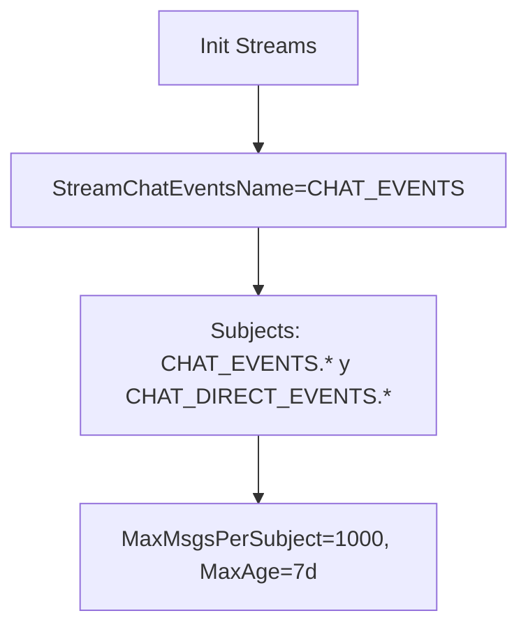

# Diagramas de flujo — handlers/chat/v1



```mermaid
flowchart TD
    A[Events struct ChatEvent] --> B[Subject(): por tipo]
    B --> C[RoomJoin -> CHAT_DIRECT_EVENTS.<userId>]
    B --> D[Otros -> CHAT_EVENTS.<roomId>]
    A --> E[Payload(): proto.Marshal + JSON wrap]
    A --> F[JetStream(): true]
```
