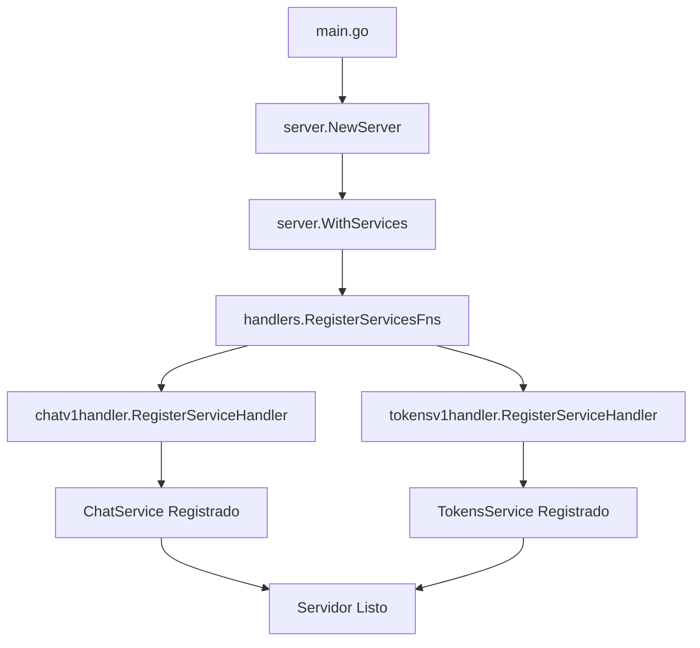

# Documentación Técnica: handlers/handlers.go

## Descripción General

El archivo `handlers.go` actúa como el punto central de registro de todos los servicios gRPC de la aplicación. Implementa un patrón de agregación que reúne las funciones de registro de diferentes handlers en una sola colección, facilitando la inicialización del servidor y el mantenimiento de los servicios.

## Estructura del Archivo

### Importaciones

```go
import (
    chatv1handler "github.com/Venqis-NolaTech/campaing-app-chat-messages-api-go/handlers/chat/v1"
    tokensv1handler "github.com/Venqis-NolaTech/campaing-app-chat-messages-api-go/handlers/tokens/v1"
    "github.com/Venqis-NolaTech/campaing-app-core-go/pkg/server"
)
```

**Análisis de Importaciones:**

- **`chatv1handler`**: Handler para el servicio de chat versión 1
  - Alias utilizado para evitar conflictos de nombres
  - Contiene toda la lógica de manejo de mensajes y salas
- **`tokensv1handler`**: Handler para el servicio de tokens versión 1
  - Maneja tokens de dispositivos para notificaciones push
  - Gestión de sesiones y autenticación de dispositivos
- **`server`**: Módulo del core que define interfaces y tipos para el servidor
  - Proporciona `RegisterServiceFn` type
  - Facilita la integración con el framework del servidor

### Variable Global de Registro

```go
var RegisterServicesFns = []server.RegisterServiceFn{
    chatv1handler.RegisterServiceHandler,
    tokensv1handler.RegisterServiceHandler,
}
```

**Análisis Detallado:**

#### Tipo `[]server.RegisterServiceFn`
- **Definición**: Slice de funciones que registran servicios
- **Propósito**: Colección ordenada de funciones de registro
- **Patrón**: Registry Pattern para servicios

#### Función `server.RegisterServiceFn`
```go
// Definición típica en el core
type RegisterServiceFn func() *vanguard.Service
```

- **Signature**: Función que retorna un servicio configurado
- **Responsabilidad**: Crear y configurar un servicio gRPC específico
- **Retorno**: `*vanguard.Service` - servicio listo para registro

#### Servicios Registrados

##### 1. `chatv1handler.RegisterServiceHandler`

**Propósito**: Registra el servicio principal de chat

**Funcionalidades del Servicio:**
- **Gestión de Salas**:
  - Crear salas (P2P y grupales)
  - Obtener lista de salas
  - Unirse y abandonar salas
  - Configurar salas (silenciar, fijar, etc.)

- **Gestión de Mensajes**:
  - Enviar mensajes
  - Editar mensajes
  - Eliminar mensajes
  - Reaccionar a mensajes
  - Marcar como leídos

- **Streaming en Tiempo Real**:
  - Stream de mensajes
  - Eventos de sala
  - Notificaciones en tiempo real

- **Gestión de Participantes**:
  - Agregar participantes
  - Remover participantes
  - Actualizar permisos
  - Bloquear usuarios

**Implementación Típica:**
```go
func RegisterServiceHandler() *vanguard.Service {
    return vanguard.NewService(
        chatv1connect.NewChatServiceHandler(
            NewHandler(), 
            options...
        )
    )
}
```

##### 2. `tokensv1handler.RegisterServiceHandler`

**Propósito**: Registra el servicio de gestión de tokens

**Funcionalidades del Servicio:**
- **Tokens de Dispositivo**:
  - Guardar tokens FCM/APNS
  - Actualizar tokens expirados
  - Asociar tokens con usuarios

- **Gestión de Sesiones**:
  - Validar tokens de sesión
  - Renovar tokens
  - Invalidar sesiones

**Implementación Típica:**
```go
func RegisterServiceHandler() *vanguard.Service {
    return vanguard.NewService(
        tokensv1connect.NewTokensServiceHandler(
            &handlerImpl{},
            options...
        )
    )
}
```

## Patrones de Diseño Implementados

### 1. Registry Pattern

**Implementación:**
```go
var RegisterServicesFns = []server.RegisterServiceFn{
    // Lista de funciones de registro
}
```

**Ventajas:**
- **Centralización**: Todos los servicios en un lugar
- **Extensibilidad**: Fácil agregar nuevos servicios
- **Orden**: Control sobre el orden de registro
- **Mantenimiento**: Punto único para gestionar servicios

### 2. Factory Pattern (Indirecto)

**Cada función de registro actúa como factory:**
```go
func RegisterServiceHandler() *vanguard.Service {
    // Crea y configura el servicio
    return configuredService
}
```

**Beneficios:**
- **Encapsulación**: Lógica de creación encapsulada
- **Configuración**: Cada servicio se configura independientemente
- **Reutilización**: Funciones reutilizables para testing

### 3. Dependency Injection

**Inyección de dependencias en handlers:**
```go
func NewHandler() chatv1connect.ChatServiceHandler {
    return &handlerImpl{
        db:     database.DB(),
        cache:  redis.Client(),
        nats:   nats.Connection(),
    }
}
```

## Uso en la Aplicación

### En main.go

```go
srv := server.NewServer(
    server.WithServices(handlers.RegisterServicesFns),
    // otras opciones...
)
```

**Proceso de Registro:**
1. **Iteración**: El servidor itera sobre `RegisterServicesFns`
2. **Ejecución**: Cada función se ejecuta para crear su servicio
3. **Registro**: Los servicios se registran en el servidor gRPC
4. **Configuración**: Se aplican middlewares y opciones

### Flujo de Inicialización



## Versionado de Servicios

### Estructura de Versionado

```
handlers/
├── chat/
│   ├── v1/          # Versión 1 del servicio de chat
│   └── v2/          # Versión 2 (futura)
└── tokens/
    ├── v1/          # Versión 1 del servicio de tokens
    └── v2/          # Versión 2 (futura)
```

### Soporte para Múltiples Versiones

```go
// Ejemplo de soporte para múltiples versiones
var RegisterServicesFns = []server.RegisterServiceFn{
    // Versión 1
    chatv1handler.RegisterServiceHandler,
    tokensv1handler.RegisterServiceHandler,
    
    // Versión 2 (cuando esté disponible)
    // chatv2handler.RegisterServiceHandler,
    // tokensv2handler.RegisterServiceHandler,
}
```

## Extensibilidad

### Agregar Nuevos Servicios

```go
// 1. Crear nuevo handler
// handlers/notifications/v1/handler.go

// 2. Implementar función de registro
func RegisterServiceHandler() *vanguard.Service {
    return vanguard.NewService(
        notificationsv1connect.NewNotificationsServiceHandler(
            NewHandler(),
            options...,
        )
    )
}

// 3. Agregar a la lista de registro
var RegisterServicesFns = []server.RegisterServiceFn{
    chatv1handler.RegisterServiceHandler,
    tokensv1handler.RegisterServiceHandler,
    notificationsv1handler.RegisterServiceHandler, // Nuevo servicio
}
```

### Configuración Condicional

```go
// Registro condicional basado en configuración
func init() {
    RegisterServicesFns = []server.RegisterServiceFn{
        chatv1handler.RegisterServiceHandler,
        tokensv1handler.RegisterServiceHandler,
    }
    
    // Agregar servicios opcionales
    if config.GetBool("features.notifications.enabled") {
        RegisterServicesFns = append(RegisterServicesFns, 
            notificationsv1handler.RegisterServiceHandler)
    }
    
    if config.GetBool("features.analytics.enabled") {
        RegisterServicesFns = append(RegisterServicesFns, 
            analyticsv1handler.RegisterServiceHandler)
    }
}
```

## Testing

### Testing de Registro

```go
func TestServiceRegistration(t *testing.T) {
    // Verificar que todos los servicios esperados están registrados
    expectedServices := 2
    actualServices := len(handlers.RegisterServicesFns)
    
    if actualServices != expectedServices {
        t.Errorf("Expected %d services, got %d", expectedServices, actualServices)
    }
}

func TestServiceCreation(t *testing.T) {
    // Verificar que cada función de registro funciona
    for i, registerFn := range handlers.RegisterServicesFns {
        service := registerFn()
        if service == nil {
            t.Errorf("Service registration function %d returned nil", i)
        }
    }
}
```

### Mocking para Testing

```go
// Mock de función de registro para testing
func mockRegisterServiceHandler() *vanguard.Service {
    return vanguard.NewService(
        chatv1connect.NewChatServiceHandler(
            &mockChatHandler{},
            options...,
        )
    )
}

// En tests
func TestWithMockServices(t *testing.T) {
    originalFns := handlers.RegisterServicesFns
    defer func() { handlers.RegisterServicesFns = originalFns }()
    
    handlers.RegisterServicesFns = []server.RegisterServiceFn{
        mockRegisterServiceHandler,
    }
    
    // Test logic
}
```

## Consideraciones de Rendimiento

### 1. Inicialización Lazy
- Los servicios se crean solo cuando se necesitan
- Reduce tiempo de startup
- Permite inicialización condicional

### 2. Orden de Registro
- Servicios críticos primero
- Dependencias respetadas
- Optimización de recursos

### 3. Configuración Eficiente
- Reutilización de conexiones
- Pool de recursos compartidos
- Configuración centralizada

## Monitoreo y Observabilidad

### Métricas de Servicios

```go
// Ejemplo de instrumentación
func RegisterServiceHandler() *vanguard.Service {
    handler := NewHandler()
    
    // Agregar métricas
    instrumentedHandler := metrics.WrapChatHandler(handler)
    
    return vanguard.NewService(
        chatv1connect.NewChatServiceHandler(
            instrumentedHandler,
            options...,
        )
    )
}
```

### Health Checks

```go
// Verificación de salud de servicios
func HealthCheck() error {
    for _, registerFn := range RegisterServicesFns {
        service := registerFn()
        if service == nil {
            return fmt.Errorf("service registration failed")
        }
    }
    return nil
}
```

## Mejores Prácticas Implementadas

1. **Separación de Responsabilidades**: Cada servicio en su propio paquete
2. **Versionado Explícito**: Versiones claras en nombres de paquetes
3. **Registro Centralizado**: Un solo punto para todos los servicios
4. **Extensibilidad**: Fácil agregar nuevos servicios
5. **Testing**: Estructura que facilita testing unitario
6. **Configuración**: Soporte para configuración condicional

Este archivo es crucial para la arquitectura de microservicios de la aplicación, proporcionando una forma limpia y escalable de gestionar múltiples servicios gRPC.