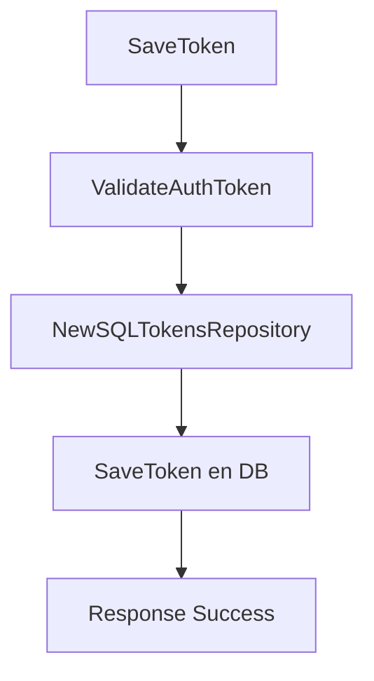

# Diagramas de flujo — handlers/tokens

```mermaid
flowchart TD
    A[SaveToken] --> B[ValidateAuthToken]
    B --> C[NewSQLTokensRepository]
    C --> D[SaveToken en DB]
    D --> E[Response Success]
```
