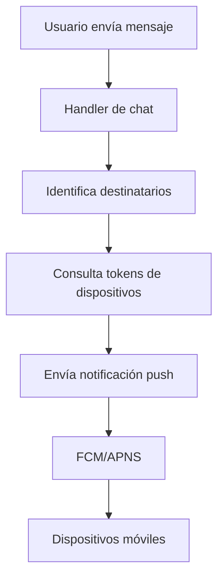

# Documentación Técnica: handlers/tokens/v1/handler.go

## Descripción General

El archivo `handler.go` del servicio de tokens implementa la funcionalidad para gestionar tokens de dispositivos móviles utilizados para notificaciones push. Este servicio es crucial para el sistema de notificaciones, permitiendo que los dispositivos se registren para recibir notificaciones push cuando ocurren eventos relevantes en el chat.

## Estructura del Archivo

### Importaciones

```go
import (
    "context"
    
    "connectrpc.com/connect"
    "github.com/Venqis-NolaTech/campaing-app-chat-messages-api-go/database"
    tokensv1 "github.com/Venqis-NolaTech/campaing-app-chat-messages-api-go/proto/generated/services/tokens/v1"
    "github.com/Venqis-NolaTech/campaing-app-chat-messages-api-go/proto/generated/services/tokens/v1/tokensv1connect"
    tokensrepository "github.com/Venqis-NolaTech/campaing-app-chat-messages-api-go/repository/tokens"
    "github.com/Venqis-NolaTech/campaing-app-chat-messages-api-go/utils"
)
```

**Análisis de Importaciones:**

- **`context`**: Para manejo de contexto y cancelación
- **`connect`**: Framework gRPC-Web para servicios
- **`database`**: Acceso a la base de datos
- **`tokensv1`**: Tipos generados de Protocol Buffers para tokens
- **`tokensv1connect`**: Interfaz del servicio generada
- **`tokensrepository`**: Repository para operaciones de tokens
- **`utils`**: Utilidades para autenticación

## Variable Global del Handler

```go
var handler tokensv1connect.TokensServiceHandler = &handlerImpl{}
```

**Análisis:**
- **Patrón Singleton**: Una sola instancia del handler
- **Interface Implementation**: Implementa `tokensv1connect.TokensServiceHandler`
- **Global Access**: Accesible globalmente para registro del servicio

## Estructura handlerImpl

```go
type handlerImpl struct{}
```

**Análisis:**
- **Estructura vacía**: No mantiene estado interno
- **Stateless**: Cada request es independiente
- **Simplicidad**: Diseño minimalista para operaciones simples
- **Thread-safe**: Sin estado compartido, naturalmente thread-safe

## Función SaveToken

```go
func (h *handlerImpl) SaveToken(ctx context.Context, req *connect.Request[tokensv1.SaveTokenRequest]) (*connect.Response[tokensv1.SaveTokenResponse], error) {
    //validate auth token
    userID, err := utils.ValidateAuthToken(req)
    if err != nil {
        return nil, err
    }
    
    roomRepository := tokensrepository.NewSQLTokensRepository(database.DB())
    
    err = roomRepository.SaveToken(ctx, userID, req.Msg)
    if err != nil {
        return nil, err
    }
    
    return connect.NewResponse(&tokensv1.SaveTokenResponse{Success: true}), nil
}
```

**Análisis Detallado:**

### Signature de la Función

```go
func (h *handlerImpl) SaveToken(ctx context.Context, req *connect.Request[tokensv1.SaveTokenRequest]) (*connect.Response[tokensv1.SaveTokenResponse], error)
```

**Parámetros:**
- **`ctx context.Context`**: Contexto para cancelación y timeouts
- **`req *connect.Request[tokensv1.SaveTokenRequest]`**: Request tipado con datos del token
- **Retorno**: Response tipado o error

### Validación de Autenticación

```go
userID, err := utils.ValidateAuthToken(req)
if err != nil {
    return nil, err
}
```

**Proceso de Validación:**
- **Extracción**: Obtiene token JWT del header Authorization
- **Validación**: Verifica firma, expiración y formato
- **Extracción de UserID**: Obtiene ID del usuario desde el token
- **Error Handling**: Retorna error 401 si la validación falla

**Casos de Error:**
- Token ausente o malformado
- Token expirado
- Firma inválida
- Usuario no encontrado

### Inicialización del Repository

```go
roomRepository := tokensrepository.NewSQLTokensRepository(database.DB())
```

**Análisis:**
- **Factory Pattern**: Crea nueva instancia del repository
- **Dependency Injection**: Inyecta conexión de base de datos
- **SQL Implementation**: Usa implementación SQL específica
- **Per-Request**: Nueva instancia por request (stateless)

**Consideraciones:**
- **Performance**: Crear repository por request puede ser ineficiente
- **Alternativa**: Inyectar repository en constructor del handler
- **Connection Pooling**: La conexión DB usa pool interno

### Persistencia del Token

```go
err = roomRepository.SaveToken(ctx, userID, req.Msg)
if err != nil {
    return nil, err
}
```

**Proceso de Guardado:**
- **Contexto**: Pasa contexto para cancelación/timeout
- **UserID**: Asocia token con usuario autenticado
- **Request Data**: Datos completos del token desde el request
- **Error Propagation**: Propaga errores del repository

**Datos Típicos del Token:**
```protobuf
message SaveTokenRequest {
    string device_token = 1;    // Token FCM/APNS
    string platform = 2;        // "ios", "android", "web"
    string app_version = 3;     // Versión de la app
    string device_id = 4;       // ID único del dispositivo
}
```

### Respuesta Exitosa

```go
return connect.NewResponse(&tokensv1.SaveTokenResponse{Success: true}), nil
```

**Características:**
- **Response Tipado**: Usa tipo generado de protobuf
- **Success Flag**: Indica operación exitosa
- **Simplicidad**: Respuesta mínima pero clara

## Casos de Uso del Servicio

### Registro de Dispositivo Móvil

```go
// Cliente móvil registra su token FCM
request := &tokensv1.SaveTokenRequest{
    DeviceToken: "fcm_token_abc123...",
    Platform:    "android",
    AppVersion:  "1.2.3",
    DeviceId:    "device_unique_id",
}

response, err := tokensClient.SaveToken(ctx, request)
```

### Actualización de Token

```go
// Actualizar token cuando FCM lo renueva
request := &tokensv1.SaveTokenRequest{
    DeviceToken: "new_fcm_token_def456...",
    Platform:    "ios",
    AppVersion:  "1.2.4",
    DeviceId:    "same_device_id",
}

response, err := tokensClient.SaveToken(ctx, request)
```

### Múltiples Dispositivos

```go
// Usuario con múltiples dispositivos
devices := []struct {
    token    string
    platform string
}{
    {"ios_token_123", "ios"},
    {"android_token_456", "android"},
    {"web_token_789", "web"},
}

for _, device := range devices {
    request := &tokensv1.SaveTokenRequest{
        DeviceToken: device.token,
        Platform:    device.platform,
        AppVersion:  "1.2.3",
        DeviceId:    generateDeviceId(),
    }
    
    _, err := tokensClient.SaveToken(ctx, request)
    if err != nil {
        log.Printf("Failed to save token for %s: %v", device.platform, err)
    }
}
```

## Integración con Sistema de Notificaciones

### Flujo de Notificación Push



### Consulta de Tokens para Notificaciones

```go
// En el servicio de notificaciones
func (n *notificationService) SendPushToUser(userID int, message string) error {
    // Obtener tokens del usuario
    tokens, err := n.tokensRepo.GetUserTokens(userID)
    if err != nil {
        return err
    }
    
    // Enviar a cada dispositivo
    for _, token := range tokens {
        switch token.Platform {
        case "ios":
            err = n.apnsClient.Send(token.DeviceToken, message)
        case "android":
            err = n.fcmClient.Send(token.DeviceToken, message)
        case "web":
            err = n.webPushClient.Send(token.DeviceToken, message)
        }
        
        if err != nil {
            log.Printf("Failed to send push to %s: %v", token.Platform, err)
        }
    }
    
    return nil
}
```

## Consideraciones de Seguridad

### 1. Autenticación Obligatoria
```go
userID, err := utils.ValidateAuthToken(req)
```
- **Verificación**: Todo token debe estar asociado a usuario autenticado
- **Prevención**: Evita registro de tokens maliciosos
- **Trazabilidad**: Permite auditar qué usuario registró qué token

### 2. Validación de Datos
```go
// Validaciones recomendadas en el repository
func (r *repository) SaveToken(ctx context.Context, userID int, req *tokensv1.SaveTokenRequest) error {
    // Validar formato del token
    if !isValidTokenFormat(req.DeviceToken, req.Platform) {
        return errors.New("invalid token format")
    }
    
    // Validar plataforma
    if !isValidPlatform(req.Platform) {
        return errors.New("unsupported platform")
    }
    
    // Continuar con guardado...
}
```

### 3. Rate Limiting
```go
// Implementación recomendada de rate limiting
func (h *handlerImpl) SaveToken(ctx context.Context, req *connect.Request[tokensv1.SaveTokenRequest]) (*connect.Response[tokensv1.SaveTokenResponse], error) {
    userID, err := utils.ValidateAuthToken(req)
    if err != nil {
        return nil, err
    }
    
    // Rate limiting por usuario
    if !h.rateLimiter.Allow(userID) {
        return nil, connect.NewError(connect.CodeResourceExhausted, errors.New("too many requests"))
    }
    
    // Continuar con lógica normal...
}
```

## Consideraciones de Performance

### 1. Repository per Request
**Problema actual:**
```go
roomRepository := tokensrepository.NewSQLTokensRepository(database.DB())
```

**Mejora recomendada:**
```go
type handlerImpl struct {
    tokensRepo tokensrepository.TokensRepository
}

func NewHandler() tokensv1connect.TokensServiceHandler {
    return &handlerImpl{
        tokensRepo: tokensrepository.NewSQLTokensRepository(database.DB()),
    }
}
```

### 2. Batch Operations
```go
// Para múltiples tokens del mismo usuario
func (h *handlerImpl) SaveTokens(ctx context.Context, req *connect.Request[tokensv1.SaveTokensRequest]) (*connect.Response[tokensv1.SaveTokensResponse], error) {
    userID, err := utils.ValidateAuthToken(req)
    if err != nil {
        return nil, err
    }
    
    err = h.tokensRepo.SaveTokensBatch(ctx, userID, req.Msg.Tokens)
    if err != nil {
        return nil, err
    }
    
    return connect.NewResponse(&tokensv1.SaveTokensResponse{Success: true}), nil
}
```

### 3. Caching
```go
// Cache de tokens para reducir consultas DB
type handlerImpl struct {
    tokensRepo tokensrepository.TokensRepository
    cache      cache.Cache
}

func (h *handlerImpl) SaveToken(ctx context.Context, req *connect.Request[tokensv1.SaveTokenRequest]) (*connect.Response[tokensv1.SaveTokenResponse], error) {
    userID, err := utils.ValidateAuthToken(req)
    if err != nil {
        return nil, err
    }
    
    // Invalidar cache del usuario
    h.cache.Delete(fmt.Sprintf("user_tokens:%d", userID))
    
    err = h.tokensRepo.SaveToken(ctx, userID, req.Msg)
    if err != nil {
        return nil, err
    }
    
    return connect.NewResponse(&tokensv1.SaveTokenResponse{Success: true}), nil
}
```

## Testing

### Unit Tests

```go
func TestSaveToken(t *testing.T) {
    tests := []struct {
        name           string
        userID         int
        request        *tokensv1.SaveTokenRequest
        mockError      error
        expectedError  bool
    }{
        {
            name:   "successful save",
            userID: 123,
            request: &tokensv1.SaveTokenRequest{
                DeviceToken: "valid_token",
                Platform:    "ios",
                AppVersion:  "1.0.0",
                DeviceId:    "device_123",
            },
            mockError:     nil,
            expectedError: false,
        },
        {
            name:   "repository error",
            userID: 123,
            request: &tokensv1.SaveTokenRequest{
                DeviceToken: "valid_token",
                Platform:    "android",
            },
            mockError:     errors.New("database error"),
            expectedError: true,
        },
    }
    
    for _, tt := range tests {
        t.Run(tt.name, func(t *testing.T) {
            // Mock repository
            mockRepo := &MockTokensRepository{}
            mockRepo.On("SaveToken", mock.Anything, tt.userID, tt.request).Return(tt.mockError)
            
            // Mock auth validation
            mockAuth := &MockAuthValidator{}
            mockAuth.On("ValidateAuthToken", mock.Anything).Return(tt.userID, nil)
            
            handler := &handlerImpl{
                tokensRepo: mockRepo,
                auth:       mockAuth,
            }
            
            req := &connect.Request[tokensv1.SaveTokenRequest]{
                Msg: tt.request,
            }
            
            response, err := handler.SaveToken(context.Background(), req)
            
            if tt.expectedError {
                assert.Error(t, err)
                assert.Nil(t, response)
            } else {
                assert.NoError(t, err)
                assert.NotNil(t, response)
                assert.True(t, response.Msg.Success)
            }
            
            mockRepo.AssertExpectations(t)
        })
    }
}
```

### Integration Tests

```go
func TestSaveTokenIntegration(t *testing.T) {
    // Setup test database
    db := setupTestDB(t)
    defer cleanupTestDB(t, db)
    
    // Create handler with real repository
    repo := tokensrepository.NewSQLTokensRepository(db)
    handler := &handlerImpl{tokensRepo: repo}
    
    // Create test user and token
    userID := createTestUser(t, db)
    token := generateTestToken()
    
    request := &tokensv1.SaveTokenRequest{
        DeviceToken: token,
        Platform:    "ios",
        AppVersion:  "1.0.0",
        DeviceId:    "test_device",
    }
    
    // Mock authentication
    ctx := context.WithValue(context.Background(), "userID", userID)
    req := &connect.Request[tokensv1.SaveTokenRequest]{
        Msg: request,
    }
    
    // Execute
    response, err := handler.SaveToken(ctx, req)
    
    // Verify
    assert.NoError(t, err)
    assert.NotNil(t, response)
    assert.True(t, response.Msg.Success)
    
    // Verify token was saved
    savedTokens, err := repo.GetUserTokens(ctx, userID)
    assert.NoError(t, err)
    assert.Len(t, savedTokens, 1)
    assert.Equal(t, token, savedTokens[0].DeviceToken)
}
```

## Monitoreo y Métricas

### Métricas Recomendadas

```go
var (
    tokensRegistered = prometheus.NewCounterVec(
        prometheus.CounterOpts{
            Name: "tokens_registered_total",
            Help: "Total number of device tokens registered",
        },
        []string{"platform", "app_version"},
    )
    
    tokenRegistrationDuration = prometheus.NewHistogramVec(
        prometheus.HistogramOpts{
            Name: "token_registration_duration_seconds",
            Help: "Time taken to register device tokens",
        },
        []string{"platform"},
    )
    
    tokenRegistrationErrors = prometheus.NewCounterVec(
        prometheus.CounterOpts{
            Name: "token_registration_errors_total",
            Help: "Total number of token registration errors",
        },
        []string{"error_type"},
    )
)
```

### Instrumentación

```go
func (h *handlerImpl) SaveToken(ctx context.Context, req *connect.Request[tokensv1.SaveTokenRequest]) (*connect.Response[tokensv1.SaveTokenResponse], error) {
    start := time.Now()
    defer func() {
        duration := time.Since(start).Seconds()
        tokenRegistrationDuration.WithLabelValues(req.Msg.Platform).Observe(duration)
    }()
    
    userID, err := utils.ValidateAuthToken(req)
    if err != nil {
        tokenRegistrationErrors.WithLabelValues("auth_error").Inc()
        return nil, err
    }
    
    err = h.tokensRepo.SaveToken(ctx, userID, req.Msg)
    if err != nil {
        tokenRegistrationErrors.WithLabelValues("repository_error").Inc()
        return nil, err
    }
    
    tokensRegistered.WithLabelValues(req.Msg.Platform, req.Msg.AppVersion).Inc()
    
    return connect.NewResponse(&tokensv1.SaveTokenResponse{Success: true}), nil
}
```

## Mejores Prácticas Implementadas

1. **Authentication First**: Validación de autenticación antes de cualquier operación
2. **Error Propagation**: Propagación limpia de errores desde repository
3. **Type Safety**: Uso de tipos generados desde protobuf
4. **Stateless Design**: Handler sin estado para mejor escalabilidad
5. **Context Propagation**: Paso de contexto para cancelación y timeouts
6. **Simple Response**: Respuesta clara y consistente

## Áreas de Mejora Identificadas

1. **Dependency Injection**: Inyectar repository en constructor
2. **Validation**: Agregar validación de datos de entrada
3. **Rate Limiting**: Implementar rate limiting por usuario
4. **Caching**: Agregar cache para tokens frecuentemente consultados
5. **Batch Operations**: Soporte para operaciones en lote
6. **Metrics**: Instrumentación para observabilidad

Este handler, aunque simple, es fundamental para el sistema de notificaciones push, proporcionando la base para que los dispositivos móviles puedan recibir notificaciones en tiempo real sobre eventos de chat.