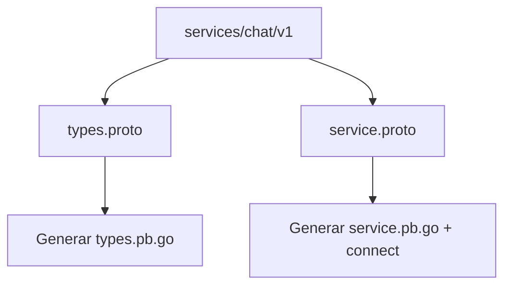

# Diagramas de flujo — proto

```mermaid
flowchart TD
    A[embed.go] --> B[//go:embed generated/openapi.yaml]
    B --> C[Exponer SwaggerJsonDoc]
```

```mermaid
flowchart TD
    A[services/chat/v1] --> B[types.proto]
    A --> C[service.proto]
    B --> D[Generar types.pb.go]
    C --> E[Generar service.pb.go + connect]
```
