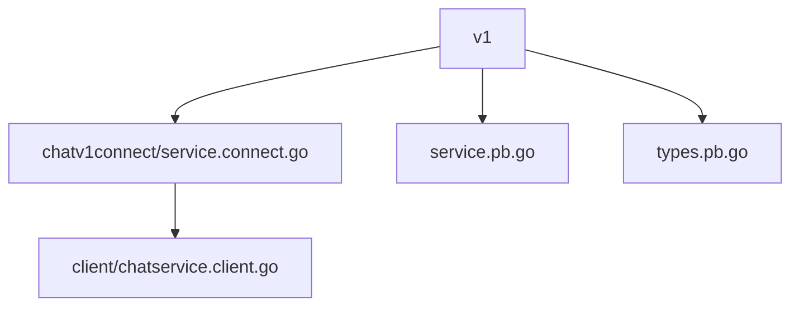

# Diagramas de flujo — proto/generated/services/chat

```mermaid
flowchart TD
    A[v1] --> B[chatv1connect/service.connect.go]
    B --> C[client/chatservice.client.go]
    A --> D[service.pb.go]
    A --> E[types.pb.go]
```
