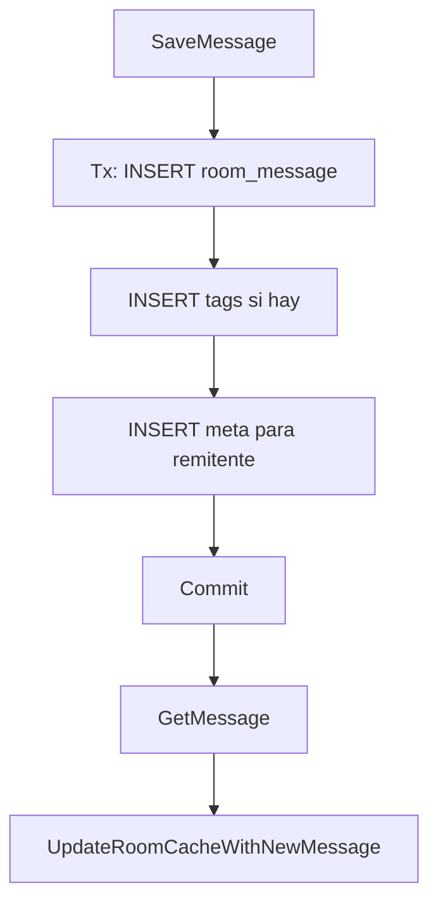
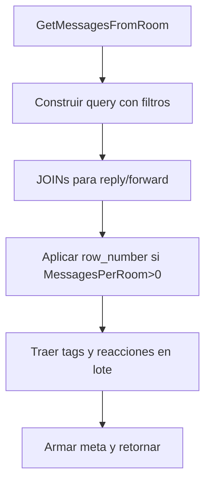
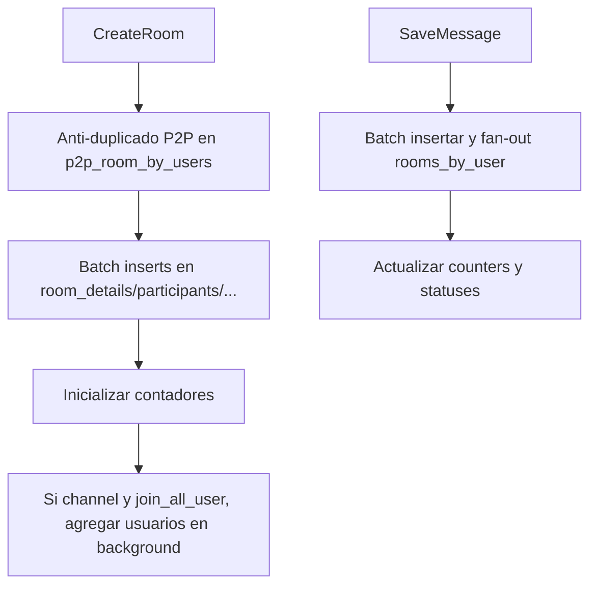

# Diagramas de flujo — repository/rooms

## Crear sala (Postgres)
```mermaid
flowchart TD
    A[CreateRoom] --> B{type == p2p?}
    B -- Sí --> C[Buscar sala existente con partner]
    C -- Encontrada --> R[Retornar sala]
    C -- No encontrada --> D[Generar encryptionData]
    B -- No --> D
    D --> E[INSERT room]
    E --> F[INSERT room_member (owner y miembros)]
    F --> G[Commit]
    G --> H[Si p2p, cargar partner]
    H --> I[Si group, cargar participantes]
    I --> J[return Room]
```

## Obtener sala (GetRoom)
```mermaid
flowchart TD
    A[GetRoom(userId, roomId, allData)] --> B[Consultar room + mm + partner + último mensaje]
    B --> C[Calcular unread_count]
    C --> D[Si group y allData -> cargar participantes]
    D --> E[FormatRoom y cachear]
```

## Guardar mensaje


## GetMessagesFromRoom (paginación y filtros)


## ScyllaDB repositorio (altas luces)

