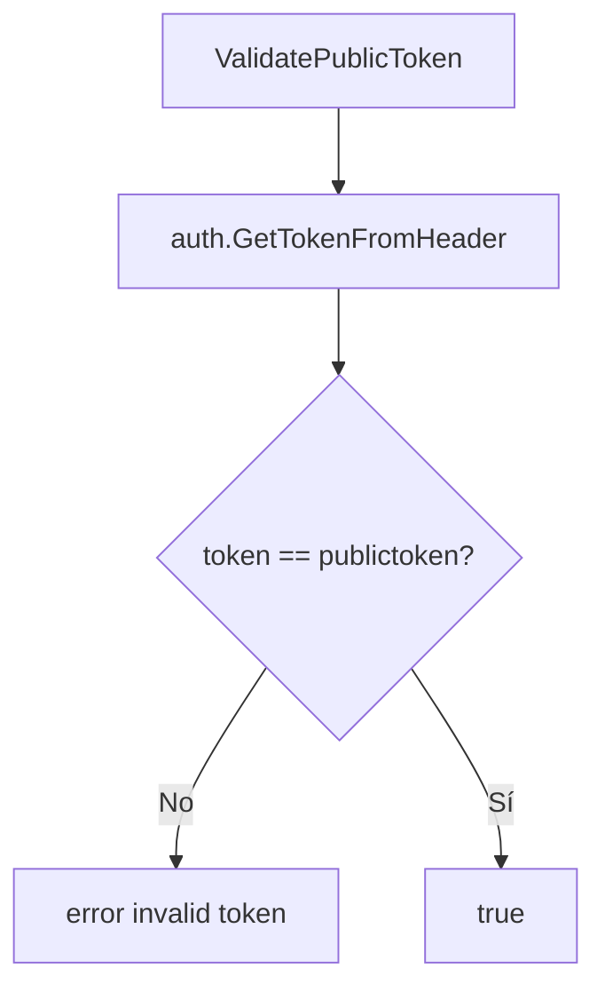
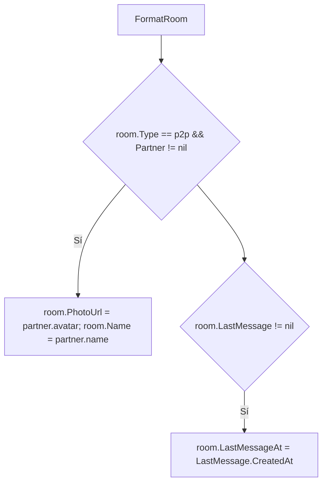
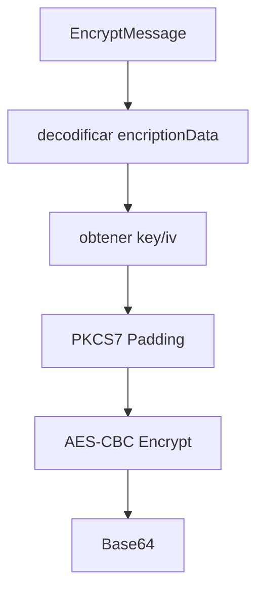
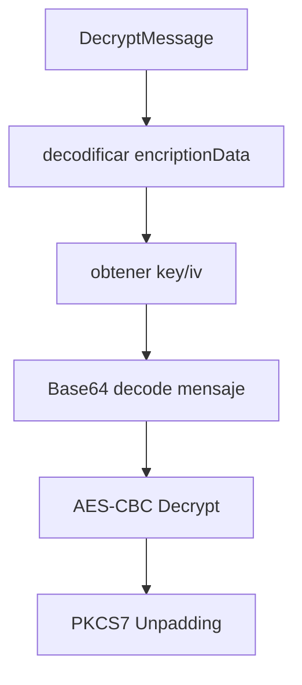

# Diagramas de flujo — utils

## Validación de tokens


```mermaid
flowchart TD
    A[ValidateAuthToken(req)] --> B[api.CheckSessionFromConnectRequest]
    B --> C{ok?}
    C -- No --> X[connect.CodeUnauthenticated]
    C -- Sí --> D[retornar userID]
```

## Formateo de sala


## Cifrado de mensajes
```mermaid
flowchart TD
    A[GenerateKeyEncript] --> B[Random salt + iv]
    B --> C[scrypt->key]
    C --> D[makePublicEncryptUtil(AES-CBC con masterKey/IV)]
    D --> E[toBase64]
```




