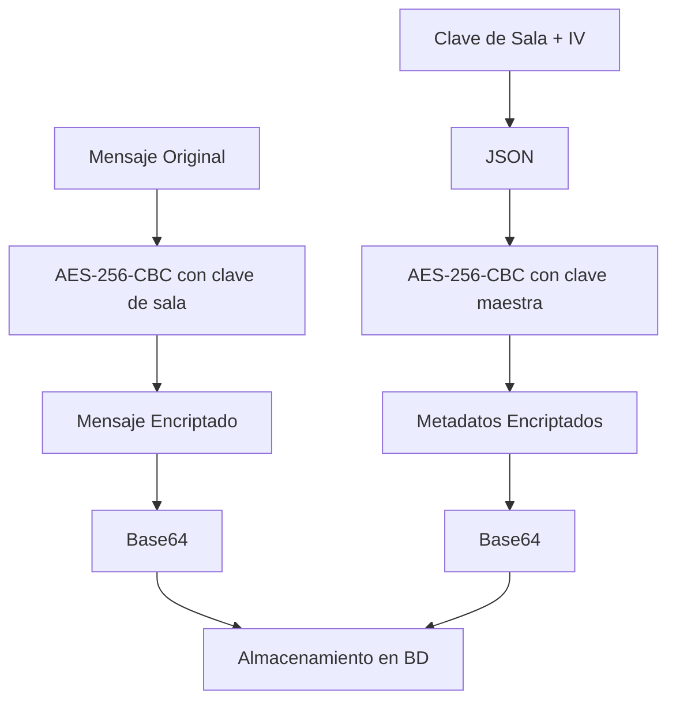

# Documentación Técnica: utils/generateKeyEncript.go

## Descripción General

El archivo `generateKeyEncript.go` implementa un sistema completo de criptografía para la aplicación de chat, proporcionando funcionalidades de generación de claves, encriptación y desencriptación de mensajes. Utiliza AES-256 en modo CBC con PKCS7 padding, implementando un esquema de doble encriptación para máxima seguridad.

## Estructura del Archivo

### Importaciones

```go
import (
    "crypto/aes"
    "crypto/cipher"
    "crypto/rand"
    "encoding/base64"
    "encoding/hex"
    "encoding/json"
    "errors"
    "fmt"
    
    "github.com/Venqis-NolaTech/campaing-app-core-go/pkg/config"
    "golang.org/x/crypto/scrypt"
)
```

**Análisis de Importaciones:**

- **Criptografía estándar**: `crypto/aes`, `crypto/cipher`, `crypto/rand`
- **Codificación**: `encoding/base64`, `encoding/hex`, `encoding/json`
- **Utilidades**: `errors`, `fmt`
- **Configuración**: Módulo del core para obtener claves maestras
- **Scrypt**: Función de derivación de claves segura

### Variables de Configuración

```go
var masterKey = config.GetString("chat.key")
var masterIv = config.GetString("chat.iv")
```

**Análisis de Variables:**

#### `masterKey`
- **Propósito**: Clave maestra para encriptar datos de encriptación de salas
- **Formato**: String hexadecimal de 64 caracteres (32 bytes)
- **Uso**: Protege las claves específicas de cada sala de chat
- **Configuración**: Obtenida desde variables de entorno

#### `masterIv`
- **Propósito**: Vector de inicialización maestro para encriptación de metadatos
- **Formato**: String hexadecimal de 32 caracteres (16 bytes)
- **Uso**: Asegura que la encriptación de metadatos sea determinística
- **Configuración**: Obtenida desde variables de entorno

## Funciones de Generación de Claves

### Función GenerateKeyEncript

```go
func GenerateKeyEncript() (string, error) {
    password := "some password"
    ivBuffer := make([]byte, 16)
    _, err := rand.Read(ivBuffer)
    if err != nil {
        return "", err
    }
    salt := make([]byte, 32)
    _, err = rand.Read(salt)
    if err != nil {
        return "", err
    }
    keyBuffer, err := scrypt.Key([]byte(password), salt, 16384, 8, 1, 32)
    if err != nil {
        return "", err
    }
    key := hex.EncodeToString(keyBuffer)
    iv := hex.EncodeToString(ivBuffer)
    encriptionData, err := makePublicEncryptUtil(map[string]string{
        "key": key,
        "iv":  iv,
    })
    if err != nil {
        return "", err
    }
    encriptionDataBase64, err := toBase64(encriptionData)
    if err != nil {
        return "", err
    }
    return encriptionDataBase64, nil
}
```

**Análisis Paso a Paso:**

#### 1. Generación de IV Aleatorio
```go
ivBuffer := make([]byte, 16)
_, err := rand.Read(ivBuffer)
```
- **Tamaño**: 16 bytes (128 bits) requerido para AES
- **Aleatoriedad**: `crypto/rand` proporciona entropía criptográficamente segura
- **Unicidad**: Cada sala tendrá un IV único

#### 2. Generación de Salt
```go
salt := make([]byte, 32)
_, err = rand.Read(salt)
```
- **Tamaño**: 32 bytes para máxima seguridad
- **Propósito**: Previene ataques de rainbow table contra la derivación de claves
- **Aleatoriedad**: Único para cada generación

#### 3. Derivación de Clave con Scrypt
```go
keyBuffer, err := scrypt.Key([]byte(password), salt, 16384, 8, 1, 32)
```

**Parámetros de Scrypt:**
- **Password**: `"some password"` (debería ser configurable)
- **Salt**: 32 bytes aleatorios
- **N**: `16384` (factor de costo CPU/memoria)
- **r**: `8` (factor de bloque)
- **p**: `1` (factor de paralelización)
- **keyLen**: `32` (256 bits para AES-256)

**Seguridad de Scrypt:**
- **Resistente a ASIC**: Requiere memoria significativa
- **Configurable**: Parámetros ajustables según necesidades
- **Estándar**: RFC 7914

#### 4. Codificación y Encriptación
```go
key := hex.EncodeToString(keyBuffer)
iv := hex.EncodeToString(ivBuffer)
encriptionData, err := makePublicEncryptUtil(map[string]string{
    "key": key,
    "iv":  iv,
})
```
- **Conversión a hex**: Para almacenamiento y transmisión
- **Estructura JSON**: Organiza key e IV en un objeto
- **Encriptación con clave maestra**: Protege los datos de encriptación

#### 5. Codificación Final
```go
encriptionDataBase64, err := toBase64(encriptionData)
```
- **Base64**: Formato seguro para almacenamiento en base de datos
- **Compatibilidad**: Funciona con sistemas que no manejan datos binarios

### Función GenerateRandomKeyAndIV

```go
func GenerateRandomKeyAndIV() (string, string, error) {
    // Generar clave de 32 bytes
    key := make([]byte, 32)
    _, err := rand.Read(key)
    if err != nil {
        return "", "", err
    }
    
    // Generar IV de 16 bytes
    iv := make([]byte, 16)
    _, err = rand.Read(iv)
    if err != nil {
        return "", "", err
    }
    
    // Convertir a hexadecimal
    keyHex := hex.EncodeToString(key)
    ivHex := hex.EncodeToString(iv)
    
    return keyHex, ivHex, nil
}
```

**Análisis:**
- **Simplicidad**: Generación directa sin derivación
- **Uso**: Para casos donde no se necesita derivación de password
- **Performance**: Más rápido que scrypt
- **Retorno**: Key e IV por separado en formato hexadecimal

## Funciones de Encriptación de Metadatos

### Función makePublicEncryptUtil

```go
func makePublicEncryptUtil(data any) (string, error) {
    jsonData, err := json.Marshal(data)
    if err != nil {
        return "", err
    }
    bufferData := []byte(jsonData)
    
    // Convertir la clave hexadecimal a bytes
    keyBytes, err := hex.DecodeString(masterKey)
    if err != nil {
        fmt.Printf("Error decodificando key: %v\n", err)
        return "", err
    }
    
    // Convertir el IV hexadecimal a bytes
    ivBytes, err := hex.DecodeString(masterIv)
    if err != nil {
        fmt.Printf("Error decodificando IV: %v\n", err)
        return "", err
    }
    
    // Hacer padding del input para que sea múltiplo de 16 bytes
    paddedData := pkcs7Padding(bufferData, 16)
    
    block, err := aes.NewCipher(keyBytes)
    if err != nil {
        fmt.Printf("Error creando cipher: %v\n", err)
        return "", err
    }
    
    cipher := cipher.NewCBCEncrypter(block, ivBytes)
    encrypted := make([]byte, len(paddedData))
    cipher.CryptBlocks(encrypted, paddedData)
    
    return hex.EncodeToString(encrypted), nil
}
```

**Análisis Detallado:**

#### 1. Serialización JSON
```go
jsonData, err := json.Marshal(data)
bufferData := []byte(jsonData)
```
- **Flexibilidad**: Acepta cualquier tipo de dato
- **Estructura**: Convierte a JSON para formato estándar
- **Bytes**: Convierte a slice de bytes para encriptación

#### 2. Decodificación de Claves
```go
keyBytes, err := hex.DecodeString(masterKey)
ivBytes, err := hex.DecodeString(masterIv)
```
- **Conversión**: De hexadecimal a bytes
- **Validación**: Verifica formato correcto
- **Error handling**: Logs detallados para debugging

#### 3. Padding PKCS7
```go
paddedData := pkcs7Padding(bufferData, 16)
```
- **Estándar**: PKCS#7 padding para AES
- **Block size**: 16 bytes para AES
- **Completitud**: Asegura que los datos sean múltiplo del tamaño de bloque

#### 4. Encriptación AES-CBC
```go
block, err := aes.NewCipher(keyBytes)
cipher := cipher.NewCBCEncrypter(block, ivBytes)
cipher.CryptBlocks(encrypted, paddedData)
```
- **Algoritmo**: AES-256 (clave de 32 bytes)
- **Modo**: CBC (Cipher Block Chaining)
- **Seguridad**: IV único previene patrones repetitivos

### Función makePublicDecryptUtil

```go
func makePublicDecryptUtil(data string) (string, string, error) {
    paddedData, err := hex.DecodeString(data)
    if err != nil {
        return "", "", err
    }
    
    keyBytes, err := hex.DecodeString(masterKey)
    if err != nil {
        return "", "", err
    }
    
    ivBytes, err := hex.DecodeString(masterIv)
    if err != nil {
        fmt.Printf("Error creando cipher: %v\n", err)
        return "", "", err
    }
    block, err := aes.NewCipher(keyBytes)
    if err != nil {
        fmt.Printf("Error creando cipher: %v\n", err)
        return "", "", err
    }
    cipher := cipher.NewCBCDecrypter(block, ivBytes)
    decrypted := make([]byte, len(paddedData))
    cipher.CryptBlocks(decrypted, paddedData)
    
    unpaddedData := pkcs7Unpadding(decrypted)
    
    unpaddedDataString := string(unpaddedData)
    
    var dataJSON map[string]string
    err = json.Unmarshal([]byte(unpaddedDataString), &dataJSON)
    if err != nil {
        return "", "", err
    }
    
    return dataJSON["key"], dataJSON["iv"], nil
}
```

**Proceso de Desencriptación:**
1. **Decodificación hex**: Convierte datos encriptados a bytes
2. **Preparación de claves**: Decodifica masterKey y masterIv
3. **Desencriptación AES-CBC**: Proceso inverso de encriptación
4. **Remoción de padding**: Elimina padding PKCS7
5. **Deserialización JSON**: Convierte a estructura de datos
6. **Extracción**: Retorna key e IV por separado

## Funciones de Encriptación de Mensajes

### Función EncryptMessage

```go
func EncryptMessage(message string, encriptionData string) (string, error) {
    encriptionData, err := fromBase64(encriptionData)
    if err != nil {
        return "", err
    }
    key, iv, err := makePublicDecryptUtil(encriptionData)
    if err != nil {
        return "", err
    }
    if message == "" {
        return "", errors.New("message is empty")
    }
    bufferData := []byte(message)
    
    // Aplicar padding PKCS7
    paddedData := pkcs7Padding(bufferData, 16)
    
    keyBytes, err := hex.DecodeString(key)
    if err != nil {
        return "", err
    }
    ivBytes, err := hex.DecodeString(iv)
    if err != nil {
        return "", err
    }
    block, err := aes.NewCipher(keyBytes)
    if err != nil {
        return "", err
    }
    cipher := cipher.NewCBCEncrypter(block, ivBytes)
    encrypted := make([]byte, len(paddedData))
    cipher.CryptBlocks(encrypted, paddedData)
    
    encryptedBase64, err := toBase64(hex.EncodeToString(encrypted))
    if err != nil {
        return "", err
    }
    return encryptedBase64, nil
}
```

**Flujo de Encriptación:**

1. **Decodificación de metadatos**: `fromBase64()` → `makePublicDecryptUtil()`
2. **Extracción de claves**: Obtiene key e IV específicos de la sala
3. **Validación**: Verifica que el mensaje no esté vacío
4. **Padding**: Aplica PKCS7 para completar bloques
5. **Encriptación**: AES-256-CBC con claves específicas
6. **Codificación**: hex → base64 para almacenamiento

### Función DecryptMessage

```go
func DecryptMessage(message string, encriptionData string) (string, error) {
    encriptionData, err := fromBase64(encriptionData)
    if err != nil {
        return "", err
    }
    key, iv, err := makePublicDecryptUtil(encriptionData)
    if err != nil {
        return "", err
    }
    if message == "" {
        return "", errors.New("message is empty")
    }
    messageBase64, err := fromBase64(message)
    if err != nil {
        return "", err
    }
    encryptedBuffer, err := hex.DecodeString(messageBase64)
    if err != nil {
        return "", err
    }
    
    // Validar que el buffer tenga el tamaño correcto para AES (múltiplo de 16 bytes)
    if len(encryptedBuffer) == 0 {
        return "", err
    }
    if len(encryptedBuffer)%16 != 0 {
        return "", err
    }
    
    keyBytes, err := hex.DecodeString(key)
    if err != nil {
        return "", err
    }
    ivBytes, err := hex.DecodeString(iv)
    if err != nil {
        return "", err
    }
    block, err := aes.NewCipher(keyBytes)
    if err != nil {
        return "", err
    }
    decipher := cipher.NewCBCDecrypter(block, ivBytes)
    decrypted := make([]byte, len(encryptedBuffer))
    decipher.CryptBlocks(decrypted, encryptedBuffer)
    
    // Remover padding PKCS7
    unpaddedData := pkcs7Unpadding(decrypted)
    
    return string(unpaddedData), nil
}
```

**Validaciones de Seguridad:**
- **Buffer no vacío**: Previene errores de desencriptación
- **Múltiplo de 16**: Valida integridad del bloque AES
- **Padding válido**: Verifica que el padding sea correcto

## Funciones de Utilidad

### Funciones de Padding

```go
func pkcs7Padding(data []byte, blockSize int) []byte {
    padding := blockSize - len(data)%blockSize
    padtext := make([]byte, padding)
    for i := range padtext {
        padtext[i] = byte(padding)
    }
    return append(data, padtext...)
}

func pkcs7Unpadding(data []byte) []byte {
    padding := int(data[len(data)-1])
    return data[:len(data)-padding]
}
```

**PKCS7 Padding:**
- **Estándar**: RFC 5652
- **Funcionamiento**: Rellena con bytes cuyo valor es la cantidad de padding
- **Ejemplo**: Para completar 3 bytes → `[0x03, 0x03, 0x03]`

### Funciones de Codificación

```go
func toBase64(message string) (string, error) {
    decodedBytes, err := hex.DecodeString(message)
    if err != nil {
        return "", err
    }
    return base64.StdEncoding.EncodeToString(decodedBytes), nil
}

func fromBase64(message string) (string, error) {
    decodedBytes, err := base64.StdEncoding.DecodeString(message)
    if err != nil {
        return "", err
    }
    return hex.EncodeToString(decodedBytes), nil
}
```

**Conversiones:**
- **toBase64**: hex → bytes → base64
- **fromBase64**: base64 → bytes → hex
- **Propósito**: Compatibilidad con diferentes sistemas de almacenamiento

## Arquitectura de Seguridad

### Esquema de Doble Encriptación



### Niveles de Protección

1. **Nivel 1 - Mensajes**: Encriptados con claves específicas de sala
2. **Nivel 2 - Metadatos**: Claves de sala encriptadas con clave maestra
3. **Nivel 3 - Configuración**: Clave maestra en variables de entorno

## Casos de Uso

### Creación de Nueva Sala

```go
// Generar datos de encriptación para nueva sala
encryptionData, err := utils.GenerateKeyEncript()
if err != nil {
    return nil, err
}

room := &chatv1.Room{
    Id:             roomID,
    EncryptionData: encryptionData,
    // ... otros campos
}
```

### Envío de Mensaje

```go
// Encriptar mensaje antes de guardar
encryptedContent, err := utils.EncryptMessage(message.Content, room.EncryptionData)
if err != nil {
    return nil, err
}

message.Content = encryptedContent
// Guardar en base de datos
```

### Recepción de Mensaje

```go
// Desencriptar mensaje al recuperar
decryptedContent, err := utils.DecryptMessage(message.Content, room.EncryptionData)
if err != nil {
    log.Error("Error decrypting message", err)
    return message // Retornar encriptado si falla
}

message.Content = decryptedContent
```

## Consideraciones de Seguridad

### Fortalezas

1. **AES-256**: Algoritmo aprobado por NSA para información clasificada
2. **Claves únicas**: Cada sala tiene sus propias claves
3. **IV aleatorio**: Previene ataques de análisis de patrones
4. **Scrypt**: Derivación de claves resistente a ataques de fuerza bruta
5. **Doble encriptación**: Protección en capas

### Áreas de Mejora

1. **Password hardcodeado**: `"some password"` debería ser configurable
2. **Rotación de claves**: No hay mecanismo de rotación automática
3. **Perfect Forward Secrecy**: No implementado
4. **Key escrow**: No hay mecanismo de recuperación de claves

## Testing

### Unit Tests

```go
func TestEncryptDecryptMessage(t *testing.T) {
    // Generar datos de encriptación
    encryptionData, err := GenerateKeyEncript()
    require.NoError(t, err)
    
    originalMessage := "Hello, World!"
    
    // Encriptar
    encrypted, err := EncryptMessage(originalMessage, encryptionData)
    require.NoError(t, err)
    assert.NotEqual(t, originalMessage, encrypted)
    
    // Desencriptar
    decrypted, err := DecryptMessage(encrypted, encryptionData)
    require.NoError(t, err)
    assert.Equal(t, originalMessage, decrypted)
}

func TestPKCS7Padding(t *testing.T) {
    data := []byte("Hello")
    padded := pkcs7Padding(data, 16)
    
    // Debe ser múltiplo de 16
    assert.Equal(t, 0, len(padded)%16)
    
    // Despadding debe retornar original
    unpadded := pkcs7Unpadding(padded)
    assert.Equal(t, data, unpadded)
}
```

## Performance y Optimización

### Benchmarks

```go
func BenchmarkEncryptMessage(b *testing.B) {
    encryptionData, _ := GenerateKeyEncript()
    message := "Test message for benchmarking"
    
    b.ResetTimer()
    for i := 0; i < b.N; i++ {
        _, _ = EncryptMessage(message, encryptionData)
    }
}
```

### Optimizaciones Posibles

1. **Cache de claves**: Evitar desencriptar metadatos repetidamente
2. **Pool de ciphers**: Reutilizar objetos cipher
3. **Streaming**: Para mensajes grandes
4. **Hardware acceleration**: Usar instrucciones AES-NI

## Mejores Prácticas Implementadas

1. **Separación de responsabilidades**: Funciones específicas para cada operación
2. **Error handling**: Manejo robusto de errores
3. **Validación de entrada**: Verificación de parámetros
4. **Estándares criptográficos**: Uso de algoritmos probados
5. **Codificación segura**: Base64 para compatibilidad
6. **Documentación**: Comentarios explicativos en código complejo

Este archivo es crítico para la seguridad de la aplicación, implementando un sistema de encriptación robusto que protege la privacidad de las comunicaciones de los usuarios.